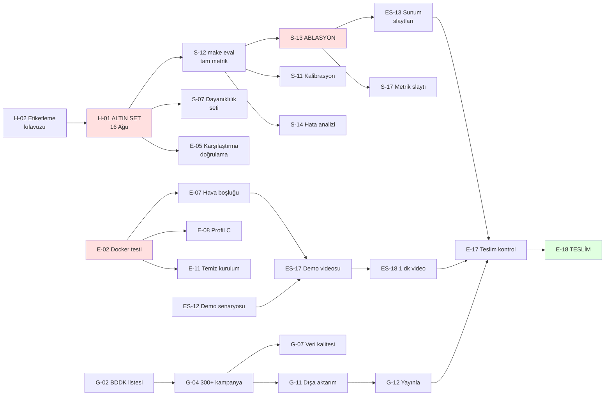

# 📋 GÖREV PANOSU — Takım SVARTAL

**Son güncelleme:** 24 Ağustos 2026 — *EVREN geçişi, tarih düzeltmesi, bayat tikler*
**Teslim:** 🔴 **27 Ağustos 2026** · **26 Ağustos: video + sunum hazırlanacak**
**Özellik dondurma:** 🔒 **21 Ağustos'ta GEÇTİ — kod yazılmıyor**

> ⏳ **Bugün 24 Ağustos. Teslime 3 gün.**
>
> | Gün | Ne yapılacak |
> |---|---|
> | **24 Ağu (bugün)** | Ölçüm (`make extract` + `make eval`), doküman başlıkları |
> | **25 Ağu** | Doküman bitirme, prova |
> | **26 Ağu** | 🎬 **Video + sunum** |
> | **27 Ağu** | 📦 **TESLİM** — depo bu gün public'e alınacak |
>
> Dondurma geçti: yeni özellik açılmaz. Kalan iş yalnız **ölçüm, doküman,
> video, sunum**.
>
> 🎬 **İKİ AYRI VİDEO ZORUNLU — 24 Ağu'da şartnameden teyit edildi.**
> Karıştırılıyordu, ikisi de gerekli:
>
> | Görev | Süre | Nerede | Şartname |
> |---|---|---|---|
> | **ES-17** | maks. **5 dakika** | GitHub'a yüklenen teslimat | **Madde 6** |
> | **ES-18** | **1 dakika** | Sunum sırasında oynatılır | **Madde 10** |
>
> Madde 10 birebir: *"Sunum süresi **4 dakika**, demo videosu süresi ise
> **1 dakika** olacaktır."* — yani o 1 dakika **soru-cevap değil, videonun
> kendisi**. ES-17 iptal edilemez: madde 6 onu ayrı teslimat sayıyor.

---

## 🧭 NASIL KULLANILIR

**Bu dosya tek doğruluk kaynağıdır. Kimseye "ben ne yapacağım?" diye sorma —
buraya bak.**

### 🔴 HER OTURUMDA — önce PULL, sonra PUSH

```bash
# ÇALIŞMAYA BAŞLARKEN — ilk iş
git pull --rebase origin main

# ... çalış, GOREVLER.md'de bitirdiğin göreve [x] at ...

# BIRAKMADAN ÖNCE — son iş
git add -A && git commit -m "..." && git push origin main
```

Dört kişi aynı depoda çalışıyor. **Pull etmeden düzenleme yapma** — çakışma
çıkar, kötü ihtimalde arkadaşının işini ezersin. **Pushlamadan bırakma** — işin
kimseye ulaşmaz, seni bekleyen arkadaşın boşuna bekler.

Bu iki adımı unutmayasın diye otomatik hatırlatma kurulu: oturum açıldığında
GitHub kontrol edilip geride kalınmışsa uyarı çıkar, oturum bitince
pushlanmamış iş varsa uyarı çıkar. Yapay zekâ ile çalışıyorsan o da sorar.
Elle kontrol için:

```bash
python3 tools/git_kontrol.py baslangic   # geride miyim?
python3 tools/git_kontrol.py bitis       # pushlanmamış işim var mı?
```

1. **Kendi bölümünü bul** (aşağıda adın var), sırayla yukarıdan aşağı çalış.
   Görevler öncelik sırasına dizildi; en üstteki senin bir sonraki işin.
2. **`⛔ Önce bitmeli:` satırı varsa bak.** Orada yazan görevler bitmeden bu işe
   başlayamazsın (aşağıda "Bağımlılıklar" bölümü var).
3. **Bitirdiğinde `[ ]` yerine `[x]` yaz**, yanına tarihini ekle.
   Örnek: `- [x] **G-01** EFT/BDDK kodlarını doğrula *(bitti: 11 Ağu)*`
4. **Sonra durma, bir sonraki `[ ]` göreve geç.**
5. Değişikliği commit'le: `git add GOREVLER.md && git commit -m "G-01 bitti"`
6. **Takıldıysan 30 dakika kuralı:** 30 dakikadan fazla takılan kişi gruba yazar.
   Tek başına 2 saat debug etmek, 180 saatlik bütçenin %1'ini yakar.

### ⚡ Tek komutla "benim görevim ne?"

Elle bakmana gerek yok — **bloke olup olmadığını da söyleyen** bir araç var:

```bash
make gorev ad=Esra          # Esra'nın yapabilecekleri + bloke olanlar
make gorev                  # herkesin özeti + darboğazlar
make gorev-dogrula          # panoyu denetle (bozuk bağımlılık, döngü)
```

Çıktı iki gruba ayrılır:

```
✅ ŞU AN BAŞLAYABİLİRSİN (12)
   Sıradaki işin: ES-01

⛔ ŞU AN YAPAMAZSIN (10) — önce başkasının işi bitmeli
   ES-13  Sunum slaytları — PDF + PPTX
        └─ bekliyor: S-13 (Samet) — ABLASYON TABLOSU
```

**Bloke bir işe takılma, listedeki bir sonraki yapılabilir işe geç.**
Düşük kapasitede boşta beklemek en pahalı şeydir.

### 🤖 Yapay zekâya sorarken

Bir yapay zekâya danışacaksan şunu yaz:

> `GOREVLER.md` dosyasını oku. Ben **[ADIN]**. Sıradaki görevim ne, bloke bir şey var mı?

Böylece hangi görevde olduğunu, ne yapılması gerektiğini, "bitti" sayılma
kriterini ve neyi beklediğini doğrudan görür.

### Görev satırı nasıl okunur

Aşağıdaki, Samet'in listesinden **gerçek** bir görev:

```
- [ ] **S-04** Sayısal alanlara akıl sağlığı sınırları · 📅 14 Ağu
      ↳ Bitti sayılır: 1000 TL'lik "finansman limiti" gibi saçma değerler kalmadı
```

| Parça | Anlamı |
|---|---|
| `S-04` | Görev kodu — **E**: Eren · **S**: Samet · **G**: Görkem · **ES**: Esra · **H**: Herkes |
| `📅` | Son tarih |
| `↳ Bitti sayılır:` | Hangi şart sağlanınca tik atabilirsin |
| `⛔ Önce bitmeli:` | Bu görev başlamadan önce bitmesi gereken görevler |
| 🔴 | Kritik — gecikirse puan kaybettirir |

---

## 🔗 BAĞIMLILIKLAR

Bazı görevler başkasının işi bitmeden başlayamaz. Kritik zincirler:



### 🚧 En çok işi tıkayan görevler

Bunlar gecikirse arkasındaki herkes bekler — öncelik sırasının gerçek tepesi:

| Görev | Kim | Kaç işi tıkıyor | Tıkananlar |
|---|---|---|---|
| **S-12** `make eval` tam metrik | Samet | 4 | S-11, S-13, S-14, S-15 |
| **G-04** 300+ kampanya topla | Görkem | 4 | G-07, G-08, G-11, G-15 |
| **E-02** Docker testi | Eren | 4 | E-07, E-08, E-09, E-11 |
| **S-13** Ablasyon tablosu | Samet | 3 | E-19, S-17, **ES-13** |
| **H-01** Altın veri seti | Herkes | 3 | E-05, S-07, S-12 |

> **Dikkat:** `H-01 → S-12 → S-13 → ES-13` zinciri projenin en uzun kritik
> yoludur. Altın set 16 Ağustos'ta bitmezse Esra'nın sunum slaytları
> 23 Ağustos'ta hazır olamaz. **Bu zincirdeki her gecikme aynen sona yansır.**

Bağımlılıkları elle takip etme, komutu çalıştır: `make gorev ad=<adın>`

---

## ⏰ GECİKMİŞ — 12 Ağustos denetimi

> 🗄️ **ARŞİV — 12 Ağustos 2026 denetimi. GÜNCEL DEĞİLDİR.**
>
> Aşağıdaki tablo, "Bugün bu sırayla" listesi ve 🚨 kritik yol alarmı
> **12 Ağustos'un gerçeğidir.** O gün geçerliydi; bugün değil. Listedeki
> ❌'lerin tamamı kapandı — `docs/ETIKETLEME_KILAVUZU.md` var, `docs/kanit/`
> var, `data/gold/` 98 kayıt taşıyor, depo 26 Ağustos'ta public yapıldı.
>
> **Güncel durum için `make gorev` çalıştırın**; o araç bu bölümü okumaz,
> aşağıdaki `[ ]` / `[x]` listesinden üretir. Bölüm silinmedi çünkü o gün
> yapılan denetim projenin ölçüm dürüstlüğü kaydının parçası.

**Denetim yöntemi:** Bu liste tahmin değil. 12 Ağustos'ta depo tek tek kontrol
edildi — commit geçmişi, dosya varlığı, `banks.yaml` içeriği, git etiketleri,
GitHub API. Bulgu: **9 Ağustos'tan sonra ürün tarafında hiçbir değişiklik yok.**
Tek commit var (10 Ağu) ve yalnızca pano/hook dosyalarına dokunuyor. `main`
origin ile birebir eşit, başka dal ve stash yok — yani pushlanmamış gizli iş
de yok. **Panoda tik olmamasının sebebi tiklemeyi unutmak değil; iş yapılmadı.**

| Görev | Kim | Son tarih | Gecikme | Doğrulanan durum |
|---|---|---|---|---|
| **E-01** | Eren | 10 Ağu | 2 gün | ❌ Depo **PRIVATE**, açıklama ve topic yok |
| **H-02** | Herkes | 10 Ağu | 2 gün | ❌ `docs/ETIKETLEME_KILAVUZU.md` yok |
| **E-03** | Eren | 10 Ağu | 2 gün | ❌ Depoda hiç git etiketi yok |
| **S-01** | Samet | 10 Ağu | 2 gün | ❌ `.env` yok, 3090 bağlantısı yapılandırılmamış |
| **G-01** | Görkem | 11 Ağu | 1 gün | ❌ 4 banka hâlâ `kod_dogrulandi: false` |
| **G-02** | Görkem | 11 Ağu | 1 gün | ❌ `docs/kanit/` klasörü bile yok |
| **ES-01** | Esra | 11 Ağu | 1 gün | ❌ `app/` 9 Ağu'dan beri değişmemiş |
| **G-03** | Görkem | 12 Ağu | bugün | ❌ `banks.yaml`'da hâlâ 9 Ağu "bulunamadı" notu |
| **E-02** | Eren | 12 Ağu | bugün | ❌ Yapılmadı — **4 görevi tıkıyor** |
| **ES-02** | Esra | 12 Ağu | bugün | ✅ Bitti |

### Bugün bu sırayla

1. **E-01 — depo herkese açık yapılsın. 5 dakika.** Şartname herkese açık depo
   istiyor; depo şu an private. Bu haliyle **değerlendirmeye alınmama riski
   somut** ve diğer her şeyin üstünde. Aynı işlemde topic'leri ve açıklamayı da
   gir, `v0.1` etiketini at (E-03 de kapanır).
2. **E-02 — Docker testi.** Arkasında 4 görev bekliyor (E-07, E-08, E-09, E-11)
   ve on-prem puanının (%20) tamamı buna dayanıyor.
3. **H-02 — etiketleme kılavuzu.** Kritik yolun başı; aşağıdaki uyarıya bak.

> 🚨 **Kritik yol alarmı.** `H-02 → H-01 (16 Ağu) → S-12 → S-13 → ES-13`
> projenin en uzun zinciri. H-02 iki gün gecikti ve **hiç başlamadı**;
> H-01'e 4 gün kaldı, `data/gold/` boş. Bu zincir kayarsa puanın %30'u
> ölçülemez ve Esra'nın slaytları 23 Ağustos'ta hazır olamaz.
> **Karar bugün verilmeli** — bkz. H-01.

---

## 📊 DURUM

| Sprint | Tarih | Durum |
|---|---|---|
| **S0** — Dikey dilim | 7–9 Ağu | ✅ **BİTTİ** — sistem uçtan uca çalışıyor |
| **S1** — Veri + çıkarım | 10–16 Ağu | 🟠 **Sürüyor — 3 gün gecikmeli** |
| **S2** — Zekâ katmanı | 17–21 Ağu | ⚪ |
| **S3** — Ölçüm + on-prem | 22–23 Ağu | ⚪ |
| **S4** — Teslim | 24–26 Ağu | ⚪ |

**Bugünkü durum (14 Ağustos):** 96 kampanya (hedef 300+) · 8 banka ·
halüsinasyon %0,25 · **253 test geçiyor** · depo **PUBLIC** ✅ ·
şema **v1.1.0** · `src/ajanlar/` kuruldu
Ayrıntı: [`docs/SPRINT0_RAPORU.md`](docs/SPRINT0_RAPORU.md)

### 🔴 ALTIN SET — 14 Ağustos denetimi: sanılandan çok geride

Denetim yöntemi: `make altin-denetle` ile dört kişinin dosyaları tek tek
tarandı. Bulgu, "etiketleme bitti" izleniminin aksine:

| Kişi | Kişisel pay | Uyum bloğu | Kalibrasyon |
|---|---|---|---|
| Eren | **0/13** | 10/10 ✅ | 0/10 |
| Samet | **0/13** | 10/10 ✅ | 0/10 |
| Görkem | **0/12** | 10/10 ✅ | 0/10 |
| Esra | **0/12** | 10/10 ⚠️ 21 ihlal | 0/10 |

**Kişisel etiketleme dosyalarının dördü de baştan sona boş** (0 dolu hücre).
Etiketlenmiş olan tek şey 10 örneklik ortak uyum bloğu — yani altın set
60 değil **10 örnek**. Ayrıca:

- **Uyum oranı %34,9** (hedef ≥%85) ve **kopya şüphesiyle geçersiz**:
  Eren ↔ Samet'in 28 serbest metin alanının 27'si birebir aynı.
- Esra'nın etiketleri sözleşmeye uymuyor (`konut` yerine `konut_finansmani`,
  `16 ağustos` yerine `2026-08-16`).

**İyi haber:** etiketler modelin kendi çıktısından kopyalanmamış (veritabanında
o alanlar `None`) — altın set kendini ölçmüyor, emek kurtarılabilir.

**15 Ağu kararı: altın set sıfırdan kuruldu.** Etiketlerin bir bölümü dil
modelinden geldiği için hepsi geçersiz sayıldı ve süreç sadeleştirildi
(bkz. [ADR 008](docs/kararlar/008-altin-set-kapsami.md)):

| | Önce | Şimdi |
|---|---|---|
| Etiketlenecek alan | 16 | **8** |
| Ortak (uyum) blok | 10 satır | **5 satır** |
| Kılavuz | 403 satır | **1 sayfa** |
| make komutu | 7 | **4** |
| Kişi başı süre | ~90 dk | **~25 dk** |

**Yapılacak — kişi başı ~25 dakika:**

1. `data/gold/etiketleme_<adın>.csv` → 13-14 satır × 8 alan
2. `data/gold/etiketleme_uyum_<adın>.csv` → 5 satır (dördünüzde de aynı satırlar)
3. `make altin-denetle ad=<adın>` → ✅ çıkana kadar düzelt
4. Kişisel dosyanı pushla; **ortak dosyayı Eren'e gönder**, pushlama

> **Çekirdek 8:** `kampanya_turu` · `kar_payi_orani` · `vade_ay_max` ·
> `finansman_tutari_max` · `tahsis_ucreti` · `masrafsiz_mi` · `odul_miktari` ·
> `kampanya_bitis`
>
> 🤖 **Etiketi yapay zekâya sordurma.** Cevap anahtarı bir modelden gelirse
> ölçtüğümüz şey doğruluk değil, iki modelin benzerliği olur. Model okuma
> yardımı olarak serbest; etiketi insan, metne bakarak yazar.
>
> 📄 **`data/gold/okuma_<adın>.md`** — her satır için sekiz alanın aday cümleleri
> önden çıkarılmış. CSV'nin yanında aç, arama derdinden kurtul.

### Yük dağılımı

| Kişi | Açık görev | Sprint 0'da biten | Ana sorumluluk |
|---|---|---|---|
| Eren | 19 | 9 | Mimari · entegrasyon · on-prem · teslim |
| Esra | 18 | 5 | Arayüz · dashboard · **video ve sunum** |
| Samet | 17 | 6 | Çıkarım motoru · LLM · **ölçüm (%30)** |
| Görkem | 16 | 5 | Veri toplama · veri kalitesi · terim sözlüğü |
| Herkes | 4 | — | Altın set · etiketleme · stand-up |

Yük bilerek eşitlendi. Kimsenin işi diğerinden hafif değil; sadece farklı
sprintlerde yoğunlaşıyor. **Esra'nın işi Sprint 2 ve 4'te ağırlaşıyor**
(yan yana karşılaştırma, dışa aktarma, video, sunum), **Samet'inki Sprint 3'te**
(ölçüm ve ablasyon), **Görkem'inki Sprint 1'de** (300+ kampanya).

### 🚨 En kritik 4 şey

1. 🔴 **DEPO HÂLÂ PRIVATE — 24 Ağu'da ölçüldü.** Bu satır önceden *"14
   Ağustos'ta public yapıldı, E-01 kapandı"* diyordu; **doğru değildi.**
   Kimliksiz istek `github.com/erenkendir722/ai-agent-nlp` → **HTTP 404**
   (kontrol: `api.github.com/repos/python/cpython` → 200, yani ağ sağlam).
   **Karar (24 Ağu): depo teslim günü, 27 Ağustos'ta public'e alınacak.**
   Bilinçli erteleme — ama E-03 ve E-18 buna bağlı, o gün unutulursa teslim düşer.
2. ✅ ~~Altın veri seti~~ — 15 Ağustos'ta bitti (H-01), 60 örnek.
3. ✅ ~~Docker testi~~ — 12 Ağustos'ta çalıştırıldı, üç kırık nokta düzeltildi.
4. 🎬 **26 Ağustos: video + sunum.** Dondurma 21 Ağu'da geçti; kod yazılmıyor.

---

## 🤖 AJAN MİMARİSİ — 14 Ağustos'ta eklendi

Mentör görüşmesi sonrası ([`Plan_Guncellemeleri_v3.md`](Plan_Guncellemeleri_v3.md)).
Gerekçe [ADR 005](docs/kararlar/005-ajan-mimarisi.md); şema değişikliği
[ADR 006](docs/kararlar/006-sema-v1-1-uygunluk.md).

**Bitenler (Eren, 14 Ağu):**

- [x] **A-01** Şema v1.1.0 — `UygunlukKosullari` eklendi, donmuş 16 alan korundu
- [x] **A-02** `src/ajanlar/temel.py` — Ajan protokolü + `AjanIzi`
- [x] **A-03** `src/ajanlar/elestirmen.py` — kanıt doğrulaması `llm.py`'den çıkarıldı
- [x] **A-04** `--elestirmen-yok` bayrağı — yeni ablasyon tablosunun kilidi
- [x] **A-05** `src/ajanlar/muhakeme.py` — kısıt çözücü
- [x] **A-06** `src/ajanlar/orkestrator.py` — profil sorgusu yönlendirmesi
- [x] **A-07** `app/pages/0_Musteri_Profili.py` — ana ekran + ajan izleri

**Açık:**

- [ ] **A-08** `uygunluk` alanlarının ÇIKARIMI — *Samet* · 📅 19 Ağu
      ⛔ Önce bitmeli: A-01
      ↳ Bitti sayılır: `make extract` sonrası kayıtların ≥%60'ında `uygunluk` dolu
      → Çoğu alan mevcut alanlardan türetilir (`max_tutar` ← `finansman_tutari_max`,
      `max_vade_ay` ← `vade_ay_max`, `ek_sartlar` ← `kampanya_kosullari`).
      Yalnız `min_tutar`, `min_vade_ay`, `zorunlu_urun` yeni çıkarım ister.
      **Bu bitmeden müşteri profili ekranı süzme yapmıyor** — şu an tüm kayıtlar
      "uygunluk çıkarılamadı" uyarısıyla listeleniyor.
- [ ] **A-09** Yeni ablasyon tablosu — *Samet* · 📅 22 Ağu
      ⛔ Önce bitmeli: A-04, H-01
      ↳ Üç yapılandırma: `--yalniz-llm --elestirmen-yok` / `--elestirmen-yok` / varsayılan
      → Eski tablo (kural/llm/hibrit) da korunacak; ikisi iki ayrı soruyu cevaplıyor
- [ ] **A-10** Toplayıcı ajanı — LLM link seçimi — *Görkem* · 📅 20 Ağu
      ↳ Bitti sayılır: T.O.M. ve Adil Katılım'dan ≥1 kampanya sayfası geliyor
      → Mevcut desen yolu KORUNUR; desen az sayfa getirdiğinde devreye girer

### ⚠️ Sunum düzeltmesi — Esra, slayt yazmadan önce oku

v3'teki "manşet oran tuzağı" örneği **sayısal olarak yanlış**:

> ~~"%1,87 / 96 ay / 5.000 TL masraflı ürün, %1,89 / 120 ay / masrafsızdan pahalı olabilir"~~

800.000 TL'de 96 ay toplam **1.739.844 TL**, 120 ay **2.028.925 TL** — kısa vade
toplamda daha ucuz. Belge toplam geri ödemeyi aylık taksitle karıştırmış.

**Doğru kurulum (aynı vadede):** 800.000 TL / 120 ay için %1,87 ile %1,89
arasındaki oran avantajı **15.796 TL** değerinde. Masraf bunu aşarsa manşet oran
yanıltır: %1,87 + 20.000 TL = 2.033.129 TL > %1,89 masrafsız = 2.028.925 TL.

Eşik `tests/test_muhakeme.py` içinde sabitlendi — slayttaki cümle ile sistemin
davranışı ayrışamaz.

---

# 👥 HERKES — ortak görevler

Bunlar dördünüzün birlikte yapacağı işler. Kimse tek başına bitiremez.

- [x] **H-01** ✅ **ALTIN VERİ SETİ — 60 örnek, 15 Ağu'da bitti** (hedef 16 Ağu)
      ↳ `data/gold/altin_set.jsonl` · 8 banka (7-8'er), 7 tür · `make eval` çalışıyor
      ↳ İlk ölçüm: **sayısal alan doğruluğu 0,850** (hedef 0,90)
      ↳ Elle denetimde 5 kayıtta eksik `kar_payi_orani` bulundu ve dolduruldu
      ↳ ⚠️ Katmanlama sistemin kendi tür tahminine göre yapıldı; bu sınır
        `docs/SONUCLAR.md` ve sunumda açıkça söylenir.
      ↳ 🔓 **S-12, S-13, E-05, S-07 artık açık** — kritik yolun başı geçildi.

- [x] **H-02** ✅ **Uyum turu tamamlandı — %79,2** (hedef %85)
      ↳ `docs/ETIKETLEME_KILAVUZU.md` v2.0 yazıldı, kararlar defteri 21 madde
      ↳ **Kopya şüphesi YOK** — detektör sessiz, etiketleme bağımsız yapıldı
      ↳ %85 tutmadı ama beş ayrışmanın hepsi tanımlı kural boşluğuydu; hepsi
        kaynak metne dönülüp karara bağlandı ve kılavuza yazıldı
      ↳ ⚠️ **Sunumda %79,2 denir, 5 örnek üzerinde olduğu da söylenir.**
        Bu sayıyı "yüksek/düşük" diye yorumlamak yanlış olur
      ↳ 🔎 **Buradaki sayı 25 Ağustos'ta iki kez düzeltildi** (bkz.
        `docs/ALTIN_SET_DENETIMI.md`):
        1. Uyum bloğunun dört dosyası uzlaşı kararıyla EZİLMİŞTİ; oran %100'e
           çıkmış, kopya detektörü alarma geçmişti. Bağımsız etiketler geri
           kondu — uzlaşı kararı artık etiketin üstüne değil kararlar
           defterine yazılıyor.
        2. Burada yazan **%80,8 hiçbir zaman veriden üretilmemişti.** O sayıyı
           ilan eden commit (`eca1466`) kendi dosyalarından koşturulduğunda
           %79,2 veriyor. Sebebi anlaşıldı: `make altin-uyum` Windows'ta oranı
           basacağı satırda `UnicodeEncodeError` ile çöküyordu (cp1254), yani
           kimse ekranda göremedi. Çökme giderildi; sayı artık her koşuda
           görülüyor ve yeniden üretilebilir.
      ↳ Uyum metriğinin göremediği bir oybirliği hatası elle yakalandı
        (dördü de başka ürünün vadesini yazmıştı) — sunumda anlatılacak

- [ ] **H-03** Günlük yazılı stand-up · her gün 21:00 · WhatsApp
      ↳ Üç satır: dün ne yaptım / bugün ne yapacağım / neyde takıldım
      ↳ Canlı toplantı yapmayın — 90 dakikalık mesainin 15'ini yer

- [ ] **H-04** Karşılaşılan problemleri yazın (doküman başlığı 8) · sürekli
      ↳ Her önemli kararı `docs/kararlar/NNN-baslik.md` olarak kaydedin
      ↳ 24 Ağustos'ta derlemesi 30 dakika sürer; yoksa 4 saat

- [x] **H-06** ✅ **ALTIN SET GENİŞLETME — 38 kayıt, BİTTİ** · 26 Ağu
      ↳ Altın set 98 kayıt (60 çekirdek + 38 genişletme), `altin_set.jsonl` derlendi
      ↳ **Neden:** makro-F1 sekiz alanın düz ortalaması ve dördünde N ≤ 7.
        `finansman_tutari_max` N=5 — o beş hücre tek başına %80 hedefini
        geçip geçmediğimizi belirliyor. Sistem tarafında yapılabilecekler
        bitti (dört fikir ölçülüp geri alındı); kalan darboğaz ölçüm aracı.
      ↳ Çalışma sayfaları HAZIR, `make altin-genislet uygula=1` ile üretildi:
        ```
        data/gold/etiketleme_ek_<adın>.csv        ~8 kayıt (kişisel pay)
        data/gold/etiketleme_ek_uyum_<adın>.csv    5 kayıt (HERKES etiketler)
        ```
      ↳ ⚠️ **Samet çalışamaz durumda; ona düşen 8 kayıt dağıtılmalı.**
        Eren ve Görkem 4'er kayıt alsın (Esra video/slaytta).
      ↳ Kılavuz aynı: `docs/ETIKETLEME_KILAVUZU.md`. **Sıfır geçerli bir
        değerdir**, boş hücreden farklıdır (bkz. `docs/kararlar/012-*`).
      ↳ Bitince sırayla: `make altin-denetle ad=<adın>` → `make altin-derle`
        → `make eval`
      ↳ ⚠️ **İlk turun 60 etiketi ezilmiyor** — ek dosyalar ayrı, `derle`
        ikisini birden okur.
      ↳ Beklenen sonuç: `finansman_tutari_max` N=5→20, `tahsis_ucreti` 5→21,
        `odul_miktari` 3→20. Sayı yükselmeyebilir; kazanç **doğru sayıyı
        öğrenmek ve güven aralığını daraltmak** (şu an %95 GA 0,654–0,865).
      ↳ 📊 **25 Ağu itibarıyla gelinen yer** (98 kayıt derlendi, `make eval`):
        ```
        alan                  hedef  ulaşılan        alan                  hedef  ulaşılan
        kampanya_turu            —        98        tahsis_ucreti          21        17
        kar_payi_orani          20        18        masrafsiz_mi           17        19 ✅
        vade_ay_max              —        33 ✅     odul_miktari           20        14
        finansman_tutari_max    20        15        kampanya_bitis         20        28 ✅
        ```
        Makro-F1 0,708 → **0,724** (%95 GA 0,651–0,781), sayısal doğruluk
        0,887 → **0,895**. Tam korpus yeniden çıkarıldı (1022 kayıt),
        `SONUCLAR.md` ✅ Güncel.
      ↳ ⚠️ **Sayı ±0,01 gürültü taşıyor.** Aynı kod, aynı girdi, iki koşu:
        makro-F1 0,735 ↔ 0,724 (98 kayıtta 7 hücre oynadı, hepsi sayısal).
        Sunumda «0,72» denir; «0,724» yanlış kesinlik iddiasıdır. Bir
        değişikliğin etkisi ancak bu bandın dışındaysa gerçektir.
      ↳ ⚠️ **`etiketleme_ek_esra.csv` gözden geçirildi — ETİKETLERİ YAPAY
        ZEKÂ YAZDI, ESRA'NIN ONAYI GEREKİR.** Jüriye «dört kişi etiketledi»
        denemez. İlk bakılacak hücre: `0205-8f21909fe25c` / `vade_ay_max`
        (sayfada hem «vade farksız 5 taksit» hem «en fazla 6 taksit» var).
      ↳ 🔎 **Beklenti tutmadı, sebebi öğrenildi.** Sekiz kaydın ham metni
        okundu: **43 hücrenin doğru cevabı BOŞ.** O sayfalar banka kartı
        tanıtımı, sadakat programı, market kampanyası — finansman koşulu
        hiç içermiyorlar. «%20 dolu» rakamı yanıltıcıydı: `_cekirdek_ilerleme`
        «baktım, yok» ile «hiç bakmadım»ı ayırt edemiyor (denetim bulgusu 8).
        Sonuç: `finansman_tutari_max` 15→16, `odul_miktari` 14→**14**.
      ↳ 🔴 **Bu iki alanı yükseltmek için YENİ BİR `genislet` TURU gerekir** —
        o alanların gerçekten konuşulduğu sayfalardan. Mevcut 98 kaydı
        etiketlemeye devam etmek bu alanları büyütmüyor.

- [ ] **H-05** 🔑 **HERKES KENDİ `.env` DOSYASINI OLUŞTURACAK** · 24 Ağu'da eklendi
      ↳ **Bunu yapmadan `make extract` ÇALIŞMAZ.** Hata şu olur:
        `RuntimeError: EVREN_API_ANAHTARI tanımlı değil`
      ↳ Çıkarım artık SSB'nin EVREN servisinde koşuyor (Qwen3.5-122B-A10B).
        Servis anahtar ister; anahtar **depoya girmez** (`.env` gitignore'da),
        o yüzden herkes kendi makinesinde bir kez oluşturmak zorunda.
      ↳ Yapılacak — üç komut:
        ```bash
        cp .env.example .env
        # .env dosyasını aç, şu satırı doldur:
        #   EVREN_API_ANAHTARI=sk-evren-team29-...
        make saglayici-dogrula     # ✅ görmen lazım
        ```
      ↳ **Anahtarı Eren WhatsApp'tan verecek.** Anahtarı asla commit'lemeyin,
        `.env.example`'a yazmayın, ekran görüntüsü paylaşmayın.
      ↳ `make saglayici-dogrula` yalnız bağlantıyı değil **şema kısıtını** da
        sınar: modele metinde karşılığı olmayan bir enum dayatılır. Kısıt
        uygulanmıyorsa "şema geçerliliği 1,00" iddiamız geçersizdir, o yüzden
        ✅ görmeden çıkarım koşmayın.
      ↳ **İnternet yoksa / EVREN düşerse:** `make extract-yerel` aynı kod
        yolunu yerel Ollama ile koşar, anahtar istemez.
      ↳ Ayrıntı: `.env.example` · `src/extraction/saglayici.py`

---

# 🧑‍✈️ EREN — Kaptan · mimari, entegrasyon, on-prem, teslim

### Hemen (10–14 Ağustos)

- [x] **E-01** ✅ **DEPO PUBLIC YAPILDI** · 26 Ağu (GitHub API 200 ile doğrulandı)
      ↳ 🔴 **KARAR (24 Ağu): bilerek teslim gününe bırakıldı.** Depo o zamana
        kadar private kalacak. **27 Ağustos sabahı ilk iş budur** — E-03 ve
        E-18 buna bağlı, unutulursa teslim edilecek bir şey kalmaz.
      ↳ 24 Ağu doğrulaması: kimliksiz istek **HTTP 404** → hâlâ private.
      ↳ ⚠️ **12 Ağu denetimi:** `api.github.com/repos/erenkendir722/ai-agent-nlp`
        **404** dönüyor, depo herkese açık depolar arasında yok → **private**.
        Ayrıca **açıklama boş, hiç topic yok, hiç git etiketi yok.**
      ↳ Bitti sayılır: Depo **herkese açık**, topic'lerinde **`BilisimVadisi2026`**
        ve **"Türkiye Açık Kaynak Platformu"** var, **takım adı** repo
        açıklamasında ve README'de, LICENSE = Apache 2.0
      ↳ ✅ Zaten tamam: LICENSE Apache 2.0, README'de "Takım SVARTAL" yazıyor
      ↳ ⚠️ Private depo + eksik `BilisimVadisi2026` etiketi =
        **değerlendirmeye alınmama riski.** Toplam 5 dakikalık iş.

- [x] **E-02** 🔴 Docker'ı gerçekten test et · 📅 12 Ağu *(bitti: 18 Ağu)*
      ↳ ✅ **18 Ağu: koşuldu ve çalışıyor.** İmaj ilk denemede derlendi, üç
        konteyner de healthy: Streamlit :8501 (200), API :8000/docs (200),
        `/saglik` → 96 kampanya · `dis_bagimlilik: false`.
      ↳ ✅ Konteynerler arası ağ (`uygulama` → `ollama:11434`) · LLM konteyner
        içinde çıkarım yaptı (19,1 sn, `qwen3.5:4b-q4_K_M`) · `exec` ile
        `durum`, `crawl` ve `seed` koştu.
      ↳ ✅ `seed` 1 dk 36 sn: hibrit çıkarım, 0 çelişki, kanıt denetimi temiz.
        **Eleştirmen ajanı konteynerde devreye girdi** — `masrafsiz_mi reddedildi`.
      ↳ Tam çıktı: `docs/KURULUM.md` «Doğrulanmış çalıştırma — 18 Ağustos 2026»
      ↳ 📌 **`extract` yerine `seed` kullanıldı** (aynı kod yolu, ağsız, altın
        setin dayandığı 9 Ağu ham verisine dokunmuyor). Tam `crawl`+`extract`
        koşusu veri setini değiştireceği için G-04 ile birlikte planlanmalı.
      ↳ 📌 **Yol boyunca çıkan bulgu (G-04 için):** yarım kalan crawl, 9 Ağu
        setinde olmayan **138 yeni kampanya sayfası** buldu — üstelik 8 bankanın
        yalnız 3'ünden. 96 → 234 demek. G-04'ün 300+ hedefi ulaşılabilir;
        toplayıcıda sorun yok, sadece yeniden koşturulması gerekiyor.
      ↳ 📌 `docs/KURULUM.md`'de iki hata düzeltildi: `cd katilim-lens` (depo adı
        `ai-agent-nlp`) ve "model ilk çalıştırmada iner" (inmiyor, `ollama pull`
        zorunlu). Jüri talimatı birebir izlese ikinci komutta duruyordu.

- [ ] **E-03** Haftalık GitHub güncellemesi + sürüm etiketi · 📅 **10, 16, 23 Ağu ⏰ ilki GECİKTİ**
      ⛔ **Önce bitmeli:** E-01 (Eren)
      ↳ Bitti sayılır: `v0.1`, `v0.2`, `v0.9` etiketleri atıldı
      ↳ ⚠️ 12 Ağu denetimi: depoda **hiç git etiketi yok**, `v0.1` atılmamış
      ↳ Şartname madde 9 zorunlu tutuyor, commit geçmişi kanıt

- [ ] **E-04** Boru hattını tüm faal bankalar için sağlamlaştır · 📅 14 Ağu
      ⛔ **Önce bitmeli:** G-02 (Görkem)
      ↳ Bitti sayılır: `make crawl && make extract` 300+ kampanyayı tek komutta işliyor

### Sprint 2 (17–21 Ağustos)

- [ ] **E-05** Karşılaştırma motorunu altın setle doğrula, kenar durumları kapat · 📅 19 Ağu
      ⛔ **Önce bitmeli:** H-01 (Herkes)
      ↳ Bitti sayılır: 5 kriterin her biri gerçek veriyle test edildi

- [ ] **E-06** Toplam maliyet hesaplayıcısını arayüze tam bağla · 📅 20 Ağu
      ↳ Motor hazır (`toplam_maliyet`), arayüzde tablo satırından tetiklenmeli

### Sprint 3 — ölçüm ve sertleştirme (22–23 Ağustos)

- [x] **E-07** ✅ **Hava boşluğu (air-gap) testi** *(bitti: 18 Ağu)*
      ↳ ⚠️ **Video kaydı ES-17'ye taşındı** — teknik ölçüm tamam, kayıt sunum işi.
      ↳ ✅ **18 Ağu: ölçüldü.** Kanıt: `docs/SARTNAME_UYUM.md` 5.9 satırı, `make hava-boslugu`.
      ↳ `ic-ag` ağı `internal: true` yapıldı; ollama **yalnız** orada.
        Konteynerden 8.8.8.8, 1.1.1.1 ve DNS **anında** engellendi (rota yok).
        Bu haldeyken: Streamlit + 3 alt sayfa 200, API 200, LLM çıkarımı
        **24,4 sn**, chatbot kaynak göstererek cevap verdi.
      ↳ 🔴 **ÖNEMLİ — tek ağ yapmayın.** İlk denemede `internal: true` tek ağda
        açıldı ve Docker **`ports:` yayınını da düşürdü**: konteynerler sağlıklı,
        içeriden 200, ama host'tan 8501/8000 **erişilemez**. Jüri demosunda ekran
        kararırdı. Çözüm iki ağ (`ic-ag` internal + `sunum` bridge) — uygulandı.
      ↳ ⚠️ **Dürüst sınır:** uygulama ve api port yayını için `sunum` ağında da
        ve oradan dışarı çıkabiliyorlar (ölçüldü). Altyapı kısıtı **model
        katmanında** var; uygulama katmanının kanıtı `tests/test_sizinti_yok.py`.
        **Sunumda bunu doğru söyleyin** — "hiçbir konteyner dışarı çıkamıyor"
        demeyin, jüri `docker network inspect` ile bakabilir.
      ↳ 📹 **Kalan iş:** demo adımlarını (`docs/KURULUM.md` «Demo adımları»)
        Wi-Fi kapalıyken ekran kaydına al. **20 saniyelik gösteri, ~15 puan.**
      ↳ ⏰ Bu kayıt ES-17'nin (demo videosu) içine girecek, yani **24 Ağu
        akşamına kadar** alınmalı — teslim 25 Ağu 20:00.

- [ ] **E-08** 🔴 **Profil C testi — final laptopunda Qwen3.5-4B** · 📅 **23 Ağu**
      ⛔ **Önce bitmeli:** E-02 (Eren)
      ↳ Bitti sayılır: Demo laptopunda tüm sistem GPU'suz çalışıyor, süre ölçüldü
      ↳ Okul 3090'ını finale götüremezsin; uzaktan bağlanmak da olmaz (on-prem
        iddian çöker + etkinlik Wi-Fi'ı güvenilmez)

- [x] **E-09** Egress + telemetri sertleştirmesini tamamla · 📅 22 Ağu *(bitti: 18 Ağu)*
      ↳ ✅ `tests/test_sizinti_yok.py` **Docker içinde koştu: 6/6 geçti** (iç ağda).
        Tüm takım da koştu: **357 test geçti** (`tools/` imajda olmadığı için
        3 dosya hariç — altın set, görev panosu, şema; onlar geliştirme aracı).
      ↳ ✅ **`.env` teyidi:** 9 değişkenin hepsi iki konteynerde de doğru —
        `HF_HUB_OFFLINE`, `TRANSFORMERS_OFFLINE`, `ANONYMIZED_TELEMETRY`,
        `DO_NOT_TRACK`, `STREAMLIT_BROWSER_GATHER_USAGE_STATS`,
        `ARROW_DEFAULT_MEMORY_POOL`, `OLLAMA_HOST`, `OLLAMA_MODEL`, `VERITABANI_URL`.
      ↳ ✅ **`make hava-boslugu`** eklendi (`tools/hava_boslugu.py`) — egress
        durumu artık tek komutla, tekrar edilebilir biçimde ölçülüyor.
      ↳ 🔬 **Araç kendi hatasını yakaladı.** İlk sürüm `sh -c 'echo > /dev/tcp/…'`
        kullanıyordu; `/dev/tcp` bir **bash** özelliği, `sh` (dash) desteklemiyor —
        prob her zaman «engellendi» diyordu. Yani ölçüm değil, bozuk prob.
        `bash`'e geçildi ve **pozitif kontrol** eklendi: ulaşılması gereken bir
        hedef kapalı görünüyorsa ölçüm geçersiz sayılıyor.
        **Ders: ölçüm aracı test edilmeden ölçüme güvenilmez.**
      ↳ ⚠️ Kalan bilinen sınır (E-07'de belgelendi): `uygulama` ve `api` port
        yayını için `sunum` ağında ve oradan çıkabiliyorlar. Tam kapatmak
        ters vekil (reverse proxy) gerektirir — yeni bağımlılık, 5 gün kala
        yapılmadı. Sunumda dürüst cümle `make hava-boslugu` çıktısında yazıyor.

- [x] **E-10** ✅ **Kurumsal entegrasyon mimarisi** *(25 Ağu)*
      ↳ `docs/KURUMSAL_ENTEGRASYON.md` — dördü de var: **LDAP/AD kimlik**
        (uygulamanın DIŞINDA, ters vekilde — yarım kimlik katmanı olmayandan
        tehlikelidir), **kurumsal vekil** (+ TLS araya girme kök sertifika
        tuzağı), **veri ambarına gecelik besleme** (üç tablo, kod parmak izi
        dahil), **denetim izi** (kanıt zinciri zaten veri modelinde).
      ↳ Yerleşim topolojisi çizildi: internet oku YALNIZ toplama adımına
        gidiyor; çıkarım, karşılaştırma ve chatbot kurum ağından çıkmıyor.
      ↳ 🔑 **Her bölümde "bugün çalışan" ile "kurumda yapılacak" ayrı
        işaretli.** Yapılmamışı yapılmış göstermek jüride en pahalı hatadır.
      ↳ 8. bölüm kurum BT ekibi için adım adım kurulum sırası.
      ↳ 🐛 **Yan bulgu:** `SARTNAME_UYUM.md`'de %20'lik On-Prem kriteri
        "🔴 Docker hiç çalıştırılmadı" diyordu — oysa aynı belgenin 100.
        satırı 18 Ağustos'ta koşulduğunu yazıyor. Bir haftadır bayatmış,
        düzeltildi.

- [ ] **E-11** 🔴 Temiz bilgisayarda sıfırdan kurulum testi · 📅 **23 Ağu**
      ⛔ **Önce bitmeli:** E-02 (Eren)
      ↳ Bitti sayılır: Bir arkadaşın senin dokümanınla kurdu, süre tutuldu
      ↳ **Kendi makinende çalışması sayılmaz.** 20 dakikayı geçiyorsa doküman eksik.

- [x] **E-12** Şartname uyum takibi — madde madde · 📅 22 Ağu *(bitti: 12 Ağu)*
      ↳ [`docs/SARTNAME_UYUM.md`](docs/SARTNAME_UYUM.md) — 20 sayfanın tamamı
        tarandı, ~80 gereklilik satırı çıkarıldı
      ↳ 🚨 **Çıkan 3 yeni bulgu:**
        (a) Madde 9'da teslim tarihi **12.07.2026** yazıyor, madde 3'teki takvim
            **26 Ağustos** diyor — şartname kendiyle çelişiyor, resmî kanaldan
            sorulmalı (bkz. E-20)
        (b) Madde 5.1 veri setinin BDDK listesindeki bankaların **tümünü**
            içermesini şart koşuyor — T.O.M. ve Adil'de 0 kampanya var
        (c) Madde 10 sunumun **GitHub'a da yüklenmesini** istiyor
      ↳ Denetim günlüğü dosyanın sonunda; her taramada satır eklenecek

- [x] **E-20** ✅ Teslim tarihi çelişkisi **çözüldü — teslim 27 Ağustos** *(24 Ağu)*
      ↳ Şartname madde 9: *"Yarışmamız 12.07.2026 tarihinde sona erecektir"*
        Şartname madde 3: *"Yarışma Çevrimiçi Süreci: 27 Temmuz – 26 Ağustos"*
      ↳ Bitti sayılır: `iletisim@teknofest.org`'a **yazılı** soruldu ve yarışma
        e-posta grubuna soruldu; cevap `docs/SARTNAME_UYUM.md`'ye işlendi
      ↳ Okumamız 26 Ağustos (12 Temmuz başvuru tarihinden kopyalanmış görünüyor)
        ama **teslim tarihi üzerine varsayım yapılmaz**. Plan 25 Ağustos hedefiyle
        devam ediyor; erken bitirmek her iki okumada da güvenli.

- [ ] **E-13** Fiziki final hazırlığı — çanta listesi · 📅 23 Ağu
      ⛔ **Önce bitmeli:** E-08 (Eren) · ES-13 (Esra) · ES-17 (Esra)
      ↳ Bitti sayılır: Demo laptopu (tam sistem kurulu, offline test edilmiş),
        yedek laptop (ikinci kişide aynı kurulum), şarj + uzatma,
        **HDMI + USB-C ve HDMI + USB-A adaptörleri**, USB bellek (repo + model +
        slaytlar + video), slaytların yazıcı çıktısı, mobil hotspot
      ↳ Projeksiyon bağlantısı en sık yaşanan aksilik

- [x] **E-14** ✅ **Çevrimdışı kurulum paketi** *(25 Ağu)* — ⚠️ USB adımı SENDE
      ↳ **`make paket`** bağımlılıkları indirir (80 paket, 140 MB),
        **`make kur-cevrimdisi`** ağsız kurar. Talimat `docs/KURULUM.md`'de.
      ↳ ✅ **Ölçüldü, iddia değil:** temiz sanal ortama `--no-index` ile
        kuruldu, kritik bağımlılıkların hepsi içe aktarıldı.
      ↳ 🔴 **İŞLETİM SİSTEMİ TUZAĞI — bunu bilmeden USB'ye kopyalama.**
        `pip download` koşulduğu makinenin tekerleklerini indirir. Bizim
        koşumuzda 80 paketin **18'i macOS'a özgü ikili** (numpy, pandas,
        pyarrow, pydantic_core, lxml, ruff, SQLAlchemy…). Final laptopu
        **macOS değilse bu paket ÇALIŞMAZ.** Çözüm: paketi final
        laptopunun kendisinde üret (`make paket`), ya da
        `--platform win_amd64 --only-binary=:all:` ile indir.
      ↳ 📦 **USB'ye DÖRT şey kopyalanacak** — üçüncüsü kolay atlanır:
        1. `paketler/` · 2. `data/katilim.db` ·
        3. **`data/vektor_indeksi.npz`** (36 MB, depoda yok, `make vektor`
           ağ ister — USB'de yoksa fiziki finalde koşul soruları ölür) ·
        4. deponun kendisi
      ↳ `paketler/` `.gitignore`'da — 140 MB depoya girmez, `make paket` üretir.

### Sprint 4 — teslim (24–26 Ağustos)

- [x] **E-15** ✅ **Dokümantasyon başlıkları 1, 6, 7** *(25 Ağu)*
      ↳ (1) **Sistem mimarisi** → `docs/MIMARI.md` gözden geçirildi; bölüm 3
        yeniden yazıldı (S-16 ile birlikte), RAG katmanı eklendi.
      ↳ (6) **Benzer ürünler nasıl karşılaştırılıyor** →
        `docs/KARSILASTIRMA_YONTEMI.md` (yeni). Beş kriter, ortak tabana
        indirgeme (TL ↔ yüzde), "En Avantajlı"nın dört adımı ve ağırlıkların
        neden tercih olduğu, **manşet oran tuzağı**, karşılaştırılamayanı
        karşılaştırmama uyarıları, uygunluk elemesi.
      ↳ (7) **Çalıştırma talimatları** → `docs/KURULUM.md` gözden geçirildi ve
        **iki bayat nokta düzeltildi**: `make vektor` adımı hiç yoktu (o adım
        atlanınca chatbot metin sorularına cevap veremiyor) ve doğrulama
        bölümü "92 test geçmeli" diyordu — gerçek sayı 700'ün üzerinde.
        Sabit sayı yerine komutun kendi çıktısına yönlendirildi.

- [ ] **E-16** Dokümantasyon başlığı 8'i derle · 📅 24 Ağu
      ⛔ **Önce bitmeli:** H-04 (Herkes)
      ↳ (8) Karşılaşılan problemler ve çözüm yaklaşımları
      ↳ `docs/SPRINT0_RAPORU.md` bölüm 5'te 6 hata zaten yazılı + `docs/kararlar/`
        altındaki ADR'ler. **Derlemesi 30 dakika**, sıfırdan yazmak 4 saat.

- [ ] **E-17** 🔴 Teslim kontrol listesini baştan sona tara · 📅 **25 Ağu**
      ⛔ **Önce bitmeli:** S-16 (Samet) · G-15 (Görkem) · ES-15 (Esra) · ES-16 (Esra) · ES-17 (Esra) · ES-18 (Esra) · ES-13 (Esra) · G-12 (Görkem)
      ↳ README bölüm "GitHub ve Teslimat Kontrol Listesi"ndeki her satır
      ↳ 10 dokümantasyon başlığının hepsi var mı, PDF **ve** PPTX var mı,
        5 dk **ve** 1 dk video var mı, veri seti bağlantısı çalışıyor mu

- [ ] **E-18** 🔴 **TESLİM** — her şey GitHub'da, `v1.0` etiketi · 📅 **27 Ağu**
      ↳ 📅 **25 Ağu: tarih 25 → 27 Ağustos'a çekildi.** Burada 25 Ağu 20:00
        yazıyordu ama bağlı olduğu E-01 (depoyu public yap) 24 Ağu'da bilerek
        27'ye bırakılmıştı — yani iki tarih çelişiyordu. Teslim için resmî
        bilgi henüz gelmedi; gelince güncellenecek.
      ⛔ **Önce bitmeli:** E-17 (Eren)

- [ ] **E-19** Jüri soru-cevap provası · 📅 26 Ağu
      ⛔ **Önce bitmeli:** S-13 (Samet) · E-07 (Eren)
      ↳ Bitti sayılır: Aşağıdaki 8 sorunun her birine 30 saniyede cevap
        verilebiliyor, herkes kendi alanını savunabiliyor

### ✅ Eren — bitenler (Sprint 0)

- [x] Şema sözleşmesi yazıldı ve donduruldu (`src/schema.py` v1.0.0) *(9 Ağu)*
- [x] Proje iskeleti, `Makefile`, `requirements.txt`, `.env.example` *(9 Ağu)*
- [x] SQLite + SQLAlchemy depolama katmanı *(9 Ağu)*
- [x] Karşılaştırma motoru — 5 kriter, şeffaf ağırlıklı skor *(9 Ağu)*
- [x] Toplam maliyet hesaplayıcı (annüite) *(9 Ağu)*
- [x] REST API — 3 uç nokta *(9 Ağu)*
- [x] `docker-compose.yml` + `Dockerfile` yazıldı *(9 Ağu — test edilmedi, bkz. E-02)*
- [x] Şartname okundu, ADR 004 yazıldı *(9 Ağu)*
- [x] Egress test takımı *(9 Ağu)*

---

# 🧪 SAMET → EREN — çıkarım motoru, LLM, değerlendirme

> 🔄 **18 Ağustos 2026: bu bölümün tamamı Eren'e devredildi.** Samet çalışamaz
> durumda. `make gorev ad=Eren` bu görevleri de listeler.
>
> **Görev kodları `S-*` olarak BIRAKILDI.** `S-02`, `S-13` gibi kodlar
> `⛔ Önce bitmeli:` satırlarında, commit mesajlarında ve `docs/` içinde
> geçiyor; yeniden adlandırmak o referansların hepsini kırardı. Devir
> `tools/gorevler.py` içindeki `DEVIR` sözlüğünde tutuluyor — Samet dönerse
> tek satır silinerek geri alınır.

> **Bu bölüm projenin %30'luk kriterinin tamamı.** En yüksek ağırlıklı kalem.

### Hemen (10–14 Ağustos)

- [ ] **S-01** 🔴 3090'a erişimi kur ve doğrula · 📅 **10 Ağu ⏰ GECİKMİŞ (2 gün)**
      ↳ ⚠️ 12 Ağu denetimi: `.env` dosyası yok, bağlantı yapılandırılmamış
      ↳ Bitti sayılır: 3090'da `ollama serve` çalışıyor, `qwen3.5:9b-q4_K_M` indi,
        `.env`'de `OLLAMA_HOST` ile bağlanılabiliyor
      ↳ Neden önemli: 8 GB laptopta 300 kampanya ~65 dk; 3090'da çok daha hızlı
        ve 9B modelle doğruluk artar

- [ ] **S-02** 🔴 `kar_payi_orani` doluluğunu yükselt · 📅 **13 Ağu**
      ↳ Şu an **%28**. En önemli alan bu ve en çok boş kalan bu.
      ↳ Bitti sayılır: doluluk ≥ %50 VEYA "sayfalarda gerçekten yazmıyor" ölçümle
        belgelendi (kaç sayfada oran geçiyor, sayarak)
      ↳ Yapılacaklar: kural katmanı bağlam sözcüklerini genişlet, LLM istemini
        sayısal alanlarda daha üretken yap, "%1,89'dan başlayan" gibi kalıpları test et

- [ ] **S-03** 🔴 Sınıflandırmayı düzelt — `diger` oranı **%38** · 📅 **13 Ağu**
      ⛔ **Önce bitmeli:** G-05 (Görkem)
      ↳ Bitti sayılır: `diger` oranı ≤ %15
      ↳ Sebep muhtemelen: çekilen sayfaların bir kısmı kampanya değil, genel ürün
        sayfası. İki yol: (a) istemi iyileştir, (b) kampanya olmayan sayfaları ele

- [ ] **S-04** Sayısal alanlara akıl sağlığı sınırları · 📅 14 Ağu
      ↳ Bitti sayılır: "1000 TL finansman limiti" gibi saçma değerler kalmadı
      ↳ Ör: finansman tutarı < 5.000 TL ise şüpheli, tahsis ücreti > 100.000 TL ise şüpheli
      ↳ `src/extraction/kural.py` içindeki `KuralTanimi`'ye alt/üst sınır alanı ekle

- [ ] **S-05** Kural/LLM uzlaşma oranını yükselt · 📅 14 Ağu
      ⛔ **Önce bitmeli:** S-02 (Samet)
      ↳ Şu an `hibrit` yalnız **11 alan**, çelişki 14. İki katmanın birbirini
        doğruladığı durum az; bu, güven skorunun kalibrasyonunu zayıflatıyor.
      ↳ Bitti sayılır: hibrit alan sayısı ≥ 50

- [x] **S-20** ✅ **Çıkarımı deterministik yap** (`temperature=0` + sabit seed) *(bitti: 23 Ağu, commit `6f6e016`)*
      ↳ ⚠️ **24 Ağu — EVREN geçişiyle kapsamı daraldı.** EVREN bayt düzeyinde
        deterministik DEĞİL (ortak vLLM'de sürekli yığınlama). Ölçüldü: oynayan
        alanların **tamamı serbest metin**, sayısal/enum alanlarda sıfır sapma.
        Bayt düzeyi tekrarlanabilirlik gerekirse `LLM_SAGLAYICI=ollama`.
        Ayrıntı: `src/extraction/saglayici.py` · `tests/test_determinizm.py`
      ↳ **Sorun ölçüldü:** `llm.py:231` `temperature=0.1`, sabit seed yok.
        Aynı kodla iki koşu arasında **6/96 kayıtta** sınıflandırma değişti,
        4'ü altın sette, 3'ü doğrudan yanlışa döndü. Tek başına bedeli
        **−0,006 makro-F1** — hedefe olan farktan (0,0024) büyük.
      ↳ Bitti sayılır: `make extract` iki kez koşulduğunda **birebir aynı**
        veritabanını üretiyor
      ↳ **Üç kazanç birden:**
        1. Ölçüm gürültüsü sıfırlanır, sayılar kararlı olur
        2. Ablasyon tablosu gerçekten karşılaştırılabilir olur —
           `docs/SONUCLAR.md`'deki 🔴 uyarının yarısı bu yüzden
        3. «Her koşuda aynı sayı» demek jüri karşısında bilimsel erdem
      ↳ Yapılandırılmış çıkarımda `temperature=0` standarttır ve genelde
        kaliteyi düşürmez, artırır.
      ↳ ⏱️ Değişiklik 1 dakika, doğrulama koşusu ~40 dk (96 kayıt, CPU).

- [ ] **S-06** Deney kaydı tut · 📅 sürekli
      ↳ Bitti sayılır: `docs/DENEYLER.md` — tarih, model/ayar, metrik, sonuç, commit
      ↳ İstemi 5 kez değiştirip hangisinin işe yaradığını hatırlamamak, aynı işi
        iki kez yapmak demektir. `docs/SONUCLAR.md` bu tablodan doğacak.

### Sprint 1 hafta sonu (15–16 Ağustos)

- [x] **S-07** ✅ **Dayanıklılık seti üreteci — 17 Ağu'da bitti** (hedef 16 Ağu)
      ↳ `make eval-robust` → `docs/DAYANIKLILIK.md`. **369 bozuk varyant** kodla
        üretiliyor: `yuzde_bicimi`, `ondalik_ayraci`, `bosluk_ekle`, `buyuk_harf`,
        `para_birimi`, `satir_karistir` + `alan_sil`.
      ↳ **Biçim bozmada %100 korunuyor** (318 varyant). Normalizasyon katmanı
        işini yapıyor: `%1,89`→`1,89 %`, `1,89`→`1.89`, `TL`→`₺`, tamamı büyük
        harf — hiçbiri değeri kaybettirmiyor.
      ↳ 🔑 **Alan silindiğinde `uydurdu` = 0.** Değeri taşıyan cümleler
        silindiğinde 51 vakanın 27'sinde sistem doğru şekilde SUSUYOR, 24'ünde
        sayfadaki başka bir sayıya kayıyor — ama **hiçbirinde kanıtsız değer
        üretmiyor**. Kanıt zinciri ölçümle doğrulandı; kalan kusur uydurma
        değil **seçim** kusuru → doğrudan S-14'ün malzemesi.
      ↳ ⚠️ **İki metodolojik tuzak ölçüm sırasında yakalandı ve kapatıldı:**
        (1) İlk sürüm tek geçişi siliyordu; banka sayfaları aynı sayıyı
        başlık/tablo/dipnotta tekrarladığı için 53 vakanın 21'inde değer
        metinde kalıyordu — sistem HAKLIYKEN "halüsinasyon" sayılıyordu.
        (2) "kaydı" ile "uydurdu" tek orana katılırsa kanıt zinciri iddiası
        ölçülemez hâle geliyordu. İkisi ayrıldı.
      ↳ Ölçüm aracı kontrol bozmasıyla doğrulandı: tüm rakamlar silindiğinde
        53 değerin 48'i düşüyor, hayatta kalan 5'i `masrafsiz_mi` (sözcükten
        türer, rakamdan değil). `tests/test_dayaniklilik.py` — 14 test.
      ↳ ⚠️ Yalnız KURAL katmanı ölçülüyor. 369 varyantı LLM ile koşmak ~2,5 saat
        sürer ve ölçüm tekrarlanamaz hâle gelir. LLM'in biçim duyarlılığı ayrı soru.

- [ ] **S-08** Dolaylı ifade testi (şartname 5.2) · 📅 16 Ağu
      ↳ Şartname dört ifadeyi açıkça sayıyor: *"%2,05 kâr payı oranı"*,
        *"avantajlı kâr payı fırsatı"*, *"özel oranlı finansman"*,
        *"düşük maliyetli finansman"*
      ↳ Bitti sayılır: Dördü de test setinde var; sayısız olanlarda model
        **sayı uydurmuyor**, ifadeyi `kampanya_avantaji`'na yazıyor

### Sprint 2 (17–21 Ağustos)

- [x] **S-09** ✅ **Gömme boru hattı + kosinüs benzerlik RAG** *(25 Ağu)*
      ⛔ **Önce bitmeli:** G-13 (Görkem) ✅
      ↳ Model: **`bge-m3-embed`** (EVREN) = `BAAI/bge-m3`, **MIT** — ADR 013.
        `turkish-e5-large` denenmedi; BGE-M3 çok dilli ve lisansı teyitli.
      ↳ Bitti ölçütü tuttu: `src/vektor_db.py` gömme + kosinüs arama yapıyor,
        `_kosul_cevabi` anahtar sözcük yerine bunu kullanıyor. Uçtan uca
        denendi — "emeklilere özel kampanya" sorusu üç ilgili paragraf getiriyor.
      ↳ ✅ Gemma tabanlı model kullanılmadı.
      ↳ ✅ Gömmeler diske yazılıyor — `data/vektor_indeksi.npz`, 15.151 paragraf,
        36 MB. `make vektor` 70 sn'de kuruyor, açılışta yeniden hesaplanmıyor.
      ↳ 🔴 **Qdrant yolu bırakıldı (ADR 014).** `qdrant.ssyz.org.tr` DNS'te
        çözülmüyordu, tahsis belgesi de yoktu; proje planı Qdrant altyapısını
        zaten bütçe dışı ilan etmiş. Bu ölçekte numpy nokta çarpımı milisaniye.
      ↳ 🐛 **Yol boyunca üç sessiz hata bulundu ve kapatıldı:** gömme modeli adı
        EVREN'de yoktu (404), hata sıfır vektörüne yutuluyordu, ve zarif düşme
        kuralı Windows hata metnine göre yazıldığı için **Mac'te chatbot'u
        çökertiyordu**. 14 yeni test yazıldı (`tests/test_vektor_db.py`, ağsız).
      ↳ ⚠️ **E-14 için:** indeks depoda durmuyor (36 MB, türetilmiş) —
        çevrimdışı pakete **elle konmalı**, yoksa hava boşluğu demosunda
        koşul soruları cevapsız kalır.

- [x] **S-10** ✅ **Chatbot 31 soruluk test seti** *(25 Ağu)*
      ↳ `eval/chatbot_sorulari.yaml` + `eval/chatbot_testi.py` · **`make chatbot-test`**
      ↳ **Doğruluk 1,000** (hedef ≥0,88) · **kaynak gösterme oranı 1,000** (hedef 1,00)
      ↳ Şartnamenin iki senaryosu da kümede ve ikisi de geçiyor.
        📌 Görev tanımı "madde 11" diyordu; senaryolar aslında **13. sayfada**,
        6. bölümden hemen önce. Madde 11 puanlama sistemi.
      ↳ Kapsam dışı 5 soru var; sistem "bilmiyorum" diyebiliyor.
      ↳ 🔑 **Beklenen cevap METNİ tutulmuyor.** Sabit dize ya çıkarım
        yenilenince yanlış yere kırılır ya da testi geçirmek için güncellenip
        ölçmeyi bırakır. Onun yerine davranış özellikleri sınanıyor —
        Görkem'in altın set çalışması bu kümeyi bayatlatmaz.
      ↳ 🔴 **KÜME ÜÇ GERÇEK HATA BULDU** (ilk koşu doğruluk 0,613):
        1. **«Garanti Bankası'nın oranı kaç?» → Türkiye Finans'ın oranı**
           dönüyordu, kaynakçayla. Korpusta olmayan banka sorulunca sistem
           başka bankanın verisini sunuyordu. Kalkan göremez: sayı gerçekten
           veride var, yanlış bankanın. **Dayanak denetimi eklendi.**
        2. **Kapsam dışı tespiti yasak listesiydi** — 5 sorunun 5'i sızdı.
           Allowlist'e çevrildi, sözlük veriden türüyor.
        3. **Şartname Senaryo 2 ÇALIŞMIYORDU.** Banka eşleştirici ilk İKİ
           sözcüğü arıyordu; kullanıcı "Albaraka" der, kayıt "Albaraka Türk".
           Karşılaştırma bankayı kendisiyle karşılaştırıyordu. Benzersiz ilk
           sözcük de kabul ediliyor artık ("turkiye" benzersiz olmadığı için
           hariç).
      ↳ Ayrıca: `kampanya_bitis` yapısal alanı "ne zaman bitiyor?" sorusuyla
        eşleşmiyordu; çoğul banka soruları tekil sorguya düşüyordu; gelecek
        tahmini soruları bugünün verisiyle kaynakça göstererek cevaplanıyordu.
      ↳ `tests/test_chatbot_soru_kumesi.py` — 8 test, **ağsız**, kümenin
        sözleşmesini korur (yinelenen YAML anahtarı dahil).

- [ ] **S-11** Güven skoru kalibrasyonu · 📅 21 Ağu
      ⛔ **Önce bitmeli:** S-12 (Samet)
      ↳ Bitti sayılır: Güven skoru ile gerçek doğruluk arasındaki ilişki ölçüldü;
        yüksek güvenli alanlar gerçekten daha doğru mu?
      ↳ Altın set gelince yapılabilir. Kalibre olmayan bir güven skoru,
        kullanıcıyı yanıltır — olmamasından kötüdür.

### Sprint 3 (22–23 Ağustos)

- [x] **S-12** ✅ `make eval` tam metrik takımı — **16 Ağu'da bitti** (hedef 22 Ağu)
      ↳ Alan bazlı doğruluk, kesinlik/duyarlılık/F1, makro-F1 ve halüsinasyon
        oranı `docs/SONUCLAR.md`'de otomatik doluyor. 13 test eklendi (320).
      ↳ 🔓 **S-11, S-13, S-14, S-15 artık açık.**
      ↳ 🔴 **Ölçüm bir sorun ortaya çıkardı — S-14'ün malzemesi.**
        Makro-F1 **0,491** (hedef ≥0,78), oysa doğruluk 0,857 görünüyor.
        Fark şundan: altın setin çoğu hücresi boş, doğruluk «iki taraf da boş»
        hücreleri doğru sayıyor. Üç alanda doğruluk, *hiçbir şey çıkarmayan*
        bir sistemin alacağı puanın **altında**:
        `finansman_tutari_max` (2 doğru / 15 yanlış pozitif),
        `masrafsiz_mi` (2/7), `odul_miktari` (2/5).
        Baskın hata aşırı çıkarım — boş kalması gereken hücrelere değer
        yazılıyor. Sunumda «doğruluk 0,857» demek savunulamaz.
      ↳ ⚠️ Rapordaki sayılar **bayat veritabanından** (bkz. S-13 notu).
      ↳ ✅ **17 Ağu — S-12e: her sayı artık belirsizliğiyle raporlanıyor.**
        Makro-F1'in yanında **%95 önyükleme (bootstrap) güven aralığı** var
        ve alan tablosuna **N sütunu** (altın sette dolu hücre sayısı) eklendi.
        İlk ölçüm: **makro-F1 0,699, %95 GA 0,578–0,781.**
        🔴 **Aralığın genişliği 0,20 — bu, hedef tartışmasının cevabı.**
        Sekiz ölçülen alanın dördünde N ≤ 7 (`odul_miktari` **3**,
        `finansman_tutari_max` 5, `tahsis_ucreti` 5, `masrafsiz_mi` 7).
        N=3'te tek kaydın düzelmesi F1'i 33 puan oynatır; oradaki 0,909 ile
        N=60 olan `kampanya_turu`'ndaki 0,567 aynı sağlamlıkta değil.
        **Bu altın sette 0,85-0,90 hedeflemek ölçüm değil ezber olur** —
        ~10 kaydı ezberlemeye denk. Yol: G-04 ile korpusu büyüt, seyrek
        alanlara hedefli katmanlı örneklem, altın seti büyüt.
        N ≤ 7 satırlar raporda 🔸 ile işaretli — tek başına alıntılanmamalı.
        Aynı disiplin H-02'de etiketleyici uyumu için de uygulanmıştı.
        `tests/test_guven_araligi.py` — 6 test.

- [x] **S-12b** ✅ Aşırı çıkarım düzeltmesi + köken takibi — **16 Ağu**
      ↳ S-12'nin ortaya çıkardığı yanlış pozitifler kapatıldı. Kural katmanı
        altın sete karşı ölçüldü (LLM'siz, saniyeler süren koşu):

        | Alan | F1 önce | F1 sonra |
        |---|---|---|
        | `kampanya_bitis` | 0,727 | **0,966** |
        | `kar_payi_orani` | 0,545 | **0,842** |
        | `vade_ay_max` | 0,756 | **0,791** |
        | `finansman_tutari_max` | 0,190 | **0,400** |
        | `masrafsiz_mi` | 0,250 | **0,714** |
        | `odul_miktari` | 0,400 | **0,667** |
        | **Makro-F1** | **0,540** | **0,755** |

      ↳ ⚠️ **BU SAYI BİR UYUM ÖLÇÜSÜDÜR, GENELLEME DEĞİL.** Veto ifadeleri
        altın setin hatalarına bakılarak yazıldı, yani aynı 60 örnek hem
        geliştirme hem ölçüm kümesi. Görülmemiş metindeki başarı bundan
        DÜŞÜK olacaktır. Ayrık bir doğrulama kümesi yok; bunu kapatacak
        görev **S-07** (dayanıklılık üreteci — bozuk varyantlar).
        Sunumda "makro-F1 0,755" derken bu kaydı düşmek gerekir.

      ↳ Üç mekanizma eklendi:
        **(1)** `aralik_ucu_reddet` — dilim tablosundan gelen sayı elenir.
        *"1.200.001 TL – 2.000.000 TL aralığında olan taşıt finansmanlarında
        12 ay vade"* → 2.000.000 finansman limiti değil, vade dilimi.
        Üst sınır koymak YANLIŞ olurdu: kurumsal 150 milyonluk limitler
        gerçek, ayıran şey büyüklük değil yazılış biçimi.
        **(2)** `veto_ifadeleri` — varlığı yeten ifade, mesafe bakılmaz.
        *"Geri Ödenecek Toplam Tutar 261.044,84 TL"*'de bağlam sözcüğü
        "tutar" sayıya dışlayıcıdan daha yakın olduğu için mesafe kuralı
        yapısal olarak kaybediyordu.
        **(3)** `_KAPSAM_DISI` — *"ücretini içermemektedir"* olumsuz yüklem
        ama masrafsızlık değil: ücret VAR, gösterilen toplama dahil değil.
      ↳ Yan ürün — sessiz bir hata bulundu: `_konum_koruyan_anahtar` büyük
        harfli Türkçe karakterleri ASCII'ye indirmiyordu (`str.translate`
        tek geçiş yapar, "Ö"→"ö"→"o" zinciri kurulmuyor). Banka sayfaları
        BÜYÜK HARFLİ başlık dolu olduğu için bağlam eşleşmesi körleşiyordu.
      ↳ Köken takibi: veritabanı artık çıkarımın ne zaman, hangi
        yapılandırmayla (`kural`/`llm`/`hibrit`) ve hangi kod parmak iziyle
        koştuğunu tutuyor. `make eval` bayatlığı kendisi tespit ediyor.
      ↳ **`kar_payi_orani` — en büyük kazanç (0,545 → 0,842).** İki sebep:
        **(a) Sıfır yapısal olarak erişilemezdi.** Altın set kılavuzu
        *"SIFIR GEÇERLİDİR — vade farksız kampanyada kâr payı gerçekten
        sıfırdır"* diyor ve 60 örneğin 3'ü sıfır etiketli; ama kural
        katmanının `gecerli_aralik` alt sınırı 0,10 ve denetim `alt < deger`
        biçimindeydi. Yani etiketleyene "sıfır yaz" denen değeri çıkarıcı
        hiçbir koşulda üretemiyordu — alanın dolu hücrelerinin %30'u.
        Muafiyet yalnız TAM sıfıra; "%0,05 havale komisyonu" hâlâ eleniyor.
        **(b) Kâr payı olmayan yüzdeler.** Gelir vergisi (%4 ve %2), konut
        hissesi (%1), mevduat getirisi (+%2), erken ödeme tazminatı (%1) —
        hepsinde "oran" bağlam sözcüğü sayının yanında olduğu için mesafe
        kuralı elemiyordu; veto listesine eklendi.
      ↳ `GUVEN_BANDI` 0,05 → 0,15. Aynı tablonun iki hücresi farklı yoldan
        puanlanıyor (tablo yolu 0,78 çarpanı yiyor), bu yüzden sıfır dilimi
        bandın dışında kalıp `en_dusuk` seçimine giremiyordu. Ölçüm: 0,05 ve
        0,10 → 0,737; 0,15'ten itibaren 0,842 ve plato. `tahsis_ucreti`
        etkilenmiyor (0,909 sabit) — o alan `en_yakin` kullanıyor.
      ↳ ⚠️ Bir test TERSİNE ÇEVRİLDİ: `test_sifir_oran_uretilmez` →
        `test_sifir_oran_gecerlidir`. Eski test "0% bir kâr payı değil"
        diyordu; altın set ve kılavuz aksini söylüyor. İkincil kaygısı
        ("maliyet sıralamasının tepesine çıkar") aşağı akışta zaten
        karşılanmış: `toplam_maliyet()` `i == 0`'ı doğru işliyor.
      ↳ 🔴 **Kalan açık — `odul_miktari` seçimi.** *"kişi başı maksimum
        2.000 TL, toplamda 5 kişi için 10.000 TL"* cümlesinde sistem artık
        yanlış 10.000'i üretmiyor ama doğru 2.000'i de seçemiyor;
        "Belirtilmemiş" diyor. **Yönlü nitelik mekanizması denendi ve
        ÖLÇÜLDÜ:** izole cümlede 2.000'i doğru seçti, altın sette alan F1'ini
        0,667'den 0,333'e düşürdü (belgede ikinci bir "10.000 TL" cümlesi var
        ve eleme, hayatta kalan aday kümesini değiştirip başka kayıtlarda
        seçimi kaydırdı). Geri alındı. Eleme değil SIRALAMA işi → S-14.
      ↳ **`kampanya_bitis` 0,727 → 0,966 (duyarlılık 0,571 → 1,000).**
        Kaçırılan 6 tarihin hepsi ARALIKTI ve 4'ünün yakınında hiçbir bağlam
        sözcüğü yoktu — menü metninin ardına düşmüş çıplak bir aralık:
        *"…ÜRÜN VE HİZMETLERİMİZ 13 Mart 2026 - 31 Aralık 2026"*.
        Sözcük eklemek bunları kurtarmaz çünkü ortada sözcük yok; kanıt
        YAPISAL: iki tarih tire ile bağlıysa ikincisi bitiştir.
        ⚠️ Tek başına yetmiyor — aynanın diğer yüzü de şart. "kampanya
        dönemi" sözcüğü eklenince o sözcük İLK tarihe daha yakın kaldığı
        için `en_yakin` başlangıcı seçmeye başladı; duyarlılık artarken
        kesinlik bozuluyordu. Aralığın BAŞI baştan aday olmaktan çıkarıldı.
        Bu hatayı ölçüm değil, yazdığım regresyon testi yakaladı.

- [x] **S-12c** ✅ Uzlaştırıcı makullük kapısı — **16 Ağu**
      ↳ 🔴 **Sessiz bir sızıntı kapatıldı.** Makullük sınırı, aralık-ucu ve
        veto denetimleri `KuralTanimi` üzerindeydi — yani YALNIZ kural
        katmanına uygulanıyordu. Uzlaştırıcıda ise şu satır var:
        `if kural is None and llm is not None: return llm`.
        Kural bir değeri eleyince susuyor, susunca LLM'in değeri filtresiz
        geçiyordu. **Eleme, hatayı önlemek yerine kaynağını değiştiriyordu.**
      ↳ Kanıt (altın set): `finansman_tutari_max = 66066.24`, `yontem=llm`,
        kaynağı *"Toplam Geri Ödenen | 66.066,24 TL"*. Kural katmanı için
        veto yazılmıştı; LLM aynı sayıyı aynı tablodan okuyup sokuyordu.
      ↳ Denetim artık **alanın** özelliği (`deger_makul_mu`), kuralın değil.
        Kazanan değer hangi katmandan gelirse gelsin aynı kapıdan geçiyor.
        Konumsuz değerler muaf (pencere denetimi yer ister); LLM sayısal
        değerleri konum taşıyor çünkü eleştirmen ham metinde doğruluyor.
      ↳ Mevcut veritabanında ölçüldü: **24 değer** bu kapıdan düşerdi
        (`odul_miktari` 9, `finansman_tutari_max` 8, `kar_payi_orani` 7).
      ↳ Yan bulgu: veto `"geri odenecek"` yazılmıştı ama Türkiye Finans
        *"Toplam Geri Ödenen"* diyor — ek farklı, eşleşmiyordu. Gövdeye
        (`"geri oden"`) indirildi. Ek'e bağlı veto yazmak kırılgan.
      ↳ `UzlastirmaRaporu.elenen_alan_sayisi` eklendi: sıfır olması kapının
        çalışmadığı anlamına gelir.

- [x] **S-12d** ✅ Kural tablosunda tutarlılık denetimi — **16 Ağu**
      ↳ Vetolar alan alan yazılmıştı ama kavramlar alan-bağımsız. Hesap
        makinesi widget'ının ürettiği TUTAR eleniyor, aynı widget'ın
        ürettiği ORAN geçiyordu:

            Kâr Oranı | %1.00 |
            Toplam Geri Ödenen | 66.066,24 TL |

        Üstelik %1,00 makullük aralığının içinde olduğu için sınır da
        yakalamıyordu. Aynı hatayı bir alanda eleyip diğerinde geçirmek.
      ↳ Vetolar isimli kavram kümelerine ayrıldı — `HESAP_ARACI_CIKTISI`,
        `ORNEK_TABLO`, `MEVDUAT_URUNU`, `VERGI_VE_MEVZUAT` — ve alan-bağımsız
        olanlar `SAYISAL_ALAN_VETOLARI` altında **tüm sayısal alanlara**
        uygulandı. `vade_ay_max` 0,756 → 0,791.
      ↳ Ay adları üç ayrı regex'te tekrar ediyordu (`D_TARIH` + iki tarih
        aralığı deseni). Tek `AYLAR` kaynağına indirildi; yeni bir biçim
        eklemek artık tek yeri değiştirmek.
      ↳ `tests/test_kural_tutarlilik.py` — davranış değil SÖZLEŞME testleri:
        her sayısal alan ortak vetoları taşımalı, vetolar normalize biçimde
        yazılmalı (şapkalı yazılan veto sessizce hiç eşleşmez), her ay hem
        `D_TARIH` hem aralık denetimleriyle tanınmalı.
        **Bu testler yazılır yazılmaz üç alan daha yakaladı** —
        `taksit_sayisi`, `indirim_orani`, `alisveris_puani` ortak korumaları
        almıyordu. Altın sette ölçülmedikleri için hiçbir ölçüm oraya
        götürmezdi.
      ↳ Veto ifadeleri derlemde tarandı: 25 ifadenin 4'ü şüpheliydi.
        `ornek hesaplama` ve `vergi kesil` **hiçbir kayıtta geçmiyordu** —
        ikincisi "gelir vergiSİ kesilmesini" metnine bitişik eşleşmediği
        için hiç çalışmamıştı. `konut hissesi`/`hisseli` tek kayıttaydı ve
        ölçümde yük taşımıyordu (o kaydı `bsmv` yakalıyor). Dördü de
        kaldırıldı, makro-F1 değişmedi. Artık bir test, derlemde ikiden az
        kayıtta geçen ortak veto eklenmesini engelliyor.

- [x] **S-13** ✅ **ABLASYON TABLOSU — 17 Ağu'da bitti** (hedef 22 Ağu)
      ↳ Üç yapılandırma da aynı kod parmak iziyle, 96 kayıt üzerinde koştu.
        Sayılar `docs/SONUCLAR.md`'ye ELLE yazılmıyor: her `make eval`
        veritabanının koşu kaydından yapılandırmayı okuyup kendi satırını
        `data/ablasyon.json`'a yazıyor (bkz. `tests/test_ablasyon.py`).

        | Yapılandırma | Kâr payı F1 | Vade F1 | Makro-F1 | Halüsinasyon | Doluluk |
        |---|---|---|---|---|---|
        | Yalnız kural | 0,842 | 0,791 | **0,628** | %0,00 | %7,3 |
        | Yalnız LLM | 0,000 | 0,000 | **0,176** | %0,48 | %13,7 |
        | **Hibrit** | 0,842 | 0,791 | **0,699** | %0,00 | %19,7 |

      ↳ 🔴 **Jüri cevabı burada — iki katman RAKİP DEĞİL, tamamlayıcı.**
        LLM tek başına sayısal alanların HEPSİNDE sıfır çekiyor: `kar_payi_orani`,
        `vade_ay_max`, `masrafsiz_mi`, `odul_miktari`, `finansman_tutari_max`
        → F1 = 0,000. Buna karşılık `kampanya_turu`'nda kural sıfır (0,000),
        LLM 0,550. Yani **kural sayıyı bulur, LLM sınıflandırır.** Hibrit
        kuralın sayısal skorlarını birebir korurken sınıflandırmayı 0,567'ye
        çıkarıyor ve doluluğu ikisinin de üstüne (%19,7) taşıyor.
      ↳ Hibritte 2 çelişki çıktı, 15 alan iki katmandan birden geldi.
        Uzlaştırıcının makullük kapısı çalışıyor: LLM tek başına %0,48
        halüsinasyon üretirken hibritte oran **%0,00** ve kanıt denetimi
        tüm değerleri ham metinde doğruladı.
      ↳ ⚠️ **Sunumda söylenmesi gereken iki kayıt:** (1) makro-F1 0,699,
        hedef olan 0,78'in ALTINDA. (2) Altın set hem geliştirme hem ölçüm
        kümesi (bkz. S-12b notu) — görülmemiş metinde bu sayı düşer.
      ↳ 🔓 **E-19, S-17, ES-13 artık açık.**

- [x] **S-14** ✅ **Hata analizi — 17 Ağu'da bitti** (hedef 23 Ağu)
      ↳ `docs/HATA_ANALIZI.md`. En hatalı üç alan, kökleri ve aksiyonlar.
      ↳ 🔴 **`finansman_tutari_max` (F1 0,400) — KARAR GEREKİYOR, kod değil.**
        Beş hatanın hepsi dilim tablosundan. Etiketleme kılavuzu (satır
        158-161) *"kademeli tabloda değer × oran hesapla, en büyüğünü yaz"*
        diyor; 800.000×%50 = 400.000 → altın setteki değer bu, yani
        **etiketleyiciler kılavuzu doğru uygulamış.** Ama bu depoda her
        sayısal alanın `ham_ifade`'si ham metinde BİREBİR geçmek zorunda —
        hesapla üretilen 400.000'in metinde karşılığı yok. Kılavuz ile
        `kanit_denetimi` çelişiyor; alan bu sözleşme altında tanım gereği
        yüksek F1 alamaz. İki seçenek `docs/HATA_ANALIZI.md`'de, biri
        seçilip **ADR yazılmalı**. Önerilen: kılavuzu daraltmak (8 gün var,
        şema donmuş ve diğer seçenek dördünün işini birden etkiler).
      ↳ ✅ **`odul_miktari` 0,400 → 0,667** — veto yan hasarı kapatıldı.
        `"toplamda"` jenerik sözcüğü *"maksimum nakit ödül tutarı toplamda
        300 TL'dir"* cümlesindeki gerçek ödülü eliyordu. Veto `"kisi icin"`e
        daraltıldı (asıl toplam imleci bu). Vetoyu tamamen kaldırmak da
        ölçüldü (F1 0,571) ama **reddedildi**: sessizliği yanlış bir 10.000
        ile takas ediyordu. Daraltma yeni yanlış pozitif üretmiyor.
        `odul_miktari`'nda kalan 1 hata (eşik/ödül karışması, *"en az 1.000
        TL ... ödül kazanırsınız"*) **bilinçli açık** — N=3'te tek kayda
        bakarak veto yazmak yeni hata açar.
      ↳ **`kampanya_turu` (F1 0,567, N=60) — en sağlam ölçülen alan.**
        26/60 yanlış. İki mod 15 vakayı açıklıyor: (a) genel/özel karışması,
        `konut/ihtiyac/tasit_finansmani` → `finansman` (6 vaka; sistem
        kategoride haklı, özgüllükte eksik — düz F1 bunu tam hata sayıyor),
        (b) `alisveris_puani` aşırı ateşlemesi (9 vaka).
        ⚠️ Bir kısmı model değil **veri** sorunu → önce **G-05**, sonra S-03.
      ↳ ⚠️ Kural kodu değişti; `make extract && make eval` yeniden koşuldu.

- [ ] **S-15** Model boyutu karşılaştırması (4B / 9B / 27B) · 📅 23 Ağu
      ⛔ **Önce bitmeli:** S-01 (Samet) · S-12 (Samet)
      ↳ Bitti sayılır: `docs/SONUCLAR.md`'ye "model boyutu vs doğruluk" satırı eklendi
      ↳ 30 dakikalık iş, ölçeklenebilirlik iddiasını kanıtlar (şartname 5.10)
      ↳ 27B için 3090 gerekiyor — S-01'i erken bitir

### Sprint 4 (24–26 Ağustos)

- [x] **S-16** ✅ **Dokümantasyon başlıkları 2, 5, 10** *(25 Ağu)*
      ↳ (2) **Kullanılan NLP yaklaşımı** → `docs/MIMARI.md` bölüm 3 yeniden
        yazıldı. Beş katman ayrı ayrı anlatılıyor: Türkçe normalizasyon ·
        kural · LLM · uzlaştırma · **RAG (3.4, yeni)**. Bölüm EVREN'e taşınmayı
        hiç yansıtmıyordu ("Ollama üzerinden" yazıyordu), düzeltildi.
      ↳ (5) **Model / kural yapısı** → `docs/MODEL_VE_KURAL_YAPISI.md` (yeni).
        Şema sözleşmesi · `KuralTanimi`'nin alan alan açıklaması · model seçimi
        ve lisans zinciri · uzlaştırma tablosu · "cevap üretiminde LLM yok".
      ↳ (10) **Performans değerlendirme yöntemleri** →
        `docs/DEGERLENDIRME_YONTEMI.md` (yeni). Yuva doldurma sözleşmesi,
        neden F1, önyükleme güven aralığı, **±0,01 gürültü bandı**, ablasyon
        disiplini, kalkanın iki yönlü hata uzayı, tazelik damgası.
      ↳ 🔑 **Sayı gömülmedi — bilerek.** Bu üç belge altın set değiştikçe
        bayatlamaz; güncel sayıların tek kaynağı `SONUCLAR.md` olarak
        gösteriliyor. Görkem'in H-02 çalışması bu dosyaları geçersizleştirmez.
      ↳ 🐛 **Yan bulgu:** `CLAUDE.md` şemanın v1.0.0'da donduğunu söylüyordu,
        kod v1.2.0. İkisi de ADR'li (006, 009) — yani protokol çalışmış, belge
        bayatmış. Jüriye "kod sözleşmeden kaçmış" gibi görünürdü, düzeltildi.

- [ ] **S-17** Sunum metrik slaytını hazırla (2:00–2:45 senin) · 📅 25 Ağu
      ⛔ **Önce bitmeli:** S-13 (Samet)
      ↳ Bitti sayılır: Metrik tablosu + ablasyon + halüsinasyon oranı tek slaytta,
        45 saniyede anlatılacak şekilde prova edildi
      ↳ Sayıları `docs/SONUCLAR.md`'den kopyala — elle yazma, hata kaynağı
      ↳ ⚠️ Kopyalamadan önce raporun başındaki üretim tarihine bak: S-13'ün
        ablasyon koşularından **eski** ise sayılar bayattır (bkz. S-13 notu).

### ✅ Samet — bitenler (Sprint 0)

- [x] Kural katmanı — bağlam + cümle sınırı + olumsuzlama denetimi *(9 Ağu)*
- [x] LLM katmanı — Ollama, JSON şema kısıtı, birebir kopya doğrulaması *(9 Ağu)*
- [x] Uzlaştırıcı — hibrit birleştirme, çelişki kaydı *(9 Ağu)*
- [x] Türkçe normalizasyon (`tr_kucult`, sayı, para, tarih, vade) *(9 Ağu)*
- [x] `think=False` keşfi — kayıt başına 3 dk → 13 sn *(9 Ağu)*
- [x] Değerlendirme iskeleti `eval/calistir.py` *(9 Ağu)*

---

# 📊 GÖRKEM — veri toplama, veri kalitesi, terim sözlüğü

### Hemen (10–14 Ağustos)

- [x] **G-01** 🔴 EFT/BDDK kodlarını doğrula · 📅 **11 Ağu ⏰ GECİKMİŞ (1 gün)**
      ↳ `data/banks.yaml`'da `kod_dogrulandi: false` olan **4 faal banka**
        *(12 Ağu denetiminde sayıldı — eski notta "3" yazıyordu, yanlıştı)*:
        Albaraka Türk, Hayat Finans, T.O.M. Katılım, Dünya Katılım
      ↳ Bitti sayılır: hepsi BDDK/TBB kaynağından teyit, `kod_dogrulandi: true`
      ↳ Yanlış kod çıkarımı bozmaz ama yayınlanan veri setinde hata olur
      ↳ ✅ 16 Ağu: on faal bankanın hepsi `kod_dogrulandi: true`, Adil'e `0215` atandı.
        `tests/test_banka_kayit_defteri.py` artık kodların benzersiz ve dört haneli
        olduğunu, faal her bankanın doğrulanmış olduğunu denetliyor.
      ↳ 🔴 **KANIT EKSİĞİ — GÖRKEM.** Elimizdeki tek kanıt `docs/kanit/bddk-liste.png`
        ve o görüntüde **EFT kodu yok**, yalnız banka adı + site adresi var. Yani
        G-02'nin kanıtı tam, G-01'inki değil. Kodların (özellikle yeni `0215`'in)
        alındığı TBB/BDDK sayfasının ekran görüntüsünü `docs/kanit/eft-kodlari.png`
        olarak ekle — G-14 (veri toplama etiği kanıt dosyası) bunu zaten isteyecek.

- [x] **G-02** 🔴 BDDK listesini resmî kaynaktan tamamla + ekran görüntüsü · 📅 **11 Ağu ⏰ GECİKTİ**
      ↳ ⚠️ 12 Ağu denetimi: `docs/kanit/` klasörü henüz oluşturulmadı
      ↳ Bitti sayılır: `docs/kanit/bddk-liste.png` var, `banks.yaml` BDDK ile birebir
      ↳ BDDK robots.txt otomatik erişimi engelliyor → **elle al** (şartname izin veriyor)
      ↳ Faaliyete geçmemiş bankaları da listede tut, `durum` ile işaretle

- [x] **G-03** T.O.M. Katılım kampanya sayfasını bul · 📅 12 Ağu ⏰ bugün son gün
      ↳ 9 Ağu sondajında ana sayfada kampanya bağlantısı bulunamadı (JS render olabilir)
      ↳ Bitti sayılır: `seed_urls` dolduruldu VEYA "kampanya yayınlamıyor" notu düşüldü
      ↳ Bulunamazsa manuel toplama yedeği kullan

- [X] **G-04** 🔴 **300+ kampanya topla** · 📅 **14 Ağu**
      ⛔ **Önce bitmeli:** G-02 (Görkem) · G-03 (Görkem)
      ↳ Şu an **96**. Hedef 300+.
      ↳ Bitti sayılır: `make durum` 300+ kampanya gösteriyor, tüm faal bankalar temsil edilmiş
      ↳ Her banka için `url_desenleri`'ni gözden geçir; bazı siteler `/firsatlar`,
        `/avantajlar` gibi farklı yollar kullanıyor
      ↳ ⚠️ `make extract` koşarken **Streamlit'i kapat** — açıkken 12 kat yavaş

- [X] **G-05** **Kampanya olmayan sayfaları ayıkla** · 📅 14 Ağu
      ↳ Bitti sayılır: Toplanan sayfaların kaçı gerçek kampanya, kaçı genel ürün
        sayfası — sayıldı ve toplayıcı süzgeci buna göre düzeltildi
      ↳ Samet'in `diger` oranı %38 sorununun (S-03) muhtemel kaynağı bu.
        **Ona bu ölçümü ver, birlikte çözün.**

- [X] **G-06** Manuel toplama yedeği · 📅 14 Ağu
      ⛔ **Önce bitmeli:** G-03 (Görkem)
      ↳ Bitti sayılır: JS ile render edilen sitelerden (T.O.M. gibi) elle
        toplanan kampanyalar `data/seed/` biçiminde sisteme girdi
      ↳ Şartname 5.1 manuel toplamaya açıkça izin veriyor — utanılacak bir şey değil,
        dokümantasyonda **yöntem olarak** anlat

### Sprint 1 hafta sonu (15–16 Ağustos)

- [x] **G-07** Veri kalitesi kontrolleri · 📅 16 Ağu
      ⛔ **Önce bitmeli:** G-04 (Görkem)
      ↳ Bitti sayılır: `docs/VERI_KALITESI.md` — aykırı değer, çelişki, eksiklik raporu
      ↳ Ör: finansman tutarı < 5.000 TL olanlar, vade > 360 ay olanlar, aynı
        bankada çelişen oranlar
      ↳ Jürinin "bankalar sitelerini değiştirirse?" sorusunun cevabı bu rapor:
        kırılma olduğunda uyarı üretiyoruz

- [ ] **G-08** Banka bazlı kapsam raporu · 📅 16 Ağu
      ⛔ **Önce bitmeli:** G-04 (Görkem)
      ↳ Bitti sayılır: Hangi bankadan kaç kampanya, hangi türlerde — tablo halinde
      ↳ Bir bankadan 40, diğerinden 2 kampanya varsa karşılaştırma yanlı olur.
        Dengesizliği **bilerek** raporlamak, fark etmemekten iyidir.

### Sprint 2 (17–21 Ağustos)

- [x] **G-09** Katılım bankacılığı terim sözlüğü — **min. 60 terim** · 📅 19 Ağu
      ↳ Bitti sayılır: `docs/TERIM_SOZLUGU.md` yayınlandı
      ↳ Şartname 5.5'teki 5 resmî tanımla başla (kâr payı oranı, finansman
        maliyeti, katılım fonu, masrafsız finansman, avantajlı finansman),
        üstüne murabaha, muşaraka, mudaraba, icara, sukuk, tekafül... ekle
      ↳ Bu sözlük LLM istemine de besleniyor (`src/extraction/llm.py`, `TERIMLER`) —
        yani doğrudan model başarısını etkiliyor, süs değil

- [ ] **G-10** Terim sözlüğünü LLM istemine bağla · 📅 20 Ağu
      ⛔ **Önce bitmeli:** G-09 (Görkem)
      ↳ Bitti sayılır: `TERIMLER` sabiti `docs/TERIM_SOZLUGU.md`'den besleniyor,
        sözlük büyüyünce istem kendiliğinden güncelleniyor
      ↳ **Samet ile birlikte yap** — çıkarım doğruluğu ölçülerek karşılaştırılsın

- [ ] **G-11** Veri seti dışa aktarım sürümü + `DATASET_CARD.md` · 📅 21 Ağu
      ⛔ **Önce bitmeli:** G-04 (Görkem)
      ↳ Bitti sayılır: `data/exports/` altında yayınlanabilir veri seti var
      ↳ ⚠️ **Tam sayfa metni koyma** — yapısal alanlar + URL + alıntı parçası.
        Telif riski böyle sıfırlanır.
      ↳ Şartname madde 9: "veri setinin indirilebileceği herkese açık bağlantı" zorunlu

### Sprint 3 (22–23 Ağustos)

- [ ] **G-12** 🔴 Veri setini yayınla — GitHub Release ve/veya Hugging Face · 📅 **22 Ağu**
      ⛔ **Önce bitmeli:** G-11 (Görkem)
      ↳ Bitti sayılır: Herkese açık indirme bağlantısı var ve README'de duruyor
      ↳ Bağlantı yoksa şartname madde 9 ihlal edilmiş olur

- [x] **G-13** ✅ Lisans raporu güncellendi — **model lisansları artık teyitli** *(24 Ağu)*
      ↳ `docs/LISANSLAR.md`: 85 kurulu paket, **79'u `requirements.txt` kapanışında**,
        kısıtlı/şüpheli lisans **0**. Rapor artık kurulu paket ile proje bağımlılığını
        ayırıyor (`openai` ortamda duruyor ama kullanılmıyor — EVREN'e düz `httpx`)
      ↳ **EVREN geçişinin lisans cevabı yazıldı:** `llm-large` = `Qwen/Qwen3.5-122B-A10B`
        (varsayılan), `llm-fast` = `Qwen/Qwen3.6-35B-A3B` (bayrakla seçilebilir),
        yerel yedek `Qwen/Qwen3.5-4B` — üçü de **Apache-2.0**, Hugging Face
        API'sinden çekilerek teyit edildi.
        Kanıt: `docs/kanit/model-lisanslari.json` · yenile: `make lisanslar-teyit`
      ↳ Servis üzerinden kullanmak lisansı değiştirmiyor; gerekçesi raporda üç madde
        (ağırlık dağıtmıyoruz · model Apache-2.0 olduğu için on-prem koşulabilir ·
        `LLM_SAGLAYICI=ollama` ile kilitlenme yok)
      ↳ ✅ **S-09'un cevabı hazır (Samet):** `BAAI/bge-m3` → **MIT**, teyit edildi.
        EVREN'de `bge-m3-embed` ucu da var.
      ↳ 🔧 **25 Ağu — uygulandı ve ölçüldü (ADR 013).** `src/vektor_db.py` artık
        `bge-m3-embed` kullanıyor. Lisans duruşu da netleşti: EVREN'de sunulan
        modeller uygun sayılır, ama kullandığımız her modelin lisansı ayrıca
        teyitli — yaslanmak zorunda değiliz.
        ⛔ Jenerik `embed` ucunu yine de kullanma, ama artık lisans yüzünden
        değil: **2560 boyut** veriyor, `VECTOR_SIZE` 1024 — tutmuyor.
        `bge-m3-embed` 1024 veriyor (BGE-M3 kimliğinin teyidi de bu).
        `embedding` diye bir uç EVREN'de **yok** — kodun eski varsayılanı buydu,
        her çağrıda sessizce 404 alıyordu.

- [x] **G-14** ✅ Veri toplama etiği kanıt dosyası — `docs/kanit/VERI_TOPLAMA_ETIGI.md` *(24 Ağu)*
      ⛔ **Önce bitmeli:** G-02 (Görkem) ✅
      ↳ Bitti: BDDK ekran görüntüsü + **robots.txt kontrol günlüğü** (12 alan adı,
        24 URL izinli, 2 çekilmiyor) + **User-Agent kaydı** (ağa gerçekten gönderilen
        başlıklar) + **KVKK taraması** (1024 kayıt, kişisel veri 0)
      ↳ Yenile: `make kanit` (robots günlüğü ağ ister, KVKK taraması istemez)
      ↳ 🔧 **Düzeltildi:** "BDDK robots.txt ile engelliyor" iddiası ölçümle doğrulanmadı.
        Gerçek durum: robots.txt YOK (404), ama TLS sertifika zinciri doğrulanamıyor.
        Karar aynı (otomatik taranmıyor), gerekçe düzeltildi — `banks.yaml` +
        `docs/VERI_METODOLOJISI.md` güncellendi
      ↳ ⏰ Günlükler tarihli: **teslimden önce `make kanit` bir kez daha koşulmalı**

### Sprint 4 (24–26 Ağustos)

- [ ] **G-15** Dokümantasyon başlıkları 3, 4 · 📅 24 Ağu
      ⛔ **Önce bitmeli:** G-04 (Görkem)
      ↳ (3) Kullanılan veri seti ve açıklaması · (4) Veri ön işleme adımları
      ↳ `docs/VERI_METODOLOJISI.md` hazır, gerçek sayılarla güncelle

- [ ] **G-16** Veri seti bağlantılarını son kontrol · 📅 25 Ağu
      ⛔ **Önce bitmeli:** G-12 (Görkem)
      ↳ Bitti sayılır: README'deki veri seti ve lisans bağlantıları çalışıyor,
        gizli/özel depo değil

### ✅ Görkem — bitenler (Sprint 0)

- [x] `banks.yaml` kayıt defteri — 15 banka, 9 faal *(9 Ağu)*
- [x] Kampanya URL'leri canlı sondajla doğrulandı (6/9 banka) *(9 Ağu)*
- [x] Jenerik toplayıcı — robots.txt, hız sınırı, sitemap keşfi *(9 Ağu)*
- [x] `docs/VERI_METODOLOJISI.md` *(9 Ağu)*
- [x] Lisans raporu üreteci — 72 paket, hepsi temiz *(9 Ağu)*

---

# 🎨 ESRA — arayüz, dashboard, chatbot paneli, sunum ve video

> **Senin işin jürinin GÖRDÜĞÜ her şey.** Fonksiyonellik (%20) kriterinin
> "çıktıların doğru ve anlaşılır olması" maddesi ve Yenilikçilik (%10)
> kriterinin "dokümantasyonun açık ve anlaşılır olması" maddesi senin elinde.
> Ayrıca **video ve sunum zorunlu teslimat** — bunlar olmadan yarışamayız.

---

## 🔴 ES-19 — METİN YAPIŞTIRMA EKRANI · en acil, 19 Ağu'da eklendi

- [ ] **ES-19** «Metin ver → yapısal çıktı» ekranı · 📅 **21 Ağu** · ⚡ **çift amaçlı**

**NEDEN BİRDEN ACİL OLDU.** 19 Ağustos soru-cevap toplantısında jüri şunu
söyledi:

> *«Sizin değerlendirme kriterleriniz de önemli ama **o anda jüri kendisi de
> test verisi verebilir**.»*

Yani sunumda jürinin biri eline bir kampanya metni alıp *"şunu bir çalıştırın"*
diyebilir. **Bugün böyle bir ekranımız yok.** Elimizde yalnız `POST /extract`
API ucu var; jüriye Swagger'da JSON göstermek zorunda kalırız — sistemin en
güçlü iddiasını (kanıt zinciri) en zayıf biçimde sunmuş oluruz.

**İKİNCİ AMAÇ — video zaten bunu istiyor.** Şartname madde 6, demo videosunda
şunların gösterilmesini şart koşuyor:

> *«…**metin girdisi verilmesi**, **yapılandırılmış çıktı**…»*

Yani ES-17/ES-18 videoları çekilirken bu ekran zaten gerekecek. **Tek iş, iki
teslimat.** Bu yüzden videodan ÖNCE yapılmalı.

### Bitti sayılır

- [ ] `app/pages/3_Metin_Analizi.py` — Streamlit sayfası
- [ ] Büyük bir `st.text_area` + «Çıkar» düğmesi
- [ ] Sonuç tablosu: **alan · değer · birim · güven · yöntem**
- [ ] Her satır açıldığında **kaynak alıntısı** görünüyor (ES-02'deki panelin
      aynısı — yeniden yazma, oradaki bileşeni kullan)
- [ ] Boş metin / çok kısa metin / hiçbir alan bulunamadı durumları kırılmıyor
      (ES-03 disiplini)
- [ ] Şartname madde 11'in **kendi örnek metni** hazır bir düğmeyle yüklenebiliyor
      («Örnek metni dene») — jüri kendi metnini vermezse biz onlarınkini gösteririz

### Kod tarafı hazır — yeni motor yazma

```python
from src.extraction.uzlastirici import kampanya_cikar
from src.schema import HamKayit

kayit = HamKayit(
    banka_kodu="MANUEL", banka_adi="Jüri metni", url="manuel://girdi",
    cekim_tarihi=datetime.now(), http_durum=200, govde_metin=metin,
)
kampanya, rapor = kampanya_cikar(kayit)
```

`src/api/sunucu.py`'deki `POST /extract` **tam olarak bunu** yapıyor (135.
satır). Oradan kopyala; iş mantığı yazma, yalnız ekranı kur.

### ⏱️ GECİKME — jüri önünde en büyük risk

| Katman | Süre |
|---|---|
| Kural katmanı | **~1 ms** |
| LLM katmanı | **13–100 saniye** (M1, 8 GB) |

Jüri önünde 90 saniye boş ekran felakettir. **Öneri:** «Çıkar» basılınca önce
kural katmanının sonucunu **anında** göster, sonra LLM'i `st.spinner` içinde
koştur ve tabloyu zenginleştir:

```python
kampanya, _ = kampanya_cikar(kayit, llm_kullan=False)   # anında
# ekrana bas, sonra:
with st.spinner("LLM katmanı çalışıyor…"):
    kampanya, _ = kampanya_cikar(kayit)                  # zenginleştir
```

Bu aynı zamanda **hibrit mimariyi gözle gösterir**: jüri kural katmanının
anında geldiğini, LLM'in üstüne ne kattığını canlı görür. Ablasyon tablosunun
ekrandaki karşılığı.

### ⛔ Önce bitmeli

Yok — bağımsız. **Bugün başlanabilir.**

### 🔓 Bunu bitirince açılan işler

- **ES-17** (5 dk video) — madde 6'nın «metin girdisi + yapılandırılmış çıktı»
  sahnesi bu ekranla çekilir
- **ES-12** (demo senaryosu) — «jüri metin verirse» provası bu ekranla yapılır

### 📌 Kanıt zinciri kırılmasın

Sonuç tablosunda **birim sütunu zorunlu**. 19 Ağustos'ta düzeltilen hata tam
buydu: `tahsis_ucreti` hem TL hem yüzde taşıyor ve ekranda «0,50 TL» yazıyordu
(doğrusu «%0,50»). Gösterimi kendin biçimlendirme —
`src.rag.chatbot.alan_goster(alan_adi, deger, birim)` kullan, biçim birimden
türesin. Ayrıntı: `docs/kararlar/009-boyutlu-nicelik.md`.

---

### Hemen (10–14 Ağustos)

- [x] **ES-01** Genel Bakış ekranını gerçek veriyle cilala · 📅 11 Ağu *(bitti: 16 Ağu)*
      ↳ Bitti sayılır: 96+ kayıtla grafikler okunaklı, ısı haritası taşmıyor,
        uzun banka adları kırpılıyor
      ↳ `app/Genel_Bakis.py` çalışıyor; tür dağılımı ve banka×tür ısı haritası var

- [x] **ES-02** Karşılaştırma ekranı — açılır kanıt panelini gözden geçir · 📅 12 Ağu ⏰ bugün son gün
      ↳ Bitti sayılır: Her satır açıldığında tüm alanlar + güven skoru +
        **kaynak alıntısı ve URL** görünüyor
      ↳ Bankacılıkta izlenebilirlik olmadan hiçbir sistem kabul edilmez — bu panel
        o iddianın arayüzdeki karşılığı

- [x] **ES-03** Yükleniyor / hata / boş durumlar · 📅 13 Ağu
      ↳ Bitti sayılır: Veritabanı boşken, sorgu sonuç döndürmediğinde, LLM
        cevap veremediğinde ekran kırılmıyor, anlamlı mesaj gösteriyor
      ↳ Jüri demo sırasında boş bir filtre seçerse ekran patlamamalı

- [x] **ES-04** Arama ve filtreleme · 📅 14 Ağu
      ↳ Bitti sayılır: Kampanya adı/metninde serbest metin araması, banka +
        kampanya türü + tarih aralığı filtreleri çalışıyor
      ↳ 300 kampanyaya çıkınca tabloyu gözle taramak imkânsız olacak

- [ ] **ES-05** **Veri kalitesi paneli** · 📅 14 Ağu
      ↳ Bitti sayılır: Genel Bakış'ta alan doluluk oranları, güven skoru dağılımı
        ve `Belirtilmemiş` sayıları görünüyor
      ↳ Bu ekran banka çalışanına "hangi veriye ne kadar güvenebilirim" der.
        Veriyi olduğundan iyi göstermemek jüriye dürüstlük sinyali verir.
      ↳ 🔴 **18 Ağu incelemesi — bkz. `docs/ARAYUZ_INCELEME.md` K3.** Paneldeki
        üç metrik kartı (%14 düzeltme oranı, 42 halüsinasyon, GPT-4 tasarrufu)
        ölçüm karşılığı olmayan uydurma sayılar. Gerçekleri `docs/SONUCLAR.md`'de
        ve daha etkileyici (halüsinasyon %0,32 · sayısal doğruluk 0,933).
        Doluluk grafiği ve histogram DOĞRU, onlar kalsın.

### Sprint 2 — zekâ katmanı arayüzü (17–21 Ağustos)

- [ ] **ES-06** Chatbot paneli — kaynak kartları ve doğrulama rozeti · 📅 18 Ağu
      ↳ İskelet hazır (`app/pages/2_Chatbot.py`)
      ↳ Bitti sayılır: Her cevapta niyet etiketi, ✅/⛔ doğrulama rozeti ve
        kaynak kartları görünüyor; sohbet geçmişi korunuyor
      ↳ ✅ **18 Ağu incelemesi: işlevsel olarak bitti.** `cevap_renderla`
        refaktörü temiz, geçmişte kartlar ve rozet korunuyor.
      ↳ 🟠 Kapatmadan önce iki küçük iş — bkz. `docs/ARAYUZ_INCELEME.md` K5, K7:
        "Eleştirmen Ajan" ifadesi yanlış (o kod yolunda yok, `sayisal_dogrulama`
        var) · reddedilen sayılar tekrarlı basılıyor.

- [ ] **ES-07** Ağırlık kaydırıcıları + vade farkı uyarısı · 📅 19 Ağu
      ↳ Kenar çubuğunda kaydırıcılar var; gerçek veriyle test et
      ↳ Jüri "en avantajlıyı nasıl belirliyorsunuz?" diye **kesin soracak** —
        cevap: "kullanıcı ağırlıkları belirliyor, formül dokümantasyonda"
      ↳ 🔴 **18 Ağu incelemesi — bkz. `docs/ARAYUZ_INCELEME.md` K1 ve K2.**
        Eklenen "vade farkı" metni kodun TERSİNİ söylüyor: motor `yuksek_iyi`
        kullanıyor, uzun vade skoru YÜKSELTİYOR (3 ay → 0,0 · 120 ay → 0,20).
        Ayrıca "eşitlikte güven skoru yüksek olan üste çıkar" diye bir kural
        `sirala()`'da YOK. Gerçek vade farkı uyarısı zaten `uyarilar()`'dan
        geliyor ve zaten ekranda (satır 166) — o kısım aslında bitmişti.

- [ ] **ES-19** 🔴 **Arayüz doğruluk düzeltmeleri (K1–K7)** · 📅 **19 Ağu**
      ↳ Tam gerekçe ve her madde için doğrulama komutu: **`docs/ARAYUZ_INCELEME.md`**
      ↳ Bitti sayılır: aşağıdaki yedi maddenin hepsi kapandı ve `make test` yeşil

      **🔴 Jüri riski — önce bunlar (~30 dk):**
      - [ ] **K1** `1_Karsilastirma.py:146` ve `:260` — "uzun vade skoru düşürülür"
            metni kodun TERSİ. Motor `yuksek_iyi` (3 ay → 0,0 · 120 ay → 0,20).
            Gerçek vade farkı uyarısı zaten `uyarilar()`'dan geliyor (satır 166).
      - [ ] **K2** `1_Karsilastirma.py:276` — "eşitlikte güven skoru yüksek olan
            üste çıkar" kuralı `sirala()`'da YOK. Ya metni çıkar, ya motora
            gerçekten ekle (o zaman Eren'e haber ver, E-06 alanı).
      - [ ] **K3** `Genel_Bakis.py:149,153-155` — üç metrik kartı uydurma
            (%14 · 42 halüsinasyon · GPT-4 tasarrufu). `docs/SONUCLAR.md`'den besle:
            halüsinasyon **%0,32** · sayısal doğruluk **0,933** · şema geçerliliği **1,00**.
            Makro-F1'i güven aralığıyla yaz: **0,736 (%95 GA: 0,610–0,810), n=60**.

      **🟠 Sonra (~45 dk):**
      - [ ] **K4** `1_Karsilastirma.py:195` — ham `.replace()` yerine
            `format_bank_name()`. 8 bankanın 4'ü iki sayfada farklı görünüyor
            (Ziraat Katılım/Ziraat · Vakıf Katılım/Vakıf · Dünya Katılım/Dünya ·
            Emlak Katılım/Türkiye Emlak). *Bu satır Sprint 0'dan kalma (`ec313d8`),
            Esra'nın commit'lerinden gelmiyor — ama sayfa onun alanı.*
      - [ ] **K5** `2_Chatbot.py:88` + `Genel_Bakis.py:149` — "Eleştirmen Ajan"
            o kod yolunda yok; `sayisal_dogrulama` kalkanı yapıyor. Adını düzelt.
      - [ ] **K6** `1_Karsilastirma.py:329`, `2_Chatbot.py:169` — hayali
            `api.svartal.bank` yerine gerçek uçlar: `GET /compare`, `POST /ask`
            (`src/api/sunucu.py`, `make api` ile 8000 portunda). Jüri önünde
            canlı çalıştırılabilir olmalı.
      - [ ] **K7** `2_Chatbot.py:46` — "Kampanya koşulları neler?" örneği kalkanı
            tetikliyor, jürinin ilk tıkladığı butonda kırmızı ⛔ çıkıyor. Ya çıkar,
            ya "🛡️ Kalkan gösterimi" etiketiyle kasıtlı demo hamlesine çevir.
            Ayrıca reddedilen sayılar tekrarlı basılıyor — tekilleştir.

      ↳ **Neden 🔴:** ES-12 (demo senaryosu), ES-13 (sunum) ve ES-17 (video) bu
        ekranları kaydediyor. Yanlış iddialar düzeltilmeden prova edilirse üçü de
        baştan çekilir. Jüri K1 veya K2'yi 30 saniyede çürütebilir — bir tanesi
        yakalanırsa doğru olan her şeyin güvenilirliği gider.
      ↳ Küçük temizlik listesi (ölü kod, çift `st.divider()`, ölü yorumlar) da
        `docs/ARAYUZ_INCELEME.md` sonunda — bunlar acil değil, sırası gelince.

- [ ] **ES-08** **Yan yana karşılaştırma + toplam maliyet** · 📅 20 Ağu
      ⛔ **Önce bitmeli:** E-06 (Eren)
      ↳ Bitti sayılır: İki (veya üç) kampanya seçilip yan yana konabiliyor,
        her biri için toplam maliyet hesaplanıp tabloda gösteriliyor
      ↳ Motor hazır: `src/comparison/karsilastirma.py::toplam_maliyet`
      ↳ Şartname madde 11'in örnek çıktı tablosu tam olarak bu — jüri bunu görmek istiyor

- [ ] **ES-09** **Dışa aktarma: CSV / Excel indir** · 📅 21 Ağu
      ↳ Bitti sayılır: Karşılaştırma tablosu tek tıkla indiriliyor, indirilen
        dosyada kaynak URL ve çekim tarihi de var
      ↳ Banka çalışanı raporu Excel'e alıp toplantıya götürür — gerçek ihtiyaç.
        Ayrıca "kurum sistemlerine entegre edilebilirlik" iddiasını destekler.

- [ ] **ES-10** Chatbot örnek soru seti + **kullanıcı testi** · 📅 21 Ağu
      ⛔ **Önce bitmeli:** ES-06 (Esra)
      ↳ 🟠 **18 Ağu incelemesi — bkz. `docs/ARAYUZ_INCELEME.md` K7.** Mevcut
        örneklerden "Kampanya koşulları neler?" kalkanı tetikliyor ve jürinin
        ilk tıkladığı butonda kırmızı ⛔ kutu çıkıyor. Ya çıkar, ya da
        "🛡️ Kalkan gösterimi" etiketiyle **kasıtlı** demo hamlesine çevir.
      ↳ Bitti sayılır: Arayüzde hazır örnek sorular var; **projeyi hiç bilmeyen
        birine kullandırıp** takıldığı yerleri not ettin
      ↳ Samet'in 30 soruluk test setiyle (S-10) karıştırma: o doğruluk ölçer,
        bu kullanılabilirlik ölçer

### Sprint 3 — cila ve hazırlık (22–23 Ağustos)

- [ ] **ES-11** Dar ekran / projeksiyon kontrolü · 📅 22 Ağu
      ⛔ **Önce bitmeli:** ES-01 (Esra) · ES-02 (Esra) · ES-04 (Esra)
      ↳ Bitti sayılır: 1280×720 çözünürlükte tablolar taşmıyor, yazılar okunuyor
      ↳ Finalde projeksiyona bağlanacaksın; kendi 27" ekranında iyi görünmesi
        hiçbir şey ifade etmiyor

- [ ] **ES-12** 🔴 Demo senaryosu — yaz, prova et, süre tut · 📅 **22 Ağu**
      ⛔ **Önce bitmeli:** ES-06 (Esra) · ES-08 (Esra) · ES-09 (Esra) · ES-19 (Esra)
      ↳ Bitti sayılır: `sunum/DEMO_SENARYOSU.md` — hangi ekran, hangi tıklama,
        hangi sırayla, hangi saniyede. 3 kez prova edildi.
      ↳ Canlı demo doğaçlama yapılmaz; tek bir yanlış tıklama 4 dakikayı yakar

- [ ] **ES-13** 🔴 Sunum slaytları — **PDF + PPTX** · 📅 **23 Ağu**
      ⛔ **Önce bitmeli:** S-13 (Samet)
      ↳ Şartname madde 6 **her iki formatı da** zorunlu tutuyor
      ↳ Her konuşmacının slaydının köşesinde adı ve rolü dursun (madde 8:
        tüm üyelerin görev tanımları sunumda olmalı) — ayrı slayt yapma
      ↳ Metrikleri `docs/SONUCLAR.md`'den kopyala, elle yazma

### Sprint 4 — teslim (24–26 Ağustos)

- [ ] **ES-14** Ekran görüntüleri — README ve dokümantasyon için · 📅 24 Ağu
      ⛔ **Önce bitmeli:** ES-11 (Esra)
      ↳ Bitti sayılır: `docs/gorseller/` altında 3 ekranın görüntüsü var,
        README'de gömülü
      ↳ Jürinin ilk 30 saniyesi README'de geçiyor; ekran görüntüsü olmayan bir
        README "çalışıyor mu acaba" sorusu bıraktırır

- [ ] **ES-15** Model çıktı örnekleri (doküman başlığı 9) · 📅 24 Ağu
      🔄 **24 Ağu: GÖRKEM'E DEVREDİLDİ.** Kod değişmedi (`ES-15` referansları
        `docs/` ve `⛔` satırlarında geçiyor), yalnız sahibi değişti —
        `tools/gorevler.py` → `GOREV_DEVRI`.
        **Neden:** teslime 3 gün kala Esra'da 15 açık iş vardı ve ES-17 tek
        başına üç görevi tıkıyordu. Video ve slayt onda kalmalı. Bu görev
        ekran gerektirmiyor — çıktı örnekleri `data/katilim.db`'den üretiliyor,
        Görkem'in veri kalitesi işine doğrudan komşu. Görkem 8 açık işle en az
        yüklü kişiydi.
      ↳ Bitti sayılır: `docs/CIKTI_ORNEKLERI.md` — girdi metni → yapısal çıktı
        eşleşmeleri, kanıt zinciriyle (alıntı + güven + yöntem)
      ↳ En az 5 örnek: biri temiz, biri eksik bilgili, biri dolaylı ifadeli

- [ ] **ES-16** Kullanım kılavuzu (banka çalışanı için) · 📅 24 Ağu
      ⛔ **Önce bitmeli:** ES-14 (Esra)
      ↳ Bitti sayılır: `docs/KULLANIM_KILAVUZU.md` — üç ekranın ne işe yaradığı,
        ekran görüntüleriyle. Teknik değil, kullanıcı dilinde.

- [ ] **ES-17** 🔴 **DEMO VİDEOSU — maks. 5 dakika** (şartname madde 6) · 📅 **26 Ağu**
      ⛔ **Önce bitmeli:** ES-12 (Esra) · E-07 (Eren)
      ↳ ✅ **24 Ağu — şartnameden teyit edildi, ZORUNLU.** Madde 6 birebir:
        *"maksimum 5 dakikalık bir video hazırlanmalıdır. Videoda kullanıcı
        arayüzü, dashboard, chatbot, metin girdisi verilmesi, modelin ürettiği
        yapılandırılmış çıktı ve karşılaştırma sonuçları açık şekilde
        gösterilmelidir."* Altı unsur da görünmezse teslimat eksik sayılır.
      ↳ ES-18 (1 dk) bunun içinden kesilir — ES-17 önce çekilirse ES-18 bedava.
      ↳ Şartname madde 6 zorunlu. **Altı unsur da görünmeli:** kullanıcı arayüzü,
        dashboard, chatbot, metin girdisi, yapılandırılmış çıktı, karşılaştırma sonuçları
      ↳ 2 saat: OBS ile ekran kaydı, tek çekimde, sesli anlatımla. **Kurgu yapma.**
      ↳ İçerik sırası: problem (20sn) → mimari (25sn) → çıkarım demo (60sn) →
        dashboard karşılaştırma (60sn) → chatbot (50sn) → **hava boşluğu kanıtı
        (30sn)** → metrikler (30sn) → kapanış (15sn)

- [ ] **ES-18** 🔴 **SUNUM VİDEOSU — 1 dakika** (şartname madde 10) · 📅 **26 Ağu**
      ⛔ **Önce bitmeli:** ES-17 (Esra)
      ↳ 🎬 Madde 10 birebir: *"Sunum süresi 4 dakika, demo videosu süresi ise
        **1 dakika** olacaktır."* Sunum sırasında oynatılır; canlı demoda
        aksaklık olursa yerine geçmesi için var.
      ↳ **Hedef 50–55 sn.** 1 dakikayı aşma — sunum taşar. 40 sn'nin altına da
        düşme; altı unsurdan hiçbiri görünmezse işe yaramaz.
      ↳ ES-17'nin (5 dk) en iyi dakikasını kes.
      ↳ Videoyu laptopta **yerel dosya** olarak bulundur — YouTube'a güvenme.
      ↳ Videoyu laptopta **yerel dosya** olarak da bulundur — YouTube'a güvenme

### ✅ Esra — bitenler (Sprint 0)

- [x] Streamlit 3 sayfa iskeleti kuruldu, üçü de hatasız render ediyor *(9 Ağu)*
- [x] Genel Bakış: metrikler, tür dağılımı, banka×tür ısı haritası *(9 Ağu)*
- [x] Karşılaştırma: 5 kriter butonu, ağırlık kaydırıcıları, kanıt paneli *(9 Ağu)*
- [x] Chatbot paneli: niyet etiketi, doğrulama rozeti, kaynak kartları *(9 Ağu)*
- [x] Banka kayıt defteri ekranı + veri metodolojisi açılır paneli *(9 Ağu)*

---

## 📅 SUNUM GÖREV DAĞILIMI (4 dakika)

| Süre | İçerik | Konuşan |
|---|---|---|
| 0:00–0:30 | Problem, sayıyla | **Eren** |
| 0:30–1:00 | Mimari — tek slayt, tek diyagram | **Eren** |
| 1:00–2:00 | 1 dakikalık demo videosu | — |
| 2:00–2:45 | Model başarısı: metrikler + ablasyon + halüsinasyon oranı | **Samet** |
| 2:45–3:10 | Veri: kaç banka, kaç kampanya, altın set, açık kaynak yayın | **Görkem** |
| 3:10–3:40 | On-prem: hava boşluğu kanıtı + donanım profilleri | **Eren** |
| 3:40–4:00 | Yenilikçilik + kapanış | **Esra** |

---

## 🎯 JÜRİNİN SORACAĞI SORULAR — hazır cevaplar

Herkes bunları bilsin, sahibi kim olursa olsun.

1. **"Bankalar sitelerini değiştirirse?"** → Toplayıcı yapılandırma tabanlı, yeni
   banka eklemek 8 satır YAML. Gövde ayıklama sezgisel. Veri kalitesi kontrolleri
   kırılmada uyarı üretiyor.
2. **"Model uydurma oran söyler mi?"** → Hayır, mimari olarak engelli. Sayısal
   cevaplar RAG'dan değil yapısal veriden geliyor, üstüne sayısal doğrulama kalkanı
   var. Ölçülen halüsinasyon oranımız **%0,25**.
3. **"En avantajlıyı nasıl belirliyorsunuz?"** → Şeffaf ağırlıklı skor, ağırlıklar
   kullanıcı tarafından ayarlanabilir, formül dokümantasyonda.
4. **"Bu gerçekten bankada çalışır mı?"** → Hava boşluğunda test edildi, 4 donanım
   profilinde ölçüldü, kurumsal entegrasyon mimarisi dokümante edildi.
5. **"Neden sadece LLM kullanmadınız?"** → Ablasyon tablosu. Hibrit yaklaşım
   sayısal alanlarda kuralın kesinliğini, metinsel alanlarda LLM'in esnekliğini
   birleştiriyor. Ölçtük.
6. **"Neden Streamlit? Basit değil mi?"** → Kurum içi dağıtımda tek runtime, ayrı
   Node bağımlılığı yok, Apache 2.0. Ekran değil sistem yarışıyoruz; API katmanı
   ayrı ve her arayüze bağlanabilir.
7. **"Veri toplarken hukuki durum?"** → robots.txt uyumu, hız sınırı, sadece
   kamuya açık sayfa, kişisel veri yok, yayınlanan sette tam metin değil yapısal
   alan + kaynak. BDDK sayfası robots kısıtı nedeniyle manuel.
8. **"Ölçeklenebilir mi?"** → Toplayıcı yatay ölçeklenir, çıkarım toplu işlenir,
   model boyutu donanıma göre değiştirilebilir (4B–27B ölçüm tablosu),
   SQLite→PostgreSQL geçişi config değişikliği.

---

## ⚠️ PUAN KAYBETTİREN 10 HATA

1. Metrik olmadan sunum yapmak — "iyi çalışıyor" cümlesi %30'luk kriterde sıfır puan
2. Sadece kendi bilgisayarında çalışan kurulum
3. Llama veya Gemma türevi model kullanmak (şartname 5.10 doğrudan bunu hedefliyor)
4. Haftalık GitHub güncellemesini atlamak
5. On-prem iddiasını kanıtsız bırakmak — 20 puan kolayca kaybedilir
6. "En avantajlı"yı kara kutu bırakmak
7. Kaynak göstermeyen çıktı
8. **`BilisimVadisi2026` etiketini unutmak** — değerlendirmeye alınmama riski
9. 10 dokümantasyon başlığından birini eksik bırakmak
10. Son 3 günü kod yazarak geçirmek

---

## 🔧 SIK KULLANILAN KOMUTLAR

```bash
make kur          # kurulum (bir kez)
make crawl        # banka sitelerinden kampanya topla
make extract      # çıkarım (kural + LLM) → SQLite
make durum        # kaç kampanya, kaç banka
make run          # Streamlit arayüzü
make test         # testler (şu an 100 test)
make eval         # metrikler → docs/SONUCLAR.md
make lisanslar    # lisans raporu

# --- altın set (H-01 / H-02) ---
make altin-ornekle       # örneklem + etiketleme CSV'si + okuma kâğıdı (bir kez)
make altin-denetle ad=X  # KENDİ dosyanı pushlamadan önce kontrol et
make altin-uyum          # etiketleyiciler arası uyum oranı
make altin-derle         # doldurulmuş CSV'ler → data/gold/altin_set.jsonl
```

> ⚠️ **`make extract` çalışırken `make run`'ı kapat.** 8 GB makinede aynı anda
> açık olunca kayıt başına 13 saniye yerine 2,5 dakika sürüyor (bellek takası).

---

## 📚 NEREYE BAKMALI

| Ne arıyorsun | Dosya |
|---|---|
| Sprint 0'da ne yapıldı, ne bozuktu | [`docs/SPRINT0_RAPORU.md`](docs/SPRINT0_RAPORU.md) |
| Sistem nasıl çalışıyor | [`docs/MIMARI.md`](docs/MIMARI.md) |
| Nasıl kurulur / çalıştırılır | [`docs/KURULUM.md`](docs/KURULUM.md) |
| Veri nereden, nasıl toplandı | [`docs/VERI_METODOLOJISI.md`](docs/VERI_METODOLOJISI.md) |
| Güncel metrikler | [`docs/SONUCLAR.md`](docs/SONUCLAR.md) |
| Neden şu karar alındı | [`docs/kararlar/`](docs/kararlar/) |
| Şartname bulguları | [`docs/kararlar/004-sartname-bulgulari.md`](docs/kararlar/004-sartname-bulgulari.md) |
| **Şartname uyum takibi** | [`docs/SARTNAME_UYUM.md`](docs/SARTNAME_UYUM.md) |
| **Nasıl etiketlenir** | [`docs/ETIKETLEME_KILAVUZU.md`](docs/ETIKETLEME_KILAVUZU.md) |
| Veri şeması (DEĞİŞTİRME) | [`src/schema.py`](src/schema.py) |
