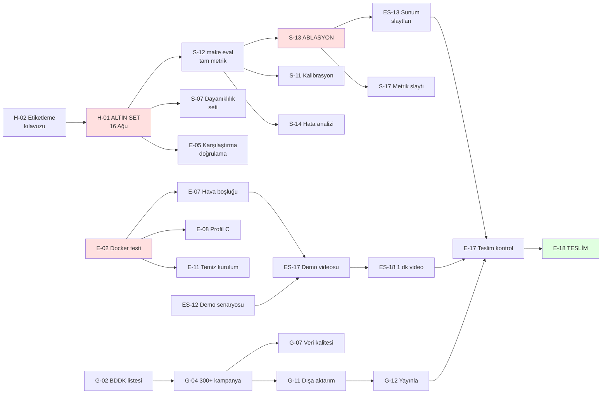

# 📋 GÖREV PANOSU — Takım SVARTAL

**Son güncelleme:** 9 Ağustos 2026
**Teslim:** 26 Ağustos 2026 23:59 · **Hedefimiz: 25 Ağustos 20:00**
**Özellik dondurma:** 🔒 **21 Ağustos Cuma 23:59 — istisnasız**

---

## 🧭 NASIL KULLANILIR

**Bu dosya tek doğruluk kaynağıdır. Kimseye "ben ne yapacağım?" diye sorma —
buraya bak.**

### 🔴 HER OTURUMDA — önce PULL, sonra PUSH

```bash
# ÇALIŞMAYA BAŞLARKEN — ilk iş
git pull --rebase origin main

# ... çalış, GOREVLER.md'de bitirdiğin göreve [x] at ...

# BIRAKMADAN ÖNCE — son iş
git add -A && git commit -m "..." && git push origin main
```

Dört kişi aynı depoda çalışıyor. **Pull etmeden düzenleme yapma** — çakışma
çıkar, kötü ihtimalde arkadaşının işini ezersin. **Pushlamadan bırakma** — işin
kimseye ulaşmaz, seni bekleyen arkadaşın boşuna bekler.

Bu iki adımı unutmayasın diye otomatik hatırlatma kurulu: oturum açıldığında
GitHub kontrol edilip geride kalınmışsa uyarı çıkar, oturum bitince
pushlanmamış iş varsa uyarı çıkar. Yapay zekâ ile çalışıyorsan o da sorar.
Elle kontrol için:

```bash
python3 tools/git_kontrol.py baslangic   # geride miyim?
python3 tools/git_kontrol.py bitis       # pushlanmamış işim var mı?
```

1. **Kendi bölümünü bul** (aşağıda adın var), sırayla yukarıdan aşağı çalış.
   Görevler öncelik sırasına dizildi; en üstteki senin bir sonraki işin.
2. **`⛔ Önce bitmeli:` satırı varsa bak.** Orada yazan görevler bitmeden bu işe
   başlayamazsın (aşağıda "Bağımlılıklar" bölümü var).
3. **Bitirdiğinde `[ ]` yerine `[x]` yaz**, yanına tarihini ekle.
   Örnek: `- [x] **G-01** EFT/BDDK kodlarını doğrula *(bitti: 11 Ağu)*`
4. **Sonra durma, bir sonraki `[ ]` göreve geç.**
5. Değişikliği commit'le: `git add GOREVLER.md && git commit -m "G-01 bitti"`
6. **Takıldıysan 30 dakika kuralı:** 30 dakikadan fazla takılan kişi gruba yazar.
   Tek başına 2 saat debug etmek, 180 saatlik bütçenin %1'ini yakar.

### ⚡ Tek komutla "benim görevim ne?"

Elle bakmana gerek yok — **bloke olup olmadığını da söyleyen** bir araç var:

```bash
make gorev ad=Esra          # Esra'nın yapabilecekleri + bloke olanlar
make gorev                  # herkesin özeti + darboğazlar
make gorev-dogrula          # panoyu denetle (bozuk bağımlılık, döngü)
```

Çıktı iki gruba ayrılır:

```
✅ ŞU AN BAŞLAYABİLİRSİN (12)
   Sıradaki işin: ES-01

⛔ ŞU AN YAPAMAZSIN (10) — önce başkasının işi bitmeli
   ES-13  Sunum slaytları — PDF + PPTX
        └─ bekliyor: S-13 (Samet) — ABLASYON TABLOSU
```

**Bloke bir işe takılma, listedeki bir sonraki yapılabilir işe geç.**
Düşük kapasitede boşta beklemek en pahalı şeydir.

### 🤖 Yapay zekâya sorarken

Bir yapay zekâya danışacaksan şunu yaz:

> `GOREVLER.md` dosyasını oku. Ben **[ADIN]**. Sıradaki görevim ne, bloke bir şey var mı?

Böylece hangi görevde olduğunu, ne yapılması gerektiğini, "bitti" sayılma
kriterini ve neyi beklediğini doğrudan görür.

### Görev satırı nasıl okunur

Aşağıdaki, Samet'in listesinden **gerçek** bir görev:

```
- [ ] **S-04** Sayısal alanlara akıl sağlığı sınırları · 📅 14 Ağu
      ↳ Bitti sayılır: 1000 TL'lik "finansman limiti" gibi saçma değerler kalmadı
```

| Parça | Anlamı |
|---|---|
| `S-04` | Görev kodu — **E**: Eren · **S**: Samet · **G**: Görkem · **ES**: Esra · **H**: Herkes |
| `📅` | Son tarih |
| `↳ Bitti sayılır:` | Hangi şart sağlanınca tik atabilirsin |
| `⛔ Önce bitmeli:` | Bu görev başlamadan önce bitmesi gereken görevler |
| 🔴 | Kritik — gecikirse puan kaybettirir |

---

## 🔗 BAĞIMLILIKLAR

Bazı görevler başkasının işi bitmeden başlayamaz. Kritik zincirler:



### 🚧 En çok işi tıkayan görevler

Bunlar gecikirse arkasındaki herkes bekler — öncelik sırasının gerçek tepesi:

| Görev | Kim | Kaç işi tıkıyor | Tıkananlar |
|---|---|---|---|
| **S-12** `make eval` tam metrik | Samet | 4 | S-11, S-13, S-14, S-15 |
| **G-04** 300+ kampanya topla | Görkem | 4 | G-07, G-08, G-11, G-15 |
| **E-02** Docker testi | Eren | 4 | E-07, E-08, E-09, E-11 |
| **S-13** Ablasyon tablosu | Samet | 3 | E-19, S-17, **ES-13** |
| **H-01** Altın veri seti | Herkes | 3 | E-05, S-07, S-12 |

> **Dikkat:** `H-01 → S-12 → S-13 → ES-13` zinciri projenin en uzun kritik
> yoludur. Altın set 16 Ağustos'ta bitmezse Esra'nın sunum slaytları
> 23 Ağustos'ta hazır olamaz. **Bu zincirdeki her gecikme aynen sona yansır.**

Bağımlılıkları elle takip etme, komutu çalıştır: `make gorev ad=<adın>`

---

## 📊 DURUM

| Sprint | Tarih | Durum |
|---|---|---|
| **S0** — Dikey dilim | 7–9 Ağu | ✅ **BİTTİ** — sistem uçtan uca çalışıyor |
| **S1** — Veri + çıkarım | 10–16 Ağu | 🔵 Sırada |
| **S2** — Zekâ katmanı | 17–21 Ağu | ⚪ |
| **S3** — Ölçüm + on-prem | 22–23 Ağu | ⚪ |
| **S4** — Teslim | 24–26 Ağu | ⚪ |

**Bugünkü durum:** 96 kampanya · 8 banka · halüsinasyon %0,25 · 100 test geçiyor
Ayrıntı: [`docs/SPRINT0_RAPORU.md`](docs/SPRINT0_RAPORU.md)

### Yük dağılımı

| Kişi | Açık görev | Sprint 0'da biten | Ana sorumluluk |
|---|---|---|---|
| Eren | 19 | 9 | Mimari · entegrasyon · on-prem · teslim |
| Esra | 18 | 5 | Arayüz · dashboard · **video ve sunum** |
| Samet | 17 | 6 | Çıkarım motoru · LLM · **ölçüm (%30)** |
| Görkem | 16 | 5 | Veri toplama · veri kalitesi · terim sözlüğü |
| Herkes | 4 | — | Altın set · etiketleme · stand-up |

Yük bilerek eşitlendi. Kimsenin işi diğerinden hafif değil; sadece farklı
sprintlerde yoğunlaşıyor. **Esra'nın işi Sprint 2 ve 4'te ağırlaşıyor**
(yan yana karşılaştırma, dışa aktarma, video, sunum), **Samet'inki Sprint 3'te**
(ölçüm ve ablasyon), **Görkem'inki Sprint 1'de** (300+ kampanya).

### 🚨 En kritik 3 şey

1. **Altın veri seti — 16 Ağustos.** Bu olmadan puanın %30'u ölçülemez. Herkes 25 örnek.
2. **Docker testi.** On-prem iddiası (%20) test edilmemiş bir Dockerfile'a dayanıyor.
3. **21 Ağustos özellik dondurma.** Sonrasında sadece ölçüm, doküman, video.

---

# 👥 HERKES — ortak görevler

Bunlar dördünüzün birlikte yapacağı işler. Kimse tek başına bitiremez.

- [ ] **H-01** 🔴 **ALTIN VERİ SETİ — kişi başı 25 örnek** · 📅 **16 Ağu (kesin)**
      ⛔ **Önce bitmeli:** H-02 (Herkes)
      ↳ Bitti sayılır: `data/gold/altin_set.jsonl` içinde 100 etiketli örnek var,
        `make eval` doğruluk metriklerini hesaplıyor (artık "beklemede" demiyor)
      ↳ Nasıl: Excel/Sheets'te etiketle, sonra JSONL'e çevir. Özel araç yazma.
      ↳ Katmanlama: her faal bankadan orantılı, her kampanya türünden en az 8 örnek
      ↳ **Gecikirse 100 → 60 örneğe düş, ama mutlaka yap.**

- [ ] **H-02** İlk 10 örneği DÖRDÜNÜZ BİRLİKTE etiketleyin, uyuşmazlıkları tartışın
      · 📅 **10 Ağu** (H-01'den önce, yoksa herkes farklı etiketler)
      ↳ Bitti sayılır: `docs/ETIKETLEME_KILAVUZU.md` yazıldı + uyum oranı hesaplandı
      ↳ Sunumda "etiketleme uzlaşmamız %X" cümlesi akademik jüriyi etkiler

- [ ] **H-03** Günlük yazılı stand-up · her gün 21:00 · WhatsApp
      ↳ Üç satır: dün ne yaptım / bugün ne yapacağım / neyde takıldım
      ↳ Canlı toplantı yapmayın — 90 dakikalık mesainin 15'ini yer

- [ ] **H-04** Karşılaşılan problemleri yazın (doküman başlığı 8) · sürekli
      ↳ Her önemli kararı `docs/kararlar/NNN-baslik.md` olarak kaydedin
      ↳ 24 Ağustos'ta derlemesi 30 dakika sürer; yoksa 4 saat

---

# 🧑‍✈️ EREN — Kaptan · mimari, entegrasyon, on-prem, teslim

### Hemen (10–14 Ağustos)

- [ ] **E-01** 🔴 GitHub deposu ayarları · 📅 **10 Ağu**
      ↳ Bitti sayılır: Repo topic'lerinde **`BilisimVadisi2026`** var,
        **"Türkiye Açık Kaynak Platformu"** etiketlenmiş, **takım adı** repo
        açıklamasında ve README'de, LICENSE = Apache 2.0, depo herkese açık
      ↳ ⚠️ `BilisimVadisi2026` etiketi eksikse **değerlendirmeye alınmama riski var**

- [ ] **E-02** 🔴 Docker'ı gerçekten test et · 📅 **12 Ağu**
      ↳ Bitti sayılır: `docker compose up -d` çalışıyor, Streamlit :8501'de açılıyor,
        API :8000/docs'ta açılıyor, `docker compose exec` ile crawl+extract koşuyor
      ↳ ⚠️ `Dockerfile` ve `docker-compose.yml` YAZILDI ama **hiç çalıştırılmadı**
        (geliştirme makinesinde Docker kurulu değil). On-prem puanının merkezi bu.
      ↳ Hata çıkarsa düzelt, `docs/KURULUM.md`'yi gerçek çıktıya göre güncelle

- [ ] **E-03** Haftalık GitHub güncellemesi + sürüm etiketi · 📅 **10, 16, 23 Ağu**
      ⛔ **Önce bitmeli:** E-01 (Eren)
      ↳ Bitti sayılır: `v0.1`, `v0.2`, `v0.9` etiketleri atıldı
      ↳ Şartname madde 9 zorunlu tutuyor, commit geçmişi kanıt

- [ ] **E-04** Boru hattını tüm faal bankalar için sağlamlaştır · 📅 14 Ağu
      ⛔ **Önce bitmeli:** G-02 (Görkem)
      ↳ Bitti sayılır: `make crawl && make extract` 300+ kampanyayı tek komutta işliyor

### Sprint 2 (17–21 Ağustos)

- [ ] **E-05** Karşılaştırma motorunu altın setle doğrula, kenar durumları kapat · 📅 19 Ağu
      ⛔ **Önce bitmeli:** H-01 (Herkes)
      ↳ Bitti sayılır: 5 kriterin her biri gerçek veriyle test edildi

- [ ] **E-06** Toplam maliyet hesaplayıcısını arayüze tam bağla · 📅 20 Ağu
      ↳ Motor hazır (`toplam_maliyet`), arayüzde tablo satırından tetiklenmeli

### Sprint 3 — ölçüm ve sertleştirme (22–23 Ağustos)

- [ ] **E-07** 🔴 **Hava boşluğu (air-gap) testi** · 📅 **23 Ağu**
      ⛔ **Önce bitmeli:** E-02 (Eren)
      ↳ Bitti sayılır: Ağ kesikken tam senaryo koşuyor, **video kaydı alındı**
      ↳ Adımlar: `docker compose up -d` → Wi-Fi kapat (ekranda görünsün) →
        `ping 8.8.8.8` başarısız → dashboard + chatbot çalışmaya devam ediyor
      ↳ `docker-compose.yml`'deki `internal: true` satırını aç
      ↳ **20 saniyelik gösteri, ~15 puan. Planın en yüksek getirili işi.**

- [ ] **E-08** 🔴 **Profil C testi — final laptopunda Qwen3.5-4B** · 📅 **23 Ağu**
      ⛔ **Önce bitmeli:** E-02 (Eren)
      ↳ Bitti sayılır: Demo laptopunda tüm sistem GPU'suz çalışıyor, süre ölçüldü
      ↳ Okul 3090'ını finale götüremezsin; uzaktan bağlanmak da olmaz (on-prem
        iddian çöker + etkinlik Wi-Fi'ı güvenilmez)

- [ ] **E-09** Egress + telemetri sertleştirmesini tamamla · 📅 22 Ağu
      ⛔ **Önce bitmeli:** E-02 (Eren)
      ↳ `tests/test_sizinti_yok.py` yazıldı ve geçiyor (6 test)
      ↳ Kalan: Docker içinde de doğrula, `.env` değerlerini teyit et

- [ ] **E-10** Kurumsal entegrasyon mimarisi diyagramı · 📅 23 Ağu
      ↳ Bitti sayılır: `docs/KURUMSAL_ENTEGRASYON.md` — LDAP/AD kimlik, kurumsal
        proxy arkasında çalışma, veri ambarına toplu besleme, denetim izi
      ↳ **Kod yazmana gerek yok, mimari çizim yeter.** ~2 saat, doğrudan puan.

- [ ] **E-11** 🔴 Temiz bilgisayarda sıfırdan kurulum testi · 📅 **23 Ağu**
      ⛔ **Önce bitmeli:** E-02 (Eren)
      ↳ Bitti sayılır: Bir arkadaşın senin dokümanınla kurdu, süre tutuldu
      ↳ **Kendi makinende çalışması sayılmaz.** 20 dakikayı geçiyorsa doküman eksik.

- [ ] **E-12** Şartname uyum takibi — madde madde · 📅 22 Ağu
      ↳ Bitti sayılır: `docs/SARTNAME_UYUM.md` — şartnamedeki **her maddeyi tek
        tek satır** olarak gir (~60 satır): madde no · gereklilik · sorumlu ·
        durum · kanıt linki
      ↳ Jüri şartnameye göre puanlıyor. Madde madde takip, unutulan bir
        gereklilik yüzünden puan kaybetmenin **tek panzehiri**.

- [ ] **E-13** Fiziki final hazırlığı — çanta listesi · 📅 23 Ağu
      ⛔ **Önce bitmeli:** E-08 (Eren) · ES-13 (Esra) · ES-17 (Esra)
      ↳ Bitti sayılır: Demo laptopu (tam sistem kurulu, offline test edilmiş),
        yedek laptop (ikinci kişide aynı kurulum), şarj + uzatma,
        **HDMI + USB-C ve HDMI + USB-A adaptörleri**, USB bellek (repo + model +
        slaytlar + video), slaytların yazıcı çıktısı, mobil hotspot
      ↳ Projeksiyon bağlantısı en sık yaşanan aksilik

- [ ] **E-14** Offline kurulum paketi hazırla · 📅 23 Ağu
      ↳ Bitti sayılır: `pip download -r requirements.txt -d paketler/` ile
        bağımlılıklar indirildi, USB'de duruyor
      ↳ Şartname "son 24 saat fiziki" diyor ve orada ek geliştirme istenebilir.
        Etkinlik Wi-Fi'ıyla `pip install` yapmayı planlama.

### Sprint 4 — teslim (24–26 Ağustos)

- [ ] **E-15** Dokümantasyon başlıkları 1, 6, 7 · 📅 24 Ağu
      ↳ (1) Sistem mimarisi ve veri akışı — `docs/MIMARI.md` hazır, gözden geçir
      ↳ (6) Ürünlerin nasıl karşılaştırıldığı
      ↳ (7) Adım adım çalıştırma talimatları — `docs/KURULUM.md` hazır, gözden geçir

- [ ] **E-16** Dokümantasyon başlığı 8'i derle · 📅 24 Ağu
      ⛔ **Önce bitmeli:** H-04 (Herkes)
      ↳ (8) Karşılaşılan problemler ve çözüm yaklaşımları
      ↳ `docs/SPRINT0_RAPORU.md` bölüm 5'te 6 hata zaten yazılı + `docs/kararlar/`
        altındaki ADR'ler. **Derlemesi 30 dakika**, sıfırdan yazmak 4 saat.

- [ ] **E-17** 🔴 Teslim kontrol listesini baştan sona tara · 📅 **25 Ağu**
      ⛔ **Önce bitmeli:** S-16 (Samet) · G-15 (Görkem) · ES-15 (Esra) · ES-16 (Esra) · ES-17 (Esra) · ES-18 (Esra) · ES-13 (Esra) · G-12 (Görkem)
      ↳ README bölüm "GitHub ve Teslimat Kontrol Listesi"ndeki her satır
      ↳ 10 dokümantasyon başlığının hepsi var mı, PDF **ve** PPTX var mı,
        5 dk **ve** 1 dk video var mı, veri seti bağlantısı çalışıyor mu

- [ ] **E-18** 🔴 **TESLİM** — her şey GitHub'da, `v1.0` etiketi · 📅 **25 Ağu 20:00**
      ⛔ **Önce bitmeli:** E-17 (Eren)

- [ ] **E-19** Jüri soru-cevap provası · 📅 26 Ağu
      ⛔ **Önce bitmeli:** S-13 (Samet) · E-07 (Eren)
      ↳ Bitti sayılır: Aşağıdaki 8 sorunun her birine 30 saniyede cevap
        verilebiliyor, herkes kendi alanını savunabiliyor

### ✅ Eren — bitenler (Sprint 0)

- [x] Şema sözleşmesi yazıldı ve donduruldu (`src/schema.py` v1.0.0) *(9 Ağu)*
- [x] Proje iskeleti, `Makefile`, `requirements.txt`, `.env.example` *(9 Ağu)*
- [x] SQLite + SQLAlchemy depolama katmanı *(9 Ağu)*
- [x] Karşılaştırma motoru — 5 kriter, şeffaf ağırlıklı skor *(9 Ağu)*
- [x] Toplam maliyet hesaplayıcı (annüite) *(9 Ağu)*
- [x] REST API — 3 uç nokta *(9 Ağu)*
- [x] `docker-compose.yml` + `Dockerfile` yazıldı *(9 Ağu — test edilmedi, bkz. E-02)*
- [x] Şartname okundu, ADR 004 yazıldı *(9 Ağu)*
- [x] Egress test takımı *(9 Ağu)*

---

# 🧪 SAMET — çıkarım motoru, LLM, değerlendirme

> **Senin işin projenin %30'luk kriterinin tamamı.** En yüksek ağırlıklı kalem.

### Hemen (10–14 Ağustos)

- [ ] **S-01** 🔴 3090'a erişimi kur ve doğrula · 📅 **10 Ağu**
      ↳ Bitti sayılır: 3090'da `ollama serve` çalışıyor, `qwen3.5:9b-q4_K_M` indi,
        `.env`'de `OLLAMA_HOST` ile bağlanılabiliyor
      ↳ Neden önemli: 8 GB laptopta 300 kampanya ~65 dk; 3090'da çok daha hızlı
        ve 9B modelle doğruluk artar

- [ ] **S-02** 🔴 `kar_payi_orani` doluluğunu yükselt · 📅 **13 Ağu**
      ↳ Şu an **%28**. En önemli alan bu ve en çok boş kalan bu.
      ↳ Bitti sayılır: doluluk ≥ %50 VEYA "sayfalarda gerçekten yazmıyor" ölçümle
        belgelendi (kaç sayfada oran geçiyor, sayarak)
      ↳ Yapılacaklar: kural katmanı bağlam sözcüklerini genişlet, LLM istemini
        sayısal alanlarda daha üretken yap, "%1,89'dan başlayan" gibi kalıpları test et

- [ ] **S-03** 🔴 Sınıflandırmayı düzelt — `diger` oranı **%38** · 📅 **13 Ağu**
      ⛔ **Önce bitmeli:** G-05 (Görkem)
      ↳ Bitti sayılır: `diger` oranı ≤ %15
      ↳ Sebep muhtemelen: çekilen sayfaların bir kısmı kampanya değil, genel ürün
        sayfası. İki yol: (a) istemi iyileştir, (b) kampanya olmayan sayfaları ele

- [ ] **S-04** Sayısal alanlara akıl sağlığı sınırları · 📅 14 Ağu
      ↳ Bitti sayılır: "1000 TL finansman limiti" gibi saçma değerler kalmadı
      ↳ Ör: finansman tutarı < 5.000 TL ise şüpheli, tahsis ücreti > 100.000 TL ise şüpheli
      ↳ `src/extraction/kural.py` içindeki `KuralTanimi`'ye alt/üst sınır alanı ekle

- [ ] **S-05** Kural/LLM uzlaşma oranını yükselt · 📅 14 Ağu
      ⛔ **Önce bitmeli:** S-02 (Samet)
      ↳ Şu an `hibrit` yalnız **11 alan**, çelişki 14. İki katmanın birbirini
        doğruladığı durum az; bu, güven skorunun kalibrasyonunu zayıflatıyor.
      ↳ Bitti sayılır: hibrit alan sayısı ≥ 50

- [ ] **S-06** Deney kaydı tut · 📅 sürekli
      ↳ Bitti sayılır: `docs/DENEYLER.md` — tarih, model/ayar, metrik, sonuç, commit
      ↳ İstemi 5 kez değiştirip hangisinin işe yaradığını hatırlamamak, aynı işi
        iki kez yapmak demektir. `docs/SONUCLAR.md` bu tablodan doğacak.

### Sprint 1 hafta sonu (15–16 Ağustos)

- [ ] **S-07** Dayanıklılık seti üreteci — **kodla üret, elle yazma** · 📅 16 Ağu
      ⛔ **Önce bitmeli:** H-01 (Herkes)
      ↳ Bitti sayılır: `make eval-robust` çalışıyor, ~400 bozuk varyant üretiliyor
      ↳ Bozma fonksiyonları: format değiştir (`%1,89` → `1.89 %`), para birimi
        değiştir, alan sil, dolaylı ifadeye çevir, boşluk ekle, tamamı büyük harf
      ↳ ~2 saatlik kod, elle 400 örnek yazmaya göre 20 saat tasarruf
      ↳ Şartnamenin *"eksik veya farklı yazılmış bilgiler karşısında doğru sonuç"*
        kriterini **doğrudan** ölçer

- [ ] **S-08** Dolaylı ifade testi (şartname 5.2) · 📅 16 Ağu
      ↳ Şartname dört ifadeyi açıkça sayıyor: *"%2,05 kâr payı oranı"*,
        *"avantajlı kâr payı fırsatı"*, *"özel oranlı finansman"*,
        *"düşük maliyetli finansman"*
      ↳ Bitti sayılır: Dördü de test setinde var; sayısız olanlarda model
        **sayı uydurmuyor**, ifadeyi `kampanya_avantaji`'na yazıyor

### Sprint 2 (17–21 Ağustos)

- [ ] **S-09** Gömme boru hattı + kosinüs benzerlik RAG · 📅 19 Ağu
      ⛔ **Önce bitmeli:** G-13 (Görkem)
      ↳ Model: `ytu-ce-cosmos/turkish-e5-large` (lisansını repodan doğrula!)
        Yedek: BGE-M3 (MIT)
      ↳ Bitti sayılır: `src/rag/` içinde gömme + kosinüs arama var, chatbot'un
        `_kosul_cevabi` fonksiyonu anahtar sözcük yerine bunu kullanıyor
      ↳ ⚠️ Gemma tabanlı gömme modeli **KULLANMA** (EmbeddingGemma dahil) — lisans
      ↳ ⚠️ Gömmeler diske yazılsın (`data/embeddings.npy`); her açılışta yeniden
        hesaplamak final laptopunda demoyu geciktirir

- [ ] **S-10** Chatbot 30 soruluk test seti · 📅 20 Ağu
      ↳ Bitti sayılır: 30 soru + beklenen cevap, doğruluk ölçülüyor (hedef ≥0,88),
        kaynak gösterme oranı 1,00
      ↳ Şartname madde 11'deki iki senaryoyu mutlaka içersin
      ↳ Kapsam dışı sorular da olsun — sistem "bilmiyorum" diyebilmeli

- [ ] **S-11** Güven skoru kalibrasyonu · 📅 21 Ağu
      ⛔ **Önce bitmeli:** S-12 (Samet)
      ↳ Bitti sayılır: Güven skoru ile gerçek doğruluk arasındaki ilişki ölçüldü;
        yüksek güvenli alanlar gerçekten daha doğru mu?
      ↳ Altın set gelince yapılabilir. Kalibre olmayan bir güven skoru,
        kullanıcıyı yanıltır — olmamasından kötüdür.

### Sprint 3 (22–23 Ağustos)

- [ ] **S-12** 🔴 `make eval` tam metrik takımı · 📅 **22 Ağu**
      ⛔ **Önce bitmeli:** H-01 (Herkes)
      ↳ Bitti sayılır: alan bazlı doğruluk, F1, makro-F1, halüsinasyon oranı
        `docs/SONUCLAR.md`'de otomatik dolduruluyor
      ↳ İskelet hazır (`eval/calistir.py`), altın set gelince aktifleşiyor

- [ ] **S-13** 🔴 **ABLASYON TABLOSU** · 📅 **22 Ağu**
      ⛔ **Önce bitmeli:** S-12 (Samet)
      ↳ Bitti sayılır: üç yapılandırma koşuldu ve tablo doldu:
        `make extract-kural && make eval` / `make extract-llm && make eval` /
        `make extract && make eval`
      ↳ **Sunumun en güçlü slaydı.** Jürinin "neden sadece LLM kullanmadınız?"
        sorusunun hazır cevabı. ~3 saat.

- [ ] **S-14** Hata analizi — en çok hangi alan yanlış? · 📅 23 Ağu
      ⛔ **Önce bitmeli:** S-12 (Samet)
      ↳ Bitti sayılır: `docs/HATA_ANALIZI.md` — altın sete göre en çok hatalı
        3 alan, sebepleri ve alınan aksiyon
      ↳ "Neyi bilmiyoruz"u bilmek, jüriye olgunluk sinyali verir. Ayrıca
        dokümantasyon başlığı 8'in malzemesi.

- [ ] **S-15** Model boyutu karşılaştırması (4B / 9B / 27B) · 📅 23 Ağu
      ⛔ **Önce bitmeli:** S-01 (Samet) · S-12 (Samet)
      ↳ Bitti sayılır: `docs/SONUCLAR.md`'ye "model boyutu vs doğruluk" satırı eklendi
      ↳ 30 dakikalık iş, ölçeklenebilirlik iddiasını kanıtlar (şartname 5.10)
      ↳ 27B için 3090 gerekiyor — S-01'i erken bitir

### Sprint 4 (24–26 Ağustos)

- [ ] **S-16** Dokümantasyon başlıkları 2, 5, 10 · 📅 24 Ağu
      ↳ (2) Kullanılan NLP yaklaşımı · (5) Model veya kural yapısı ·
        (10) Performans değerlendirme yöntemleri
      ↳ `docs/MIMARI.md` bölüm 3 iyi bir başlangıç

- [ ] **S-17** Sunum metrik slaytını hazırla (2:00–2:45 senin) · 📅 25 Ağu
      ⛔ **Önce bitmeli:** S-13 (Samet)
      ↳ Bitti sayılır: Metrik tablosu + ablasyon + halüsinasyon oranı tek slaytta,
        45 saniyede anlatılacak şekilde prova edildi
      ↳ Sayıları `docs/SONUCLAR.md`'den kopyala — elle yazma, hata kaynağı

### ✅ Samet — bitenler (Sprint 0)

- [x] Kural katmanı — bağlam + cümle sınırı + olumsuzlama denetimi *(9 Ağu)*
- [x] LLM katmanı — Ollama, JSON şema kısıtı, birebir kopya doğrulaması *(9 Ağu)*
- [x] Uzlaştırıcı — hibrit birleştirme, çelişki kaydı *(9 Ağu)*
- [x] Türkçe normalizasyon (`tr_kucult`, sayı, para, tarih, vade) *(9 Ağu)*
- [x] `think=False` keşfi — kayıt başına 3 dk → 13 sn *(9 Ağu)*
- [x] Değerlendirme iskeleti `eval/calistir.py` *(9 Ağu)*

---

# 📊 GÖRKEM — veri toplama, veri kalitesi, terim sözlüğü

### Hemen (10–14 Ağustos)

- [ ] **G-01** 🔴 EFT/BDDK kodlarını doğrula · 📅 **11 Ağu**
      ↳ `data/banks.yaml`'da `kod_dogrulandi: false` olan **3 banka**:
        Albaraka Türk, Hayat Finans, T.O.M., Dünya Katılım
      ↳ Bitti sayılır: hepsi BDDK/TBB kaynağından teyit, `kod_dogrulandi: true`
      ↳ Yanlış kod çıkarımı bozmaz ama yayınlanan veri setinde hata olur

- [ ] **G-02** 🔴 BDDK listesini resmî kaynaktan tamamla + ekran görüntüsü · 📅 **11 Ağu**
      ↳ Bitti sayılır: `docs/kanit/bddk-liste.png` var, `banks.yaml` BDDK ile birebir
      ↳ BDDK robots.txt otomatik erişimi engelliyor → **elle al** (şartname izin veriyor)
      ↳ Faaliyete geçmemiş bankaları da listede tut, `durum` ile işaretle

- [ ] **G-03** T.O.M. Katılım kampanya sayfasını bul · 📅 12 Ağu
      ↳ 9 Ağu sondajında ana sayfada kampanya bağlantısı bulunamadı (JS render olabilir)
      ↳ Bitti sayılır: `seed_urls` dolduruldu VEYA "kampanya yayınlamıyor" notu düşüldü
      ↳ Bulunamazsa manuel toplama yedeği kullan

- [ ] **G-04** 🔴 **300+ kampanya topla** · 📅 **14 Ağu**
      ⛔ **Önce bitmeli:** G-02 (Görkem) · G-03 (Görkem)
      ↳ Şu an **96**. Hedef 300+.
      ↳ Bitti sayılır: `make durum` 300+ kampanya gösteriyor, tüm faal bankalar temsil edilmiş
      ↳ Her banka için `url_desenleri`'ni gözden geçir; bazı siteler `/firsatlar`,
        `/avantajlar` gibi farklı yollar kullanıyor
      ↳ ⚠️ `make extract` koşarken **Streamlit'i kapat** — açıkken 12 kat yavaş

- [ ] **G-05** **Kampanya olmayan sayfaları ayıkla** · 📅 14 Ağu
      ↳ Bitti sayılır: Toplanan sayfaların kaçı gerçek kampanya, kaçı genel ürün
        sayfası — sayıldı ve toplayıcı süzgeci buna göre düzeltildi
      ↳ Samet'in `diger` oranı %38 sorununun (S-03) muhtemel kaynağı bu.
        **Ona bu ölçümü ver, birlikte çözün.**

- [ ] **G-06** Manuel toplama yedeği · 📅 14 Ağu
      ⛔ **Önce bitmeli:** G-03 (Görkem)
      ↳ Bitti sayılır: JS ile render edilen sitelerden (T.O.M. gibi) elle
        toplanan kampanyalar `data/seed/` biçiminde sisteme girdi
      ↳ Şartname 5.1 manuel toplamaya açıkça izin veriyor — utanılacak bir şey değil,
        dokümantasyonda **yöntem olarak** anlat

### Sprint 1 hafta sonu (15–16 Ağustos)

- [ ] **G-07** Veri kalitesi kontrolleri · 📅 16 Ağu
      ⛔ **Önce bitmeli:** G-04 (Görkem)
      ↳ Bitti sayılır: `docs/VERI_KALITESI.md` — aykırı değer, çelişki, eksiklik raporu
      ↳ Ör: finansman tutarı < 5.000 TL olanlar, vade > 360 ay olanlar, aynı
        bankada çelişen oranlar
      ↳ Jürinin "bankalar sitelerini değiştirirse?" sorusunun cevabı bu rapor:
        kırılma olduğunda uyarı üretiyoruz

- [ ] **G-08** Banka bazlı kapsam raporu · 📅 16 Ağu
      ⛔ **Önce bitmeli:** G-04 (Görkem)
      ↳ Bitti sayılır: Hangi bankadan kaç kampanya, hangi türlerde — tablo halinde
      ↳ Bir bankadan 40, diğerinden 2 kampanya varsa karşılaştırma yanlı olur.
        Dengesizliği **bilerek** raporlamak, fark etmemekten iyidir.

### Sprint 2 (17–21 Ağustos)

- [ ] **G-09** Katılım bankacılığı terim sözlüğü — **min. 60 terim** · 📅 19 Ağu
      ↳ Bitti sayılır: `docs/TERIM_SOZLUGU.md` yayınlandı
      ↳ Şartname 5.5'teki 5 resmî tanımla başla (kâr payı oranı, finansman
        maliyeti, katılım fonu, masrafsız finansman, avantajlı finansman),
        üstüne murabaha, muşaraka, mudaraba, icara, sukuk, tekafül... ekle
      ↳ Bu sözlük LLM istemine de besleniyor (`src/extraction/llm.py`, `TERIMLER`) —
        yani doğrudan model başarısını etkiliyor, süs değil

- [ ] **G-10** Terim sözlüğünü LLM istemine bağla · 📅 20 Ağu
      ⛔ **Önce bitmeli:** G-09 (Görkem)
      ↳ Bitti sayılır: `TERIMLER` sabiti `docs/TERIM_SOZLUGU.md`'den besleniyor,
        sözlük büyüyünce istem kendiliğinden güncelleniyor
      ↳ **Samet ile birlikte yap** — çıkarım doğruluğu ölçülerek karşılaştırılsın

- [ ] **G-11** Veri seti dışa aktarım sürümü + `DATASET_CARD.md` · 📅 21 Ağu
      ⛔ **Önce bitmeli:** G-04 (Görkem)
      ↳ Bitti sayılır: `data/exports/` altında yayınlanabilir veri seti var
      ↳ ⚠️ **Tam sayfa metni koyma** — yapısal alanlar + URL + alıntı parçası.
        Telif riski böyle sıfırlanır.
      ↳ Şartname madde 9: "veri setinin indirilebileceği herkese açık bağlantı" zorunlu

### Sprint 3 (22–23 Ağustos)

- [ ] **G-12** 🔴 Veri setini yayınla — GitHub Release ve/veya Hugging Face · 📅 **22 Ağu**
      ⛔ **Önce bitmeli:** G-11 (Görkem)
      ↳ Bitti sayılır: Herkese açık indirme bağlantısı var ve README'de duruyor
      ↳ Bağlantı yoksa şartname madde 9 ihlal edilmiş olur

- [ ] **G-13** Lisans raporunu güncelle (`make lisanslar`) · 📅 22 Ağu
      ↳ Yeni bağımlılık eklendiyse rapor değişir; ✅ şu an 72 paketin tamamı temiz
      ↳ ⚠️ Samet gömme modeli eklerken (S-09) **lisansını sen doğrula** —
        Gemma tabanlı model gelirse şartname 5.10 ihlali olur

- [ ] **G-14** Veri toplama etiği kanıt dosyası · 📅 23 Ağu
      ⛔ **Önce bitmeli:** G-02 (Görkem)
      ↳ Bitti sayılır: `docs/kanit/` altında BDDK ekran görüntüsü, robots.txt
        kontrol günlüğü örneği, kullanılan User-Agent kaydı
      ↳ Jüri "veri toplarken hukuki durum?" diye soracak; cevabın **kanıtı** olsun

### Sprint 4 (24–26 Ağustos)

- [ ] **G-15** Dokümantasyon başlıkları 3, 4 · 📅 24 Ağu
      ⛔ **Önce bitmeli:** G-04 (Görkem)
      ↳ (3) Kullanılan veri seti ve açıklaması · (4) Veri ön işleme adımları
      ↳ `docs/VERI_METODOLOJISI.md` hazır, gerçek sayılarla güncelle

- [ ] **G-16** Veri seti bağlantılarını son kontrol · 📅 25 Ağu
      ⛔ **Önce bitmeli:** G-12 (Görkem)
      ↳ Bitti sayılır: README'deki veri seti ve lisans bağlantıları çalışıyor,
        gizli/özel depo değil

### ✅ Görkem — bitenler (Sprint 0)

- [x] `banks.yaml` kayıt defteri — 15 banka, 9 faal *(9 Ağu)*
- [x] Kampanya URL'leri canlı sondajla doğrulandı (6/9 banka) *(9 Ağu)*
- [x] Jenerik toplayıcı — robots.txt, hız sınırı, sitemap keşfi *(9 Ağu)*
- [x] `docs/VERI_METODOLOJISI.md` *(9 Ağu)*
- [x] Lisans raporu üreteci — 72 paket, hepsi temiz *(9 Ağu)*

---

# 🎨 ESRA — arayüz, dashboard, chatbot paneli, sunum ve video

> **Senin işin jürinin GÖRDÜĞÜ her şey.** Fonksiyonellik (%20) kriterinin
> "çıktıların doğru ve anlaşılır olması" maddesi ve Yenilikçilik (%10)
> kriterinin "dokümantasyonun açık ve anlaşılır olması" maddesi senin elinde.
> Ayrıca **video ve sunum zorunlu teslimat** — bunlar olmadan yarışamayız.

### Hemen (10–14 Ağustos)

- [ ] **ES-01** Genel Bakış ekranını gerçek veriyle cilala · 📅 11 Ağu
      ↳ Bitti sayılır: 96+ kayıtla grafikler okunaklı, ısı haritası taşmıyor,
        uzun banka adları kırpılıyor
      ↳ `app/Genel_Bakis.py` çalışıyor; tür dağılımı ve banka×tür ısı haritası var

- [ ] **ES-02** Karşılaştırma ekranı — açılır kanıt panelini gözden geçir · 📅 12 Ağu
      ↳ Bitti sayılır: Her satır açıldığında tüm alanlar + güven skoru +
        **kaynak alıntısı ve URL** görünüyor
      ↳ Bankacılıkta izlenebilirlik olmadan hiçbir sistem kabul edilmez — bu panel
        o iddianın arayüzdeki karşılığı

- [ ] **ES-03** Yükleniyor / hata / boş durumlar · 📅 13 Ağu
      ↳ Bitti sayılır: Veritabanı boşken, sorgu sonuç döndürmediğinde, LLM
        cevap veremediğinde ekran kırılmıyor, anlamlı mesaj gösteriyor
      ↳ Jüri demo sırasında boş bir filtre seçerse ekran patlamamalı

- [ ] **ES-04** Arama ve filtreleme · 📅 14 Ağu
      ↳ Bitti sayılır: Kampanya adı/metninde serbest metin araması, banka +
        kampanya türü + tarih aralığı filtreleri çalışıyor
      ↳ 300 kampanyaya çıkınca tabloyu gözle taramak imkânsız olacak

- [ ] **ES-05** **Veri kalitesi paneli** · 📅 14 Ağu
      ↳ Bitti sayılır: Genel Bakış'ta alan doluluk oranları, güven skoru dağılımı
        ve `Belirtilmemiş` sayıları görünüyor
      ↳ Bu ekran banka çalışanına "hangi veriye ne kadar güvenebilirim" der.
        Veriyi olduğundan iyi göstermemek jüriye dürüstlük sinyali verir.

### Sprint 2 — zekâ katmanı arayüzü (17–21 Ağustos)

- [ ] **ES-06** Chatbot paneli — kaynak kartları ve doğrulama rozeti · 📅 18 Ağu
      ↳ İskelet hazır (`app/pages/2_Chatbot.py`)
      ↳ Bitti sayılır: Her cevapta niyet etiketi, ✅/⛔ doğrulama rozeti ve
        kaynak kartları görünüyor; sohbet geçmişi korunuyor

- [ ] **ES-07** Ağırlık kaydırıcıları + vade farkı uyarısı · 📅 19 Ağu
      ↳ Kenar çubuğunda kaydırıcılar var; gerçek veriyle test et
      ↳ Jüri "en avantajlıyı nasıl belirliyorsunuz?" diye **kesin soracak** —
        cevap: "kullanıcı ağırlıkları belirliyor, formül dokümantasyonda"

- [ ] **ES-08** **Yan yana karşılaştırma + toplam maliyet** · 📅 20 Ağu
      ⛔ **Önce bitmeli:** E-06 (Eren)
      ↳ Bitti sayılır: İki (veya üç) kampanya seçilip yan yana konabiliyor,
        her biri için toplam maliyet hesaplanıp tabloda gösteriliyor
      ↳ Motor hazır: `src/comparison/karsilastirma.py::toplam_maliyet`
      ↳ Şartname madde 11'in örnek çıktı tablosu tam olarak bu — jüri bunu görmek istiyor

- [ ] **ES-09** **Dışa aktarma: CSV / Excel indir** · 📅 21 Ağu
      ↳ Bitti sayılır: Karşılaştırma tablosu tek tıkla indiriliyor, indirilen
        dosyada kaynak URL ve çekim tarihi de var
      ↳ Banka çalışanı raporu Excel'e alıp toplantıya götürür — gerçek ihtiyaç.
        Ayrıca "kurum sistemlerine entegre edilebilirlik" iddiasını destekler.

- [ ] **ES-10** Chatbot örnek soru seti + **kullanıcı testi** · 📅 21 Ağu
      ⛔ **Önce bitmeli:** ES-06 (Esra)
      ↳ Bitti sayılır: Arayüzde hazır örnek sorular var; **projeyi hiç bilmeyen
        birine kullandırıp** takıldığı yerleri not ettin
      ↳ Samet'in 30 soruluk test setiyle (S-10) karıştırma: o doğruluk ölçer,
        bu kullanılabilirlik ölçer

### Sprint 3 — cila ve hazırlık (22–23 Ağustos)

- [ ] **ES-11** Dar ekran / projeksiyon kontrolü · 📅 22 Ağu
      ⛔ **Önce bitmeli:** ES-01 (Esra) · ES-02 (Esra) · ES-04 (Esra)
      ↳ Bitti sayılır: 1280×720 çözünürlükte tablolar taşmıyor, yazılar okunuyor
      ↳ Finalde projeksiyona bağlanacaksın; kendi 27" ekranında iyi görünmesi
        hiçbir şey ifade etmiyor

- [ ] **ES-12** 🔴 Demo senaryosu — yaz, prova et, süre tut · 📅 **22 Ağu**
      ⛔ **Önce bitmeli:** ES-06 (Esra) · ES-08 (Esra) · ES-09 (Esra)
      ↳ Bitti sayılır: `sunum/DEMO_SENARYOSU.md` — hangi ekran, hangi tıklama,
        hangi sırayla, hangi saniyede. 3 kez prova edildi.
      ↳ Canlı demo doğaçlama yapılmaz; tek bir yanlış tıklama 4 dakikayı yakar

- [ ] **ES-13** 🔴 Sunum slaytları — **PDF + PPTX** · 📅 **23 Ağu**
      ⛔ **Önce bitmeli:** S-13 (Samet)
      ↳ Şartname madde 6 **her iki formatı da** zorunlu tutuyor
      ↳ Her konuşmacının slaydının köşesinde adı ve rolü dursun (madde 8:
        tüm üyelerin görev tanımları sunumda olmalı) — ayrı slayt yapma
      ↳ Metrikleri `docs/SONUCLAR.md`'den kopyala, elle yazma

### Sprint 4 — teslim (24–26 Ağustos)

- [ ] **ES-14** Ekran görüntüleri — README ve dokümantasyon için · 📅 24 Ağu
      ⛔ **Önce bitmeli:** ES-11 (Esra)
      ↳ Bitti sayılır: `docs/gorseller/` altında 3 ekranın görüntüsü var,
        README'de gömülü
      ↳ Jürinin ilk 30 saniyesi README'de geçiyor; ekran görüntüsü olmayan bir
        README "çalışıyor mu acaba" sorusu bıraktırır

- [ ] **ES-15** Model çıktı örnekleri (doküman başlığı 9) · 📅 24 Ağu
      ↳ Bitti sayılır: `docs/CIKTI_ORNEKLERI.md` — girdi metni → yapısal çıktı
        eşleşmeleri, kanıt zinciriyle (alıntı + güven + yöntem)
      ↳ En az 5 örnek: biri temiz, biri eksik bilgili, biri dolaylı ifadeli

- [ ] **ES-16** Kullanım kılavuzu (banka çalışanı için) · 📅 24 Ağu
      ⛔ **Önce bitmeli:** ES-14 (Esra)
      ↳ Bitti sayılır: `docs/KULLANIM_KILAVUZU.md` — üç ekranın ne işe yaradığı,
        ekran görüntüleriyle. Teknik değil, kullanıcı dilinde.

- [ ] **ES-17** 🔴 **DEMO VİDEOSU — maks. 5 dakika** · 📅 **25 Ağu**
      ⛔ **Önce bitmeli:** ES-12 (Esra) · E-07 (Eren)
      ↳ Şartname madde 6 zorunlu. **Altı unsur da görünmeli:** kullanıcı arayüzü,
        dashboard, chatbot, metin girdisi, yapılandırılmış çıktı, karşılaştırma sonuçları
      ↳ 2 saat: OBS ile ekran kaydı, tek çekimde, sesli anlatımla. **Kurgu yapma.**
      ↳ İçerik sırası: problem (20sn) → mimari (25sn) → çıkarım demo (60sn) →
        dashboard karşılaştırma (60sn) → chatbot (50sn) → **hava boşluğu kanıtı
        (30sn)** → metrikler (30sn) → kapanış (15sn)

- [ ] **ES-18** 🔴 **1 dakikalık kısa video** (sunum için) · 📅 **25 Ağu**
      ⛔ **Önce bitmeli:** ES-17 (Esra)
      ↳ 30 dk: en iyi 60 saniyeyi kes. Şartname madde 10 zorunlu tutuyor.
      ↳ Videoyu laptopta **yerel dosya** olarak da bulundur — YouTube'a güvenme

### ✅ Esra — bitenler (Sprint 0)

- [x] Streamlit 3 sayfa iskeleti kuruldu, üçü de hatasız render ediyor *(9 Ağu)*
- [x] Genel Bakış: metrikler, tür dağılımı, banka×tür ısı haritası *(9 Ağu)*
- [x] Karşılaştırma: 5 kriter butonu, ağırlık kaydırıcıları, kanıt paneli *(9 Ağu)*
- [x] Chatbot paneli: niyet etiketi, doğrulama rozeti, kaynak kartları *(9 Ağu)*
- [x] Banka kayıt defteri ekranı + veri metodolojisi açılır paneli *(9 Ağu)*

---

## 📅 SUNUM GÖREV DAĞILIMI (4 dakika)

| Süre | İçerik | Konuşan |
|---|---|---|
| 0:00–0:30 | Problem, sayıyla | **Eren** |
| 0:30–1:00 | Mimari — tek slayt, tek diyagram | **Eren** |
| 1:00–2:00 | 1 dakikalık demo videosu | — |
| 2:00–2:45 | Model başarısı: metrikler + ablasyon + halüsinasyon oranı | **Samet** |
| 2:45–3:10 | Veri: kaç banka, kaç kampanya, altın set, açık kaynak yayın | **Görkem** |
| 3:10–3:40 | On-prem: hava boşluğu kanıtı + donanım profilleri | **Eren** |
| 3:40–4:00 | Yenilikçilik + kapanış | **Esra** |

---

## 🎯 JÜRİNİN SORACAĞI SORULAR — hazır cevaplar

Herkes bunları bilsin, sahibi kim olursa olsun.

1. **"Bankalar sitelerini değiştirirse?"** → Toplayıcı yapılandırma tabanlı, yeni
   banka eklemek 8 satır YAML. Gövde ayıklama sezgisel. Veri kalitesi kontrolleri
   kırılmada uyarı üretiyor.
2. **"Model uydurma oran söyler mi?"** → Hayır, mimari olarak engelli. Sayısal
   cevaplar RAG'dan değil yapısal veriden geliyor, üstüne sayısal doğrulama kalkanı
   var. Ölçülen halüsinasyon oranımız **%0,25**.
3. **"En avantajlıyı nasıl belirliyorsunuz?"** → Şeffaf ağırlıklı skor, ağırlıklar
   kullanıcı tarafından ayarlanabilir, formül dokümantasyonda.
4. **"Bu gerçekten bankada çalışır mı?"** → Hava boşluğunda test edildi, 4 donanım
   profilinde ölçüldü, kurumsal entegrasyon mimarisi dokümante edildi.
5. **"Neden sadece LLM kullanmadınız?"** → Ablasyon tablosu. Hibrit yaklaşım
   sayısal alanlarda kuralın kesinliğini, metinsel alanlarda LLM'in esnekliğini
   birleştiriyor. Ölçtük.
6. **"Neden Streamlit? Basit değil mi?"** → Kurum içi dağıtımda tek runtime, ayrı
   Node bağımlılığı yok, Apache 2.0. Ekran değil sistem yarışıyoruz; API katmanı
   ayrı ve her arayüze bağlanabilir.
7. **"Veri toplarken hukuki durum?"** → robots.txt uyumu, hız sınırı, sadece
   kamuya açık sayfa, kişisel veri yok, yayınlanan sette tam metin değil yapısal
   alan + kaynak. BDDK sayfası robots kısıtı nedeniyle manuel.
8. **"Ölçeklenebilir mi?"** → Toplayıcı yatay ölçeklenir, çıkarım toplu işlenir,
   model boyutu donanıma göre değiştirilebilir (4B–27B ölçüm tablosu),
   SQLite→PostgreSQL geçişi config değişikliği.

---

## ⚠️ PUAN KAYBETTİREN 10 HATA

1. Metrik olmadan sunum yapmak — "iyi çalışıyor" cümlesi %30'luk kriterde sıfır puan
2. Sadece kendi bilgisayarında çalışan kurulum
3. Llama veya Gemma türevi model kullanmak (şartname 5.10 doğrudan bunu hedefliyor)
4. Haftalık GitHub güncellemesini atlamak
5. On-prem iddiasını kanıtsız bırakmak — 20 puan kolayca kaybedilir
6. "En avantajlı"yı kara kutu bırakmak
7. Kaynak göstermeyen çıktı
8. **`BilisimVadisi2026` etiketini unutmak** — değerlendirmeye alınmama riski
9. 10 dokümantasyon başlığından birini eksik bırakmak
10. Son 3 günü kod yazarak geçirmek

---

## 🔧 SIK KULLANILAN KOMUTLAR

```bash
make kur          # kurulum (bir kez)
make crawl        # banka sitelerinden kampanya topla
make extract      # çıkarım (kural + LLM) → SQLite
make durum        # kaç kampanya, kaç banka
make run          # Streamlit arayüzü
make test         # testler (şu an 100 test)
make eval         # metrikler → docs/SONUCLAR.md
make lisanslar    # lisans raporu
```

> ⚠️ **`make extract` çalışırken `make run`'ı kapat.** 8 GB makinede aynı anda
> açık olunca kayıt başına 13 saniye yerine 2,5 dakika sürüyor (bellek takası).

---

## 📚 NEREYE BAKMALI

| Ne arıyorsun | Dosya |
|---|---|
| Sprint 0'da ne yapıldı, ne bozuktu | [`docs/SPRINT0_RAPORU.md`](docs/SPRINT0_RAPORU.md) |
| Sistem nasıl çalışıyor | [`docs/MIMARI.md`](docs/MIMARI.md) |
| Nasıl kurulur / çalıştırılır | [`docs/KURULUM.md`](docs/KURULUM.md) |
| Veri nereden, nasıl toplandı | [`docs/VERI_METODOLOJISI.md`](docs/VERI_METODOLOJISI.md) |
| Güncel metrikler | [`docs/SONUCLAR.md`](docs/SONUCLAR.md) |
| Neden şu karar alındı | [`docs/kararlar/`](docs/kararlar/) |
| Şartname bulguları | [`docs/kararlar/004-sartname-bulgulari.md`](docs/kararlar/004-sartname-bulgulari.md) |
| Veri şeması (DEĞİŞTİRME) | [`src/schema.py`](src/schema.py) |
