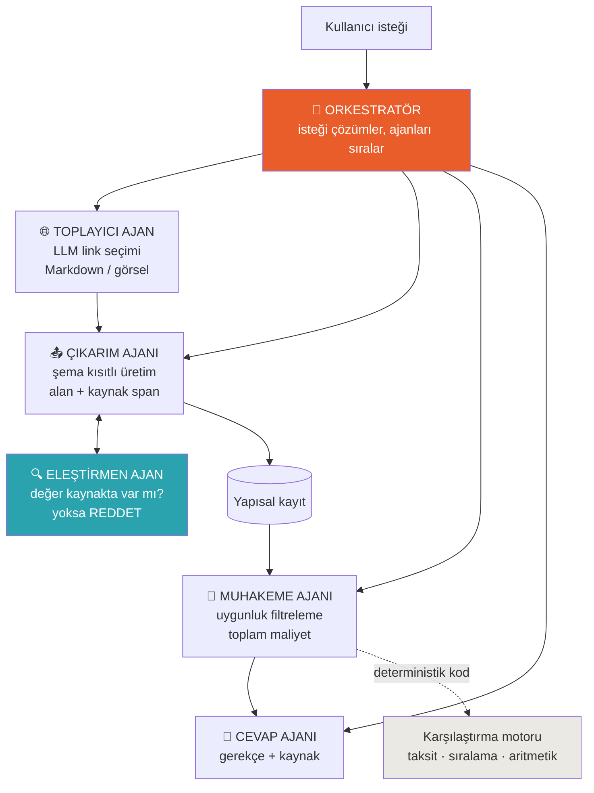

# Plan Güncellemeleri — v2 → v3

> 🗄️ **TARİHSEL BELGE — 14 Ağustos'ta yazıldı, sistemin bugünkü hâlini anlatmaz.**
> Buradaki 3090 / 27B model satırları geçersizdir: çıkarım **EVREN**'de koşuyor
> ([ADR 013](docs/kararlar/013-evren-model-lisans-durusu.md)), 3090 yolu hiç kurulmadı.
> Güncel durum → [`GOREVLER.md`](GOREVLER.md) · [`docs/MIMARI.md`](docs/MIMARI.md) ·
> [`docs/SONUCLAR.md`](docs/SONUCLAR.md).
## Mentör Geri Bildirimi Sonrası Değişiklikler

**Bu dosya sadece DEĞİŞENLERİ içerir.** Ana plandaki ([`TEKNOFEST_2026_Proje_Plani(1).md`](TEKNOFEST_2026_Proje_Plani%281%29.md)) diğer her şey — takvim, kapasite matematiği, GitHub kontrol listesi, risk kaydı, fiziki final hazırlığı, sunum yapısı — aynen geçerli.

---

## 1. ÜRÜN TANIMI — değişti

**ESKİ:**
> Katılım bankalarının sitelerindeki kampanya metinlerini toplayan, finansal bilgileri çıkaran, bankalar arası karşılaştırma yapan sistem.

**YENİ:**
> **Banka çalışanının önündeki müşteri profiline göre**, hangi rakip kampanyaların gerçekten uygulanabilir olduğunu bulan; bunları **toplam maliyete** göre sıralayan; her gerekçeyi kaynak metne bağlayarak gösteren, tamamen kurum içinde çalışan ajan tabanlı sistem.

**Neden değişti:** Mentörün "problemi içselleştirin, kendinden bir şey kat" geri bildirimi. Eski tanım herhangi bir alana uygulanabilirdi. Yeni tanım, banka çalışanının gerçek sorusunu cevaplıyor:

> *"Karşımda maaş müşterisi, 3 yıldır bizde, 800.000 TL konut finansmanı istiyor, 10 yıl vade. Rakiplerin hangisi bizden iyi teklif veriyor ve neden?"*

Bu bir arama değil, **kısıt çözme problemi.** Kampanya koşulları birbiriyle etkileşiyor (yeni müşteri VE maaş müşterisi VE tutar aralığı VE vade sınırı). Bu, çıkarımdan tamamen farklı bir yetenek ve multiagent yapıya gerçek bir sebep veriyor.

---

## 2. MODEL SEÇİMİ — ⚠️ KRİTİK DÜZELTME

### Qwen 3.7 KULLANILAMAZ

Mentörün önerisi ama **Qwen 3.7 Max kapalı ağırlıklı.** Sadece DashScope API üzerinden erişiliyor, ağırlıkları indirilemiyor, token başına ücretli.

Üç şartname maddesini birden ihlal eder:

| Madde | İhlal |
|---|---|
| 5.10 | Açık kaynak zorunluluğu |
| 5.9 | Dış servise bağımlı olmama |
| 8 | "Ücretli yazılım kullanamaz", "üçüncü taraflardan hizmet satın alamaz" |

**Bunu mentöre iletin.** Muhtemelen "3.7 daha yeni" diye düşündü, açık/kapalı ayrımını kaçırdı.

### Yeni model tablosu

| Nerede | Model | Boyut | Lisans |
|---|---|---|---|
| ❌ *(uygulanmadı)* 3090 — toplu çıkarım | **Qwen3.6-27B** (dense) Q4_K_M | ~16,8 GB | Apache 2.0 |
| ❌ *(uygulanmadı)* 3090 — geliştirme | Qwen3.6-35B-A3B (MoE) | 35B toplam / 3B aktif | Apache 2.0 |
| **Final laptopu** | Qwen3.6-35B-A3B (MoE) veya küçük dense | 3B aktif → düşük donanımda hızlı | Apache 2.0 |

### "27B'yi 8 GB'a sığdırma" — mekanizma MoE

Dense 27B'yi 8 GB'a sıkıştırmak Q2 seviyesi ister, kalite çöker. Gerçek çözüm **Mixture-of-Experts**: 35B-A3B'de her token'da sadece 3 milyar parametre aktif. Bellekte tüm model duruyor, hesaplama 3B'lik modelinki kadar.

### fastllm

`ztxz16/fastllm` — Apache 2.0, C++, MoE modellerini GPU + CPU karma modda çalıştırmak için yazılmış. Mentör doğru aracı söylemiş.

**Ama:** dokümantasyonu Çince, kurulumu Ollama'dan çok zahmetli.

**Karar:** Geliştirmeyi Ollama ile yapın. fastllm'i sadece final laptopunda büyük MoE'ye ihtiyaç duyarsanız devreye alın. Erken bağımlılık haline getirmeyin — Sprint 3'te değerlendirin.

---

## 3. MİMARİ — hiyerarşik ajan yapısına geçiş

### Neden değişti

Mentörün en güçlü argümanı, kendisinin söylemediği argüman: **yarışmanın adı "Yapay Zekâ Dil AJANLARI Yarışması."** Ajanlar ismin içinde. Jüri muhtemelen ajan mimarisi görmeyi bekliyor. Bu, teknik tercih değil stratejik zorunluluk.

### Yeni yapı



### Ajan sorumlulukları

| Ajan | İşi | LLM kullanır mı |
|---|---|---|
| **Orkestratör** | İsteği çözümler, hangi ajanın çalışacağına karar verir | Evet |
| **Toplayıcı** | Link listesinden kampanya sayfalarını seçer, içerik yeterli mi değerlendirir | Evet |
| **Çıkarım** | Metinden alanları çıkarır, her alana kaynak span'i bağlar | Evet (şema kısıtlı) |
| **Eleştirmen** | Çıkarılan her değerin kaynakta gerçekten geçtiğini doğrular, geçmiyorsa reddedip geri gönderir | Hayır — deterministik kod |
| **Muhakeme** | Müşteri profiline uyan kampanyaları filtreler | Evet (filtreleme kararı) |
| **Karşılaştırma motoru** | Taksit hesabı, sıralama, aritmetik | **Hayır — saf kod** |
| **Cevap** | Gerekçeli cevabı kaynaklarıyla yazar | Evet |

### ⚠️ Ajan tuzağı — buna düşmeyin

**Aritmetiği ajana yaptırmayın.** `1.87 < 1.89` karşılaştırması, taksit hesabı, sıralama — hepsi normal kod. Ajan sadece *hangi ürünlerin karşılaştırılacağına* karar versin.

LLM'e aritmetik yaptırmak, halüsinasyon savunmanızla kazandığınız güveni tek hamlede kaybettirir.

**Ajan sayısı için ajan eklemeyin.** Her ajanın var olma sebebi olmalı ve bunu jüriye tek cümlede anlatabilmelisiniz.

---

## 4. VERİ TOPLAMA — klasik yöntemden çıkış

### Neyi bırakıyoruz

`httpx` + `trafilatura` + YAML'de elle yazılmış URL desenleri. Bu klasik: site yapısı değişince kırılır, her banka için insan müdahalesi gerekir.

### Yeni akış

```
TOPLAYICI AJAN
  │
  ├─ 1. Banka ana sayfasını al → tüm linkleri çıkar
  │
  ├─ 2. LLM'e sor: "bu link listesinden hangileri kampanya/ürün sayfası?"
  │      → elle yazılmış desen YOK, model karar veriyor
  │
  ├─ 3. Seçilen sayfaları Markdown'a çevir
  │
  ├─ 4. LLM değerlendirir: "içerik yeterli mi?"
  │
  └─ 5. Yetersizse → sayfanın ekran görüntüsünü al → görsel modele ver
```

**5. adım özellikle güçlü:** Qwen3.6 metin, görsel ve video girdisi kabul ediyor. Tablo halindeki oran listelerini ekran görüntüsünden okuyabilirsiniz — HTML yapısı ne olursa olsun çalışır.

Bu, %10'luk **Yenilikçilik** kriterinin doğrudan karşılığı ve jüriye anlatılabilir gerçek bir yenilik.

**Değişmeyen:** robots.txt uyumu, hız sınırı, User-Agent, anlık görüntü saklama, KVKK disiplini. Bunlar aynen kalıyor.

---

## 5. REGEX'İN ROLÜ — çıkarımdan doğrulamaya

### Mentörün itirazı ve doğru cevap

*"Regex ile o değerleri yakalamak imkânsız"* — kısmen haklı. Bir paragrafta üç yüzde varsa hangisinin kâr payı olduğuna regex karar veremez. Bu anlamsal görev, LLM'in işi.

**Ayrıca:** Sunumdaki `[0.94]`, `[0.71]` gibi sayılar **yer tutucuydu**, köşeli parantez içindeydi ve notlarda "gerçek ölçümle değiştirin" yazıyordu. Henüz hiçbir ölçüm yapılmadı. Yanlış anlaşılma varsa mentöre bunu açıkça söyleyin.

### Yeni rol dağılımı

| Katman | İş | Yöntem |
|---|---|---|
| Çıkarım ajanı | Hangi sayı ne anlama geliyor? | LLM (anlamsal) |
| Normalizasyon | `%2,05` = `% 2.05` = `2.05 %` | Regex/kod |
| **Eleştirmen ajan** | **LLM'in dediği değer kaynakta var mı?** | **Regex/kod (deterministik)** |

Üçüncü satır kritik: LLM `%1,89` dediyse, kod kaynak metinde `1,89` arıyor. Bulamazsa **cevap reddediliyor**.

Halüsinasyon böyle sıfırlanır — LLM'e "kendini kontrol et" diyerek değil, deterministik kodla.

**Mentöre sunum cümlesi:** *"Regex'i çıkarım için değil, ajanın çıktısını doğrulamak için kullanıyoruz."*

---

## 6. RAG / DETERMİNİZM — kavram düzeltmesi

Mentör bu ikisini karıştırmış. Ayrımı sunumda ve dokümantasyonda net yapın:

| Kavram | Ne demek | Nereden gelir |
|---|---|---|
| **Dayanaklandırma (grounding)** | Cevap modelin hafızasından değil, getirilen belgeden geliyor | RAG sağlar |
| **Determinizm** | Aynı girdi → her zaman aynı çıktı | Sadece deterministik kod sağlar |

**RAG determinizm vermez.** Aynı soruyu iki kez sorsanız model iki farklı cümle kurabilir.

### "Bizde RAG nerede?"

Mimaride var ama sadece **metinsel sorular** için: gömme vektörleri + kosinüs benzerliği → "bu kampanyanın koşulları neler?"

**Sayısal sorular RAG'a hiç uğramıyor**, doğrudan yapısal veriden geliyor.

**Mentöre sunum cümlesi:** *"İki yol var. Metinsel sorular RAG'dan geçiyor, sayısal sorular yapısal veriden. Çünkü RAG'da model yine metin okuyup yorumluyor — sayı karıştırma riski var."*

---

## 7. VERİ ŞEMASI — uygunluk koşulları eklendi

**⚠️ Şemayı dondurmadan önce bunu ekleyin. Sonradan değiştirmek pahalı.**

**ESKİ:**
```python
kampanya_kosullari: Alan   # serbest metin listesi
hedef_kitle: Alan          # serbest metin
```

**YENİ:**
```python
class UygunlukKosullari(BaseModel):
    """Muhakeme ajanının kısıt çözmesi için yapısal koşullar."""
    musteri_tipi: list[Literal["yeni", "mevcut", "maas", "emekli", "tumu"]]
    min_tutar: Decimal | None
    max_tutar: Decimal | None
    min_vade_ay: int | None
    max_vade_ay: int | None
    zorunlu_urun: list[str]        # "maaş hesabı", "kredi kartı" vb.
    ek_sartlar: list[str]          # yapısallaştırılamayan kalanlar
    kaynak: Kaynak

class Kampanya(BaseModel):
    # ... mevcut alanlar aynen kalıyor ...
    uygunluk: UygunlukKosullari    # YENİ — muhakeme ajanının girdisi

    # Türetilmiş (hesaplanan, çıkarılan değil)
    toplam_geri_odeme: Decimal | None
    aylik_taksit: Decimal | None
    efektif_maliyet: Decimal | None   # masraflar dâhil
```

`uygunluk` alanı olmadan müşteri profili eşleştirmesi yapılamaz. Ürünün ana farkı burada.

---

## 8. DEPOLAMA — SQLite tartışması

Mentörün gerekçesi hatalı (Docker paketleme aracı, SQLite depolama — biri diğerinin yerini tutmaz). Ama sonucu önemsiz.

500 kayıtla SQL'e gerçekten ihtiyacınız yok. Üçü de savunulabilir:

| Seçenek | Savunması |
|---|---|
| JSONL + pandas | En basit, 500 kayıt için fazlasıyla yeterli |
| **DuckDB** | Sunucusuz, dosya üstünde SQL. "Veritabanı değil, analitik motor" |
| SQLite | Standart, tek dosya, sıfır yapılandırma |

**Karar: DuckDB'ye geçin.** Mentörün itirazını karşılar, SQL sorgulama kabiliyetini korur, "veritabanı bağımlılığı" eleştirisine kapalı.

**Bu konuda tartışmayın.** Puana etkisi sıfır.

---

## 9. YENİ ÖZGÜN KATKILAR — sunum slaytı 6 güncellendi

**ESKİ üç katkı:**
1. Kaynağa bağlı çıkarım
2. Sayısal doğrulama kalkanı
3. Toplam maliyet karşılaştırması

**YENİ üç katkı:**

### 1. Uygunluk muhakemesi *(ana fark — bunu öne çıkarın)*
Müşteri profili verildiğinde hangi kampanyaların gerçekten uygulanabilir olduğunu bulan kısıt çözücü. Kampanya koşulları birbiriyle etkileşiyor; bu bir arama değil muhakeme problemi.

### 2. Manşet oran tuzağı
%1,87 / 96 ay / 5.000 TL masraflı bir ürün, %1,89 / 120 ay / masrafsız bir üründen **pahalı olabilir.** Sistem toplam geri ödemeyi hesaplayıp bunu gösteriyor. *"En düşük oran her zaman en ucuz değildir."*

### 3. Çelişki tespiti
Bir bankanın kampanya sayfası %1,89 derken oran tablosu %1,95 diyorsa — bunu yakalamak, sistemin metni gerçekten *okuduğunu* kanıtlar, desen eşleştirmediğini. Bankacılık jürisi için güçlü sinyal.

> **Not:** Eski 1 ve 2 numaralı katkılar (kaynağa bağlı çıkarım + doğrulama kalkanı) kaybolmuyor — artık **eleştirmen ajanın** işi olarak mimarinin içinde. Sunumda mimari slaytında anlatılıyor.

---

## 10. DASHBOARD — yeni ekran

Mevcut 3 ekrana bir tane daha ekleniyor ve o birincil hale geliyor:

**🆕 Müşteri Profili Ekranı** *(ana ekran)*
- Girdi: müşteri tipi, tutar, vade, mevcut ürünler
- Çıktı: uygun kampanyalar, toplam maliyete göre sıralı
- Her satırda: neden uygun / neden uygun değil + kaynak alıntısı
- Uygun olmayanlar da gösterilsin, sebebi yazsın (*"120 ay vade sunuyor ama minimum tutar 1.000.000 TL"*)

Mevcut ekranlar (Genel Bakış, Karşılaştırma, Chatbot) aynen kalıyor.

---

## 11. TAKVİM DEĞİŞİKLİĞİ

Ana plandaki tarihler ve kapasite matematiği **aynen geçerli**. Sadece Sprint içeriklerinde kaydırma var:

| Sprint | Değişiklik |
|---|---|
| **S0** (7–9 Ağu) | Şemaya `uygunluk` eklenir. Dikey dilim artık **5 ajanı** kapsamalı — tek banka, tek kampanya, uçtan uca |
| **S1** (10–16 Ağu) | Toplayıcı ajanlaştırılır (LLM link seçimi). Eleştirmen ajan **baştan** yazılır, sonraya bırakılmaz |
| **S2** (17–21 Ağu) | Muhakeme ajanı + müşteri profili ekranı. Chatbot bu ajanın üstüne kurulur |
| **S3** (22–23 Ağu) | Ablasyon tablosu değişti (aşağıda). fastllm burada değerlendirilir |
| **S4** (24–26 Ağu) | Değişiklik yok |

### Yeni ablasyon tablosu

Eski tablo (kural-only / LLM-only / hibrit) yerine ajan mimarisini savunan tablo:

| Yapılandırma | Kâr payı | Uygunluk | Halüsinasyon |
|---|---|---|---|
| Tek LLM çağrısı (ajan yok) | ? | ? | ? |
| Ajan var, eleştirmen yok | ? | ? | ? |
| **Tam hiyerarşi (bizim)** | ? | ? | ? |

Bu tablo, *"neden bu kadar ajan?"* sorusunun kanıtlı cevabı olur.

---

## 12. ⚠️ KAPASİTE UYARISI

Bu mimari, v2 planından belirgin şekilde ağır. Günde 1-2 saatle hepsi yetişmeyebilir.

**Kural: Önce dikey dilim.** Tek banka, tek kampanya türü, beş ajan uçtan uca çalışsın. Sonra genişletin.

**Ajan sayısını değil, ajanların kalitesini artırın.** Üç iyi çalışan ajan, yedi yarım ajandan iyidir.

Kapsam kesme sırası (yukarıdan aşağı, gerekirse):
1. Görsel model yedeği (5. toplama adımı) → SHOULD'a düşer
2. Çelişki tespiti → COULD'a düşer
3. Orkestratör ajanı → basit kural tabanlı yönlendiriciye iner
4. Banka sayısı → 12'den 6 faal bankaya iner

---

## 13. MENTÖRE İLETİLECEKLER

**Mutlaka söyleyin:**
1. Qwen 3.7 kapalı ağırlıklı — üç şartname maddesini ihlal ediyor. Qwen3.6-27B / 35B-A3B'ye geçtik.
2. Sunumdaki metrikler yer tutucuydu, henüz ölçüm yapılmadı.
3. Regex'i çıkarım için değil, ajan çıktısını doğrulamak için kullanıyoruz.
4. RAG dayanaklandırma sağlar, determinizm sağlamaz — determinizm karşılaştırma motorundan geliyor.

**Sorun:**
> *"Uygunluk muhakemesini merkeze alırsak, çıkarım tarafını daha basit tutmak sizce kabul edilebilir mi?"*

Cevabı, kalan sürenizi nereye harcayacağınızı belirler.

**Ayrıca sorun:**
- Jüri kimlerden oluşuyor? (bankacı / akademisyen / yazılımcı dağılımı)
- Ajan mimarisi jüri tarafından özellikle aranıyor mu?
- Final günü ek görev/sürpriz senaryo verilecek mi?
