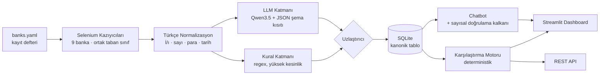
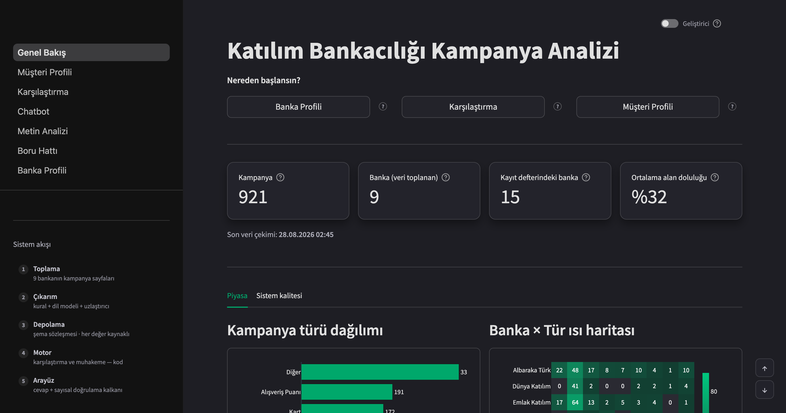
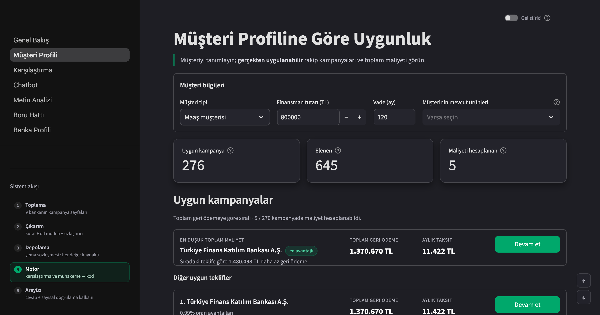
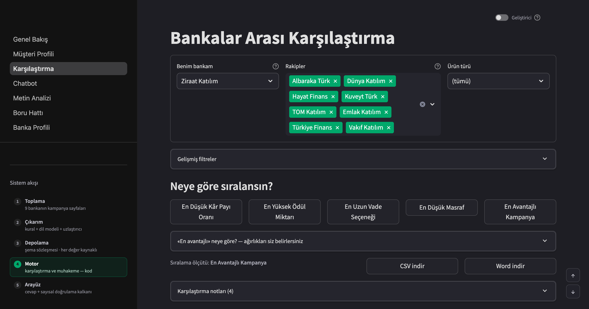
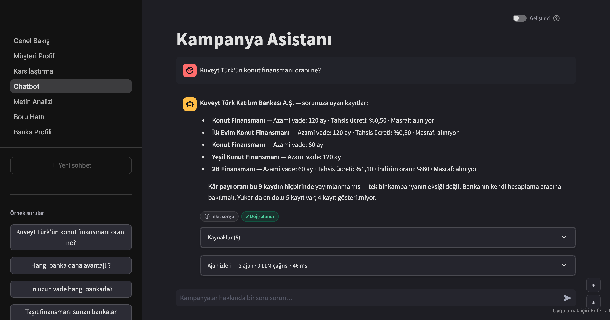
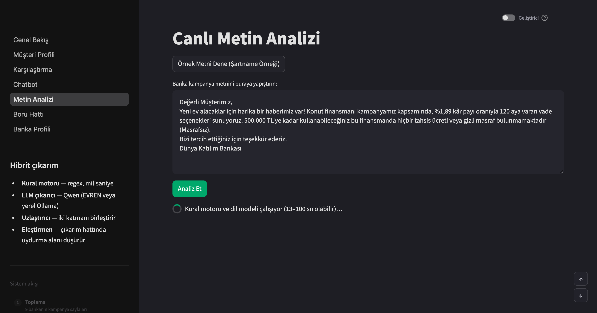
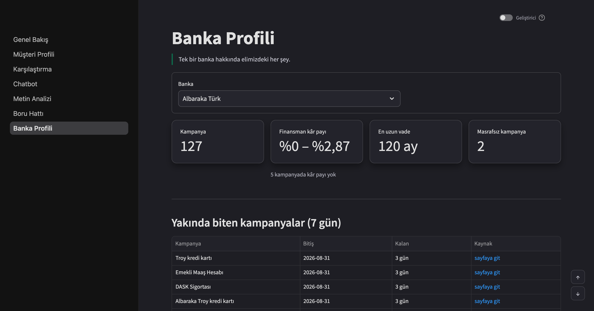
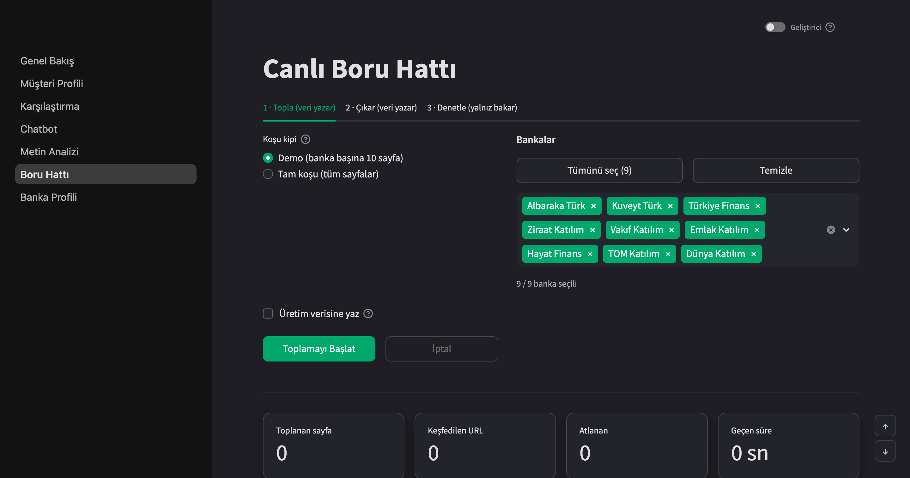

# Katılım Bankacılığı Finansal Metin Madenciliği

**Takım SVARTAL** · TEKNOFEST 2026 Yapay Zekâ Dil Ajanları Yarışması · 2. Senaryo

> Katılım bankalarının resmî sitelerindeki kampanya metinlerini toplayan; kâr payı
> oranı, vade, masraf, avantaj ve hedef kitle bilgilerini **kaynağına bağlı biçimde**
> çıkaran; bankalar arası karşılaştırma yapan; dashboard ve chatbot ile sunan,
> **tamamen kurum içinde çalışan** açık kaynak sistem.

[](LICENSE)

---

## Sistem tek bakışta

| | |
|---|---|
| **İşlenen kampanya** | **921** (9 faal katılım bankasının tamamı) |
| **Ham gezilen sayfa** | 1.019 (95 kopya + 7 liste sayfası korpusa alınmaz) |
| **Makro-F1** | **0,817** _(%95 GA: 0,756–0,868 · N=92 altın set örneği)_ |
| **Sayısal alan doğruluğu** | **0,927** (hedef ≥ 0,90) |
| **Halüsinasyon oranı** | **%0,21** (hedef ≤ %3) |
| **Şema geçerliliği** | 1,00 |
| **Kalkanın meşru soruyu bloklaması** | %0,0 (0/35) |
| **Test** | 1.755 test yeşil · `ruff` temiz |

Ölçümlerin tamamı ve yöntemi: [`docs/SONUCLAR.md`](docs/SONUCLAR.md) (`make eval`) ·
[`docs/DEGERLENDIRME_YONTEMI.md`](docs/DEGERLENDIRME_YONTEMI.md)

> **Sayıyı okurken:** çıkarım EVREN'de ortak bir vLLM sunucusunda koşuyor ve
> `temperature=0` olmasına rağmen **bayt düzeyinde deterministik değil**. Ölçüldü:
> aynı kod, aynı girdi, 98 kayıtta 7 hücre oynadı. Yani `make eval` sayısı ±0,01
> gürültü taşır — «makro-F1 0,82» doğrudur, «0,817» yanlış bir kesinlik iddiasıdır.
> Bayt düzeyinde tekrar üretilebilirlik gerekiyorsa: `make extract-yerel`.

---

## 30 saniyede kurulum

```bash
git clone https://github.com/erenkendir722/ai-agent-nlp.git && cd ai-agent-nlp
docker compose up -d          # Streamlit: http://localhost:8501 · API: http://localhost:8000/docs
```

Docker'sız:

```bash
make kur                              # venv + bağımlılıklar
ollama pull qwen3.5:4b-q4_K_M         # ~3,4 GB, tek seferlik
make extract && make run              # crawl GEREKMEZ: ham kayıtlar depoda
```

Adım adım ve sorun giderme: [`docs/KURULUM.md`](docs/KURULUM.md)

---

## Mimari



Katman katman açıklama ve veri akışı: [`docs/MIMARI.md`](docs/MIMARI.md) ·
kural/model yapısı: [`docs/MODEL_VE_KURAL_YAPISI.md`](docs/MODEL_VE_KURAL_YAPISI.md)

**Alanların hangi katmandan geldiği** (ablasyonun temeli, 921 kayıt):

| Yöntem | Alan sayısı |
|---|---|
| `llm` | 3.140 |
| `kural` | 1.519 |
| `hibrit` (iki katman uzlaştı) | 119 |

---

## Ekranlar

Yedi ekran; hepsi aynı veritabanından okur, hiçbiri kendi başına değer üretmez.
Görüntüler `make ekran-goruntuleri` ile **çalışan arayüzden** alınır — elle
alınmadıkları için arayüz değişince eskimezler.

| | |
|---|---|
| **Genel Bakış** — kapsam, tür dağılımı, banka × tür ısı haritası, son çekim tarihi | **Müşteri Profili** — tutar/vade/segment verilir, sıralama toplam maliyete göre yapılır |
|  |  |
| **Karşılaştırma** — beş ölçüt, ağırlıklar kullanıcıda, formül açık | **Kampanya Asistanı** — kaynaklı cevap, «Doğrulandı» rozeti, 0 LLM çağrısı |
|  |  |
| **Metin Analizi** — yapıştırılan metinden alan · birim · güven · yöntem · alıntı | **Banka Profili** — veri tazeliği, yakında biten kampanyalar, alan doluluğu |
|  |  |

**Canlı Boru Hattı** — toplama ve çıkarım arayüzden sürülür; animasyon gerçek
olaylardan beslenir, nezaket kuralı ve `robots.txt` kapısı demoda da açıktır.
Yazma hedefi `data/demo/`, üretim verisine yalnız kapalı gelen onay kutusuyla
dokunulur.



Ekranların ne işe yaradığı ve nasıl okunacağı:
[`docs/KULLANIM_KILAVUZU.md`](docs/KULLANIM_KILAVUZU.md).

---

## Farkı açan üç karar

### 1. Kanıtsız değer üretilemez

Her alan kendi kanıtını taşır: değerin geldiği **metin parçası + karakter aralığı
+ URL + çekim tarihi + güven skoru + hangi katmandan geldiği**. Bu, sonradan
eklenen bir özellik değil, [şemanın kendisine](src/schema.py) gömülü bir kısıt —
`Alan(deger=2.05, yontem="belirtilmemis")` çağrısı `ValueError` fırlatır.

Alan bulunamadığında `None` değil, **"Belirtilmemiş"** işaretlenir.

### 2. Chatbot uydurma oran söyleyemez — mimari olarak

Sayısal cevaplar **asla** serbest metin aramasından gelmez, **her zaman** yapısal
veritabanı sorgusundan gelir. Üstüne [sayısal doğrulama kalkanı](src/rag/chatbot.py)
vardır: cevaptaki her sayının getirilen yapısal kayıtta karşılığı aranır,
bulunamazsa cevap **reddedilir**.

Kalkan iki yönlü ölçülür: **meşru cevabı engelleme 0/35**, uydurma sayıyı geçirme
`tests/test_kalkan_kokenli.py` ile korunur. Cevap parçaları kökenine göre ayrı
denetlenir — `yapisal` kayda karşı, `alinti` kaynak metne karşı, `sistem` kendi
hesap girdilerine karşı, `duz` ise sayı içeremez.

Aynı kısıt çıkarım katmanında da uygulanır: LLM'den değeri yorumlaması değil
**metinde geçtiği hâliyle birebir kopyalaması** istenir, dönen ifade ham metinde
aranır, bulunamazsa alan düşürülür.

### 3. On-prem bir iddia değil, kanıt

| Gereklilik (şartname 5.9) | Kanıt |
|---|---|
| Kurum içi sunucularda çalışabilme | `docker compose up` — 18 Ağu'da koşuldu, 3 konteyner sağlıklı |
| Veri güvenliği | Tüm veri yerel diskte, `tests/test_sizinti_yok.py` (6 test) |
| Verinin kurum dışına çıkmaması | `internal: true` ağı + egress testi |
| Dış servise bağımlı olmama | **Ağ kesilmiş demo** — hava boşluğunda çıkarım 24,4 sn'de koştu |

Telemetri gönderen kütüphaneler tespit edilip kapatıldı (`HF_HUB_OFFLINE`,
`ANONYMIZED_TELEMETRY`, `DO_NOT_TRACK` — bkz. [.env.example](.env.example)).

Kurumsal yerleşim, LDAP/AD, vekil sunucu, veri ambarı beslemesi ve denetim izi:
[`docs/KURUMSAL_ENTEGRASYON.md`](docs/KURUMSAL_ENTEGRASYON.md)

---

## Veri kapsamı

Dokuz **faal** katılım bankasının dokuzunda da kampanya var. Kayıt defteri
([`data/banks.yaml`](data/banks.yaml)) BDDK listesindeki **15 kuruluşu** taşır:
9 faal · 2 faaliyete geçmemiş (Adil, İktisat) · 4 kuruluş aşamasında.

| Banka | Kampanya |
|---|---|
| Ziraat Katılım | 211 |
| Kuveyt Türk | 205 |
| Albaraka Türk | 127 |
| Türkiye Emlak Katılım | 109 |
| Vakıf Katılım | 72 |
| Türkiye Finans | 64 |
| T.O.M. Katılım | 62 |
| Dünya Katılım | 52 |
| Hayat Finans | 19 |
| **Toplam** | **921** |

**Dengesizlik açıkça beyan edilir:** en geniş/en dar kapsam oranı **11,1×**.
Bunun sıralamayı neden doğrudan bozmadığı ölçümle birlikte
[`docs/KAPSAM_RAPORU.md`](docs/KAPSAM_RAPORU.md)'da (motor tekil ürün
karşılaştırır, banka ortalaması almaz — şartname madde 15.1).

Kampanya türü dağılımı (şartnamedeki 8 tür + `diger`): `diger` 330 ·
`alisveris_puani` 191 · `kart` 172 · `finansman` 68 · `yatirim_urunu` 44 ·
`tasit_finansmani` 44 · `ihtiyac_finansmani` 38 · `konut_finansmani` 27 ·
`yeni_musteri` 7.

**Alan doluluğu %32,4** (14.736 alanın 4.778'i dolu). Düşüklük kaynaktan
geliyor, uydurmaktan kaçınmaktan: bankaların çoğu kâr payı oranını kampanya
sayfasında değil başvuru ekranında veriyor. Kâr payı doluluğu **%17,4**
(160/921). Boş alan `Belirtilmemiş` işaretlenir, tahmin edilmez.

Bilinen sınırlar ve veri kalitesi denetimi:
[`docs/VERI_KALITESI.md`](docs/VERI_KALITESI.md) ·
[`docs/HATA_ANALIZI.md`](docs/HATA_ANALIZI.md)

---

## Teknoloji seçimleri ve lisans gerekçeleri

Şartname 5.10 *"açık kaynaklı gözüküp lisans problemi çıkarma potansiyeli olan
çözümler"* kullanılmamasını istiyor. Bu doğrudan Llama ve Gemma lisanslarını
hedefliyor; ikisini de **kullanmıyoruz**.

| Bileşen | Seçim | Lisans |
|---|---|---|
| LLM — çıkarım (EVREN `llm-large`) | `Qwen/Qwen3.5-122B-A10B` | **Apache 2.0** |
| LLM — seçilebilir hızlı uç, varsayılan değil (EVREN `llm-fast`) | `Qwen/Qwen3.6-35B-A3B` | **Apache 2.0** |
| LLM — yerel yedek | `Qwen/Qwen3.5-4B` (Ollama) | **Apache 2.0** |
| RAG gömme (EVREN `bge-m3-embed`) | `BAAI/bge-m3` | **MIT** |
| Çıkarım sunucusu | Ollama | MIT |
| Veritabanı | SQLite + SQLAlchemy | Public Domain / MIT |
| Arayüz | Streamlit | Apache 2.0 |
| API | FastAPI | MIT |
| Toplama | Selenium · httpx · trafilatura · selectolax | **Apache 2.0** · BSD · **Apache 2.0** · MIT |

Tam bağımlılık ve model lisans raporu: [`docs/LISANSLAR.md`](docs/LISANSLAR.md)
(`make lisanslar`). **Kurulu 85 paketin tamamı izin verici (permissive)
lisanslıdır** — 79'u `requirements.txt` kapanışında, kalanı ortamda kalmış ve
teslim edilen koda dahil olmayan paketler; rapor ikisini ayırır. Kısıtlı kullanım
şartı olan hiçbir bileşen yoktur.

**Model lisansları elle iddia edilmiyor, teyit ediliyor:** `make lisanslar-teyit`
kullandığımız modellerin lisansını Hugging Face depo üst verisinden çeker ve
beklenenle tutmazsa kırılır. Ham yanıt:
[`docs/kanit/model-lisanslari.json`](docs/kanit/model-lisanslari.json).

**Neden Streamlit, React değil?** Kurum içi dağıtımda tek runtime, ayrı Node
bağımlılığı yok, Apache 2.0. Ekran değil sistem yarışıyoruz; API katmanı ayrıdır
ve her arayüze bağlanabilir.

---

## Donanım profilleri

| Profil | Donanım | Model | Kullanım |
|---|---|---|---|
| A — Kurumsal | 24 GB+ VRAM | Qwen3.6-27B Q4 (~17 GB) | Final ölçüm koşusu |
| B — Geliştirme | 24 GB VRAM | Qwen3.5-9B Q4 (~6,6 GB) | Ana geliştirme |
| C — Laptop | 8 GB RAM, GPU yok | **Qwen3.5-4B Q4 (~3,4 GB)** | Fiziki final demosu |
| D — Düşük bellek | 8 GB RAM | Qwen3.5-2B Q4 (~1,9 GB) | Yedek |

Model `.env` içindeki `OLLAMA_MODEL` ile değişir; kod aynı kalır.
EVREN ile yerel arasında geçiş tek değişken: `LLM_SAGLAYICI`.

---

## Komutlar

```bash
make kur          # kurulum
make crawl        # banka sitelerinden kampanya topla  [Chrome gerekir]
make extract      # çıkarım (kural + LLM hibrit) -> SQLite   [EVREN]
make extract-yerel      # aynı çıkarım, yerel Ollama ile (yedek / hava boşluğu)
make durum        # kaç kampanya, kaç banka, RAG indeksi güncel mi
make vektor       # RAG vektör indeksini kur (~70 sn)
make run          # Streamlit arayüzü
make api          # REST API
make test         # testler (1.755)
make lint         # kod denetimi
make eval         # metrikler -> docs/SONUCLAR.md
make ablasyon     # 5 kollu ablasyon (katman + ajan katkısı), ~25 dk
make kapsam       # banka bazlı kapsam raporu
make veri-seti    # yayınlanabilir veri seti + veri kartı
make lisanslar    # bağımlılık + model lisans raporu
make kanit        # veri toplama etiği kanıtları (robots + KVKK)
make sunum        # sunum PDF'i üret
```

Ablasyon kolları (aynı kod yolu, farklı yapılandırma):

```bash
make extract-kural   # yalnız kural katmanı
make extract-llm     # yalnız LLM katmanı
make extract         # hibrit (bizim)
```

---

## REST API

`make api` → http://localhost:8000/docs

| Uç nokta | İş |
|---|---|
| `POST /extract` | Ham metin ver, kanıt zincirli yapısal çıktı al |
| `GET /compare` | Beş ölçüte göre bankalar arası karşılaştırma |
| `POST /ask` | Chatbot — kaynaklı ve kalkandan geçmiş cevap |
| `GET /saglik` | Sağlık yoklaması |

---

## Veri toplama etiği

- **robots.txt uyumu zorunlu**, `crawl-delay` uygulanır
- İstek arası en az **2 saniye**, eşzamanlı istek yok
- Tanımlı User-Agent, iletişim adresiyle
- Yalnız **kamuya açık** sayfalar; giriş gerektiren hiçbir alana erişilmez
- **Kişisel veri toplanmaz** (KVKK) — 1.019 ham kayıt tarandı, kimliği belirli
  gerçek kişiye ait veri bulunmadı
- BDDK listesi **manuel** alınmıştır (şartname 5.1 izin veriyor); site otomatik
  taranmıyor, gerekçesi ölçümle belgeli
- Yayınlanan veri setinde tam sayfa metni değil, **yapısal alanlar + URL + alıntı**

**Bunlar beyan değil, kanıt:** [`docs/kanit/VERI_TOPLAMA_ETIGI.md`](docs/kanit/VERI_TOPLAMA_ETIGI.md)
— alan adı başına robots.txt kararları, ağa gerçekten gönderilen User-Agent
başlığı, BDDK ekran görüntüsü ve KVKK taraması, hepsi `make kanit` ile yeniden
üretilebilir.

Ayrıntı: [`docs/VERI_METODOLOJISI.md`](docs/VERI_METODOLOJISI.md)

---

## Veri seti — indirme ve içerik

Şartname madde 9, veri setinin **herkese açık bir bağlantıdan indirilebilmesini**
şart koşuyor. Veri seti ayrı bir sunucuda değil, **bu deponun içindedir**; depo
Apache 2.0 ile herkese açıktır, dolayısıyla klonlamak indirmektir:

```bash
git clone https://github.com/erenkendir722/ai-agent-nlp.git
```

| Yol | İçerik | Kayıt |
|---|---|---|
| [`data/exports/svartal_kampanyalar.csv`](data/exports/svartal_kampanyalar.csv) | **Yayın sürümü** — düz tablo: her alan + yöntemi + güven skoru (`;` ayraçlı, Excel'de açılır) | 921 |
| [`data/exports/svartal_kampanyalar.jsonl`](data/exports/svartal_kampanyalar.jsonl) | **Yayın sürümü** — kanıt zinciriyle: değer + birim + ham ifade + kaynak alıntısı + uygunluk koşulları | 921 |
| [`data/exports/DATASET_CARD.md`](data/exports/DATASET_CARD.md) | **Veri kartı** — kapsam, dağılım, toplama yöntemi, bilinen sınırlar | — |
| [`data/raw/<banka_kodu>/*.json`](data/raw/) | Toplanan sayfaların ham anlık görüntüsü: URL, çekim tarihi, HTTP durumu, başlık ve **çıkarılmış gövde metni** | 1.019 |
| [`data/banks.yaml`](data/banks.yaml) | BDDK kayıt defteri — faal + kuruluş aşamasındaki tüm katılım bankaları | 15 |
| [`data/gold/`](data/gold/) | Altın set — dört kişi bağımsız etiketledi, uyum ölçüldü | 92 |

> **1.019 ile 921 iki ayrı sayıdır ve ikisi de doğrudur.** 1.019 *gezilen sayfa*,
> 921 *kampanya*. Aradaki 98: bankalar aynı kampanyayı iki adresten yayımladığı
> için oluşan 95 birebir kopya, artı indekslenemeyen 7 kategori listeleme sayfası.
> `make durum` ikisini yan yana gösterir.

Yayın sürümünde **tam sayfa metni yoktur**: yapısal alanlar, kaynak adresi ve
değerin dayandığı kısa alıntı vardır. Bu tercih telif riskini sıfırlar,
doğrulanabilirliği korur. Yeniden üretmek için `make veri-seti`.

**Ham HTML depoda tutulmaz** (`.gitignore`): depoyu şişirir ve bankaların sayfa
telifini yeniden yayımlamak olurdu. Çıkarım zaten `govde_metin` alanından
çalıştığı için bu bir eksiklik değildir — taze bir klonda ağ bağlantısı olmadan
`make extract` koşar:

```bash
git clone https://github.com/erenkendir722/ai-agent-nlp.git && cd ai-agent-nlp
make kur && ollama pull qwen3.5:4b-q4_K_M
make extract          # data/raw/*.json -> SQLite   (crawl GEREKMEZ)
make eval             # metrikler -> docs/SONUCLAR.md
```

Sayfaları kaynağından yeniden toplamak isteyen `make crawl` çalıştırır; kimlikler
URL'den deterministik üretildiği için aynı sayfa aynı kaydın üstüne yazar.

---

## Depo yapısı

```
├── src/
│   ├── schema.py              ← ŞEMA SÖZLEŞMESİ (donmuş, v1.2.0)
│   ├── boru_hatti.py          ← CLI giriş noktası
│   ├── depolama.py            ← SQLite + SQLAlchemy
│   ├── vektor_db.py           ← yerel gömme + kosinüs arama (harici vektör DB yok)
│   ├── terim_sozlugu.py       ← sözlüğün makine tarafı
│   ├── collector/             ← kayıt defteri + nezaket + 9 banka kazıyıcısı
│   ├── preprocessing/         ← Türkçe normalizasyon
│   ├── extraction/            ← kural + LLM + uzlaştırıcı + sağlayıcı
│   ├── comparison/            ← karşılaştırma motoru + toplam maliyet
│   ├── ajanlar/               ← uygunluk · eleştirmen · yüklem · muhakeme · orkestratör
│   ├── izleme/                ← tetikleyici · dinleyici · yeni kampanya keşfi
│   ├── rag/                   ← chatbot + sayısal doğrulama kalkanı + sohbet bağlamı
│   └── api/                   ← FastAPI
├── app/                       ← Streamlit, 7 ekran
├── data/banks.yaml            ← banka kayıt defteri
├── data/exports/              ← yayınlanan veri seti + veri kartı
├── docs/kararlar/             ← 26 ADR (mimari karar kayıtları)
├── docs/kanit/                ← robots günlüğü · KVKK taraması · model lisansları
└── tests/  eval/  tools/
```

---

## Takım ve görev dağılımı

| Kişi | Rol |
|---|---|
| Eren | Kaptan · mimari · entegrasyon · on-prem |
| Samet | Çıkarım motoru · LLM · değerlendirme |
| Görkem | Veri toplama · veri kalitesi · terim sözlüğü |
| Esra | Arayüz · dashboard · chatbot paneli |

---

## Lisans

[Apache License 2.0](LICENSE)
