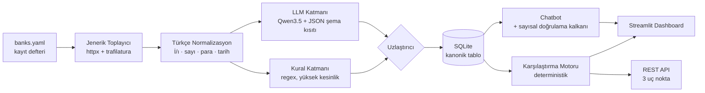

# Katılım Bankacılığı Finansal Metin Madenciliği

**Takım SVARTAL** · TEKNOFEST 2026 Yapay Zekâ Dil Ajanları Yarışması · 2. Senaryo

> Katılım bankalarının resmî sitelerindeki kampanya metinlerini toplayan; kâr payı
> oranı, vade, masraf, avantaj ve hedef kitle bilgilerini **kaynağına bağlı biçimde**
> çıkaran; bankalar arası karşılaştırma yapan; dashboard ve chatbot ile sunan,
> **tamamen kurum içinde çalışan** açık kaynak sistem.

[](LICENSE)

---

## 30 saniyede kurulum

```bash
git clone <depo-adresi> && cd katilim-lens
docker compose up -d          # Streamlit: http://localhost:8501 · API: http://localhost:8000/docs
```

Docker'sız:

```bash
make kur                              # venv + bağımlılıklar
ollama pull qwen3.5:4b-q4_K_M         # ~3,4 GB, tek seferlik
make crawl && make extract && make run
```

---

## Mimari



---

## Farkı açan üç karar

### 1. Kanıtsız değer üretilemez

Her alan kendi kanıtını taşır: değerin geldiği **metin parçası + karakter aralığı
+ URL + çekim tarihi + güven skoru + hangi katmandan geldiği**. Bu, sonradan
eklenen bir özellik değil, [şemanın kendisine](src/schema.py) gömülü bir kısıt —
`Alan(deger=2.05, yontem="belirtilmemis")` çağrısı `ValueError` fırlatır.

Alan bulunamadığında `None` değil, **"Belirtilmemiş"** işaretlenir.

### 2. Chatbot uydurma oran söyleyemez — mimari olarak

Sayısal cevaplar **asla** serbest metin aramasından gelmez, **her zaman** yapısal
veritabanı sorgusundan gelir. Üstüne [sayısal doğrulama kalkanı](src/rag/chatbot.py)
vardır: cevaptaki her sayının getirilen yapısal kayıtta karşılığı aranır,
bulunamazsa cevap **reddedilir**.

Aynı kısıt çıkarım katmanında da uygulanır: LLM'den değeri yorumlaması değil
**metinde geçtiği hâliyle birebir kopyalaması** istenir, dönen ifade ham metinde
aranır, bulunamazsa alan düşürülür.

### 3. On-prem bir iddia değil, kanıt

| Gereklilik (şartname 5.9) | Kanıt |
|---|---|
| Kurum içi sunucularda çalışabilme | `docker compose up` — tek komut |
| Veri güvenliği | Tüm veri yerel diskte, dış servis çağrısı yok |
| Verinin kurum dışına çıkmaması | `internal: true` ağı + egress testi |
| Dış servise bağımlı olmama | **Ağ kesilmiş demo** — hava boşluğu testi |

Telemetri gönderen kütüphaneler tespit edilip kapatıldı (`HF_HUB_OFFLINE`,
`ANONYMIZED_TELEMETRY`, `DO_NOT_TRACK` — bkz. [.env.example](.env.example)).

---

## Teknoloji seçimleri ve lisans gerekçeleri

Şartname 5.10 *"açık kaynaklı gözüküp lisans problemi çıkarma potansiyeli olan
çözümler"* kullanılmamasını istiyor. Bu doğrudan Llama ve Gemma lisanslarını
hedefliyor; ikisini de **kullanmıyoruz**.

| Bileşen | Seçim | Lisans |
|---|---|---|
| LLM | Qwen3.5 (4B / 9B / 27B) | **Apache 2.0** |
| Çıkarım sunucusu | Ollama | MIT |
| Veritabanı | SQLite + SQLAlchemy | Public Domain / MIT |
| Arayüz | Streamlit | Apache 2.0 |
| API | FastAPI | MIT |
| Toplama | httpx · trafilatura · selectolax | BSD · **Apache 2.0** · MIT |

Tam bağımlılık lisans raporu: [`docs/LISANSLAR.md`](docs/LISANSLAR.md) (`make lisanslar`).
**72 paketin tamamı izin verici (permissive) lisanslıdır**; kısıtlı kullanım
şartı olan hiçbir bileşen yoktur. Rapor, seçmeli lisansların (`tld`,
`python-dateutil`) hangi seçenekle kullanıldığını da gerekçesiyle belgeler.

**Neden Streamlit, React değil?** Kurum içi dağıtımda tek runtime, ayrı Node
bağımlılığı yok, Apache 2.0. Ekran değil sistem yarışıyoruz; API katmanı ayrıdır
ve her arayüze bağlanabilir.

---

## Donanım profilleri

| Profil | Donanım | Model | Kullanım |
|---|---|---|---|
| A — Kurumsal | 24 GB+ VRAM | Qwen3.6-27B Q4 (~17 GB) | Final ölçüm koşusu |
| B — Geliştirme | 24 GB VRAM | Qwen3.5-9B Q4 (~6,6 GB) | Ana geliştirme |
| C — Laptop | 8 GB RAM, GPU yok | **Qwen3.5-4B Q4 (~3,4 GB)** | Fiziki final demosu |
| D — Düşük bellek | 8 GB RAM | Qwen3.5-2B Q4 (~1,9 GB) | Yedek |

Model `.env` içindeki `OLLAMA_MODEL` ile değişir; kod aynı kalır.

---

## Komutlar

```bash
make kur          # kurulum
make crawl        # banka sitelerinden kampanya topla
make extract      # çıkarım (kural + LLM hibrit) -> SQLite
make seed         # tohum veriden çıkarım (ağ gerekmez)
make durum        # veritabanı özeti
make run          # Streamlit arayüzü
make api          # REST API
make test         # testler
make eval         # metrikler -> docs/SONUCLAR.md
make lisanslar    # lisans raporu
```

Ablasyon koşuları (aynı kod yolu, farklı yapılandırma):

```bash
make extract-kural   # yalnız kural katmanı
make extract-llm     # yalnız LLM katmanı
make extract         # hibrit (bizim)
```

---

## Veri toplama etiği

- **robots.txt uyumu zorunlu**, `crawl-delay` uygulanır
- İstek arası en az **2 saniye**, eşzamanlı istek yok
- Tanımlı User-Agent, iletişim adresiyle
- Yalnız **kamuya açık** sayfalar; giriş gerektiren hiçbir alana erişilmez
- **Kişisel veri toplanmaz** (KVKK)
- BDDK listesi, sitenin robots.txt kısıtı nedeniyle **manuel** alınmıştır
- Yayınlanan veri setinde tam sayfa metni değil, **yapısal alanlar + URL + alıntı**

Ayrıntı: [`docs/VERI_METODOLOJISI.md`](docs/VERI_METODOLOJISI.md)

---

## Depo yapısı

```
├── src/
│   ├── schema.py              ← ŞEMA SÖZLEŞMESİ (donmuş, v1.0.0)
│   ├── boru_hatti.py          ← CLI giriş noktası
│   ├── depolama.py            ← SQLite + SQLAlchemy
│   ├── collector/             ← jenerik toplayıcı (banka başına özel kod YOK)
│   ├── preprocessing/         ← Türkçe normalizasyon
│   ├── extraction/            ← kural + LLM + uzlaştırıcı
│   ├── comparison/            ← karşılaştırma motoru + toplam maliyet
│   ├── rag/                   ← chatbot + sayısal doğrulama kalkanı
│   └── api/                   ← FastAPI, 3 uç nokta
├── app/                       ← Streamlit, 3 ekran
├── data/banks.yaml            ← banka kayıt defteri
├── docs/kararlar/             ← ADR'ler
└── tests/  eval/
```

---

## Takım

| Kişi | Rol |
|---|---|
| Eren | Kaptan · mimari · entegrasyon · on-prem |
| Samet | Çıkarım motoru · LLM · değerlendirme |
| Görkem | Veri toplama · veri kalitesi · terim sözlüğü |
| Esra | Arayüz · dashboard · chatbot paneli |

## Lisans

[Apache License 2.0](LICENSE)
