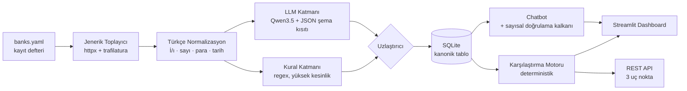

# Katılım Bankacılığı Finansal Metin Madenciliği

**Takım SVARTAL** · TEKNOFEST 2026 Yapay Zekâ Dil Ajanları Yarışması · 2. Senaryo

> Katılım bankalarının resmî sitelerindeki kampanya metinlerini toplayan; kâr payı
> oranı, vade, masraf, avantaj ve hedef kitle bilgilerini **kaynağına bağlı biçimde**
> çıkaran; bankalar arası karşılaştırma yapan; dashboard ve chatbot ile sunan,
> **tamamen kurum içinde çalışan** açık kaynak sistem.

[](LICENSE)

---

## 30 saniyede kurulum

```bash
git clone <depo-adresi> && cd katilim-lens
docker compose up -d          # Streamlit: http://localhost:8501 · API: http://localhost:8000/docs
```

Docker'sız:

```bash
make kur                              # venv + bağımlılıklar
ollama pull qwen3.5:4b-q4_K_M         # ~3,4 GB, tek seferlik
make crawl && make extract && make run
```

---

## Mimari



---

## Farkı açan üç karar

### 1. Kanıtsız değer üretilemez

Her alan kendi kanıtını taşır: değerin geldiği **metin parçası + karakter aralığı
+ URL + çekim tarihi + güven skoru + hangi katmandan geldiği**. Bu, sonradan
eklenen bir özellik değil, [şemanın kendisine](src/schema.py) gömülü bir kısıt —
`Alan(deger=2.05, yontem="belirtilmemis")` çağrısı `ValueError` fırlatır.

Alan bulunamadığında `None` değil, **"Belirtilmemiş"** işaretlenir.

### 2. Chatbot uydurma oran söyleyemez — mimari olarak

Sayısal cevaplar **asla** serbest metin aramasından gelmez, **her zaman** yapısal
veritabanı sorgusundan gelir. Üstüne [sayısal doğrulama kalkanı](src/rag/chatbot.py)
vardır: cevaptaki her sayının getirilen yapısal kayıtta karşılığı aranır,
bulunamazsa cevap **reddedilir**.

Aynı kısıt çıkarım katmanında da uygulanır: LLM'den değeri yorumlaması değil
**metinde geçtiği hâliyle birebir kopyalaması** istenir, dönen ifade ham metinde
aranır, bulunamazsa alan düşürülür.

### 3. On-prem bir iddia değil, kanıt

| Gereklilik (şartname 5.9) | Kanıt |
|---|---|
| Kurum içi sunucularda çalışabilme | `docker compose up` — tek komut |
| Veri güvenliği | Tüm veri yerel diskte, dış servis çağrısı yok |
| Verinin kurum dışına çıkmaması | `internal: true` ağı + egress testi |
| Dış servise bağımlı olmama | **Ağ kesilmiş demo** — hava boşluğu testi |

Telemetri gönderen kütüphaneler tespit edilip kapatıldı (`HF_HUB_OFFLINE`,
`ANONYMIZED_TELEMETRY`, `DO_NOT_TRACK` — bkz. [.env.example](.env.example)).

---

## Teknoloji seçimleri ve lisans gerekçeleri

Şartname 5.10 *"açık kaynaklı gözüküp lisans problemi çıkarma potansiyeli olan
çözümler"* kullanılmamasını istiyor. Bu doğrudan Llama ve Gemma lisanslarını
hedefliyor; ikisini de **kullanmıyoruz**.

| Bileşen | Seçim | Lisans |
|---|---|---|
| LLM — çıkarım (EVREN `llm-large`) | `Qwen/Qwen3.5-122B-A10B` | **Apache 2.0** |
| LLM — seçilebilir hızlı uç, varsayılan değil (EVREN `llm-fast`) | `Qwen/Qwen3.6-35B-A3B` | **Apache 2.0** |
| LLM — yerel yedek | `Qwen/Qwen3.5-4B` (Ollama) | **Apache 2.0** |
| Çıkarım sunucusu | Ollama | MIT |
| Veritabanı | SQLite + SQLAlchemy | Public Domain / MIT |
| Arayüz | Streamlit | Apache 2.0 |
| API | FastAPI | MIT |
| Toplama | httpx · trafilatura · selectolax | BSD · **Apache 2.0** · MIT |

Tam bağımlılık ve model lisans raporu: [`docs/LISANSLAR.md`](docs/LISANSLAR.md)
(`make lisanslar`). **Kurulu 85 paketin tamamı izin verici (permissive)
lisanslıdır** — 79'u `requirements.txt` kapanışında, kalanı ortamda kalmış ve
teslim edilen koda dahil olmayan paketler; rapor ikisini ayırır. Kısıtlı kullanım
şartı olan hiçbir bileşen yoktur. Rapor, seçmeli lisansların (`tld`,
`python-dateutil`) hangi seçenekle kullanıldığını da gerekçesiyle belgeler.

**Model lisansları elle iddia edilmiyor, teyit ediliyor:** `make lisanslar-teyit`
kullandığımız modellerin lisansını Hugging Face depo üst verisinden çeker ve
beklenenle tutmazsa kırılır. Ham yanıt:
[`docs/kanit/model-lisanslari.json`](docs/kanit/model-lisanslari.json).

**Neden Streamlit, React değil?** Kurum içi dağıtımda tek runtime, ayrı Node
bağımlılığı yok, Apache 2.0. Ekran değil sistem yarışıyoruz; API katmanı ayrıdır
ve her arayüze bağlanabilir.

---

## Donanım profilleri

| Profil | Donanım | Model | Kullanım |
|---|---|---|---|
| A — Kurumsal | 24 GB+ VRAM | Qwen3.6-27B Q4 (~17 GB) | Final ölçüm koşusu |
| B — Geliştirme | 24 GB VRAM | Qwen3.5-9B Q4 (~6,6 GB) | Ana geliştirme |
| C — Laptop | 8 GB RAM, GPU yok | **Qwen3.5-4B Q4 (~3,4 GB)** | Fiziki final demosu |
| D — Düşük bellek | 8 GB RAM | Qwen3.5-2B Q4 (~1,9 GB) | Yedek |

Model `.env` içindeki `OLLAMA_MODEL` ile değişir; kod aynı kalır.

---

## Komutlar

```bash
make kur          # kurulum
make crawl        # banka sitelerinden kampanya topla
make extract      # çıkarım (kural + LLM hibrit) -> SQLite
make seed         # tohum veriden çıkarım (ağ gerekmez)
make durum        # veritabanı özeti
make run          # Streamlit arayüzü
make api          # REST API
make test         # testler
make eval         # metrikler -> docs/SONUCLAR.md
make lisanslar    # lisans raporu
```

Ablasyon koşuları (aynı kod yolu, farklı yapılandırma):

```bash
make extract-kural   # yalnız kural katmanı
make extract-llm     # yalnız LLM katmanı
make extract         # hibrit (bizim)
```

---

## Veri toplama etiği

- **robots.txt uyumu zorunlu**, `crawl-delay` uygulanır
- İstek arası en az **2 saniye**, eşzamanlı istek yok
- Tanımlı User-Agent, iletişim adresiyle
- Yalnız **kamuya açık** sayfalar; giriş gerektiren hiçbir alana erişilmez
- **Kişisel veri toplanmaz** (KVKK) — 1024 ham kayıt tarandı, kimliği belirli
  gerçek kişiye ait veri bulunmadı
- BDDK listesi **manuel** alınmıştır (şartname 5.1 izin veriyor); site otomatik
  taranmıyor, gerekçesi ölçümle belgeli
- Yayınlanan veri setinde tam sayfa metni değil, **yapısal alanlar + URL + alıntı**

**Bunlar beyan değil, kanıt:** [`docs/kanit/VERI_TOPLAMA_ETIGI.md`](docs/kanit/VERI_TOPLAMA_ETIGI.md)
— alan adı başına robots.txt kararları, ağa gerçekten gönderilen User-Agent
başlığı, BDDK ekran görüntüsü ve KVKK taraması, hepsi `make kanit` ile yeniden
üretilebilir.

Ayrıntı: [`docs/VERI_METODOLOJISI.md`](docs/VERI_METODOLOJISI.md)

---

## Veri seti — indirme ve içerik

Şartname madde 9, veri setinin **herkese açık bir bağlantıdan indirilebilmesini**
şart koşuyor. Veri seti ayrı bir sunucuda değil, **bu deponun içindedir**; depo
Apache 2.0 ile herkese açıktır, dolayısıyla klonlamak indirmektir:

```bash
git clone https://github.com/erenkendir722/ai-agent-nlp.git
```

| Yol | İçerik | Kayıt |
|---|---|---|
| [`data/exports/svartal_kampanyalar.csv`](data/exports/svartal_kampanyalar.csv) | **Yayın sürümü** — düz tablo: her alan + yöntemi + güven skoru (Excel'de açılır) | 1.024 |
| [`data/exports/svartal_kampanyalar.jsonl`](data/exports/svartal_kampanyalar.jsonl) | **Yayın sürümü** — kanıt zinciriyle: değer + birim + ham ifade + kaynak alıntısı + uygunluk koşulları | 1.024 |
| [`data/exports/DATASET_CARD.md`](data/exports/DATASET_CARD.md) | **Veri kartı** — kapsam, dağılım, toplama yöntemi, bilinen sınırlar | — |
| [`data/raw/<banka_kodu>/*.json`](data/raw/) | Toplanan sayfaların ham anlık görüntüsü: URL, çekim tarihi, HTTP durumu, başlık ve **çıkarılmış gövde metni** | 1.024 |
| [`data/banks.yaml`](data/banks.yaml) | BDDK kayıt defteri — faal + kuruluş aşamasındaki tüm katılım bankaları | 15 |
| [`data/gold/`](data/gold/) | Altın set etiketleme dosyaları (98 örnek, insan etiketli) | 98 |

Yayın sürümünde **tam sayfa metni yoktur**: yapısal alanlar, kaynak adresi ve
değerin dayandığı kısa alıntı vardır. Bu tercih telif riskini sıfırlar,
doğrulanabilirliği korur. Yeniden üretmek için `make veri-seti`.

**Ham HTML depoda tutulmaz** (`.gitignore`): depoyu şişirir ve bankaların sayfa
telifini yeniden yayımlamak olurdu. Çıkarım zaten `govde_metin` alanından
çalıştığı için bu bir eksiklik değildir — taze bir klonda ağ bağlantısı olmadan
`make extract` koşar:

```bash
git clone https://github.com/erenkendir722/ai-agent-nlp.git && cd ai-agent-nlp
make kur && ollama pull qwen3.5:4b-q4_K_M
make extract          # data/raw/*.json -> SQLite   (crawl GEREKMEZ)
make eval             # metrikler -> docs/SONUCLAR.md
```

Sayfaları kaynağından yeniden toplamak isteyen `make crawl` çalıştırır; kimlikler
URL'den deterministik üretildiği için aynı sayfa aynı kaydın üstüne yazar.

---

## Depo yapısı

```
├── src/
│   ├── schema.py              ← ŞEMA SÖZLEŞMESİ (donmuş, v1.2.0)
│   ├── boru_hatti.py          ← CLI giriş noktası
│   ├── depolama.py            ← SQLite + SQLAlchemy
│   ├── collector/             ← jenerik toplayıcı (banka başına özel kod YOK)
│   ├── preprocessing/         ← Türkçe normalizasyon
│   ├── extraction/            ← kural + LLM + uzlaştırıcı
│   ├── comparison/            ← karşılaştırma motoru + toplam maliyet
│   ├── ajanlar/               ← uygunluk · eleştirmen · yüklem · muhakeme · orkestratör
│   ├── rag/                   ← chatbot + sayısal doğrulama kalkanı + yerel vektör arama
│   └── api/                   ← FastAPI, 3 uç nokta
├── app/                       ← Streamlit, 5 ekran
├── data/banks.yaml            ← banka kayıt defteri
├── data/exports/              ← yayınlanan veri seti + veri kartı
├── docs/kararlar/             ← ADR'ler
└── tests/  eval/
```

---

## Takım ve görev dağılımı

| Kişi | Rol |
|---|---|
| Eren | Kaptan · mimari · entegrasyon · on-prem |
| Samet | Çıkarım motoru · LLM · değerlendirme |
| Görkem | Veri toplama · veri kalitesi · terim sözlüğü |
| Esra | Arayüz · dashboard · chatbot paneli |

> 📋 **Görevini öğrenmek için → [`GOREVLER.md`](GOREVLER.md)**
> Herkesin görevi kendi bölümünde, tikli listede. Bitirince `[ ]` → `[x]` yap
> ve sıradakine geç; kimseye sormana gerek yok.

## Teslimat kontrol listesi

Şartname madde 6, 9 ve 10'un istediği her teslimat kalemi. Teslimden önce
baştan sona taranır (görev E-17).

### Kod ve depo

- [x] Çalışan proje kodu, tüm kaynak kodlar depoda
- [x] Depo **herkese açık** ve Apache 2.0 lisanslı
- [x] `BilisimVadisi2026` ve `turkiye-acik-kaynak-platformu` etiketleri
- [x] Kurulum adımları net: [`docs/KURULUM.md`](docs/KURULUM.md)
- [x] Bağımlılıkların eksiksiz listesi: `requirements.txt` + [`docs/LISANSLAR.md`](docs/LISANSLAR.md)
- [x] Veri setinin herkese açık indirme bağlantısı: [`data/exports/`](data/exports/)
- [ ] `v1.0` sürüm etiketi atıldı

### Dokümantasyon — madde 6'nın 10 başlığı

- [x] 1. Sistem mimarisi ve veri akışı → [`docs/MIMARI.md`](docs/MIMARI.md)
- [x] 2. Kullanılan NLP yaklaşımı → [`docs/MIMARI.md`](docs/MIMARI.md) §3
- [x] 3. Kullanılan veri seti ve açıklaması → [`docs/VERI_METODOLOJISI.md`](docs/VERI_METODOLOJISI.md)
- [x] 4. Veri ön işleme adımları → [`docs/VERI_METODOLOJISI.md`](docs/VERI_METODOLOJISI.md) §3
- [x] 5. Model veya kural yapısının açıklaması → [`docs/MODEL_VE_KURAL_YAPISI.md`](docs/MODEL_VE_KURAL_YAPISI.md)
- [x] 6. Benzer ürünler nasıl karşılaştırılıyor → [`docs/KARSILASTIRMA_YONTEMI.md`](docs/KARSILASTIRMA_YONTEMI.md)
- [x] 7. Adım adım çalıştırma talimatları → [`docs/KURULUM.md`](docs/KURULUM.md)
- [x] 8. Karşılaşılan problemler ve çözümler → [`docs/PROBLEMLER_VE_COZUMLER.md`](docs/PROBLEMLER_VE_COZUMLER.md)
- [x] 9. Model çıktılarının örnekleri → [`docs/CIKTI_ORNEKLERI.md`](docs/CIKTI_ORNEKLERI.md)
- [x] 10. Performans değerlendirme yöntemleri → [`docs/DEGERLENDIRME_YONTEMI.md`](docs/DEGERLENDIRME_YONTEMI.md)

### Sunum ve video

- [x] Sunum materyali PDF → [`docs/sunum/Svartal_Sunum.pdf`](docs/sunum/Svartal_Sunum.pdf)
- [ ] Sunum materyali PPTX
- [ ] Demo videosu — maks. 5 dakika (madde 6)
- [ ] Sunum videosu — 1 dakika (madde 10)
- [x] Sunumda tüm üyelerin görev tanımları

### Ölçüm ve uyum kanıtları

- [x] Ölçüm sonuçları: [`docs/SONUCLAR.md`](docs/SONUCLAR.md) · ablasyon tablosu dahil
- [x] Şartname madde madde uyum takibi: [`docs/SARTNAME_UYUM.md`](docs/SARTNAME_UYUM.md)
- [x] Veri toplama etiği kanıtları: [`docs/kanit/`](docs/kanit/) (`make kanit`)
- [x] Model ve paket lisansları teyitli: [`docs/LISANSLAR.md`](docs/LISANSLAR.md) (`make lisanslar-teyit`)
- [x] Testler yeşil (`make test`) ve kod denetimi temiz (`make lint`)

---

## Lisans

[Apache License 2.0](LICENSE)
