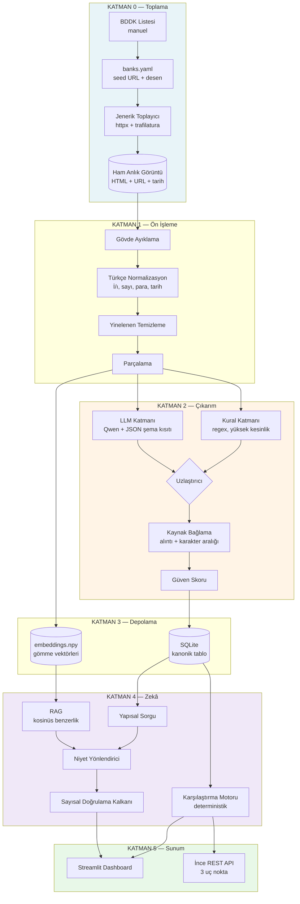

# TEKNOFEST 2026 — Yapay Zekâ Dil Ajanları Yarışması
## Katılım Bankacılığı Finansal Metin Madenciliği Kategorisi (2. Senaryo)
### Proje Planı v2 — Kapasiteye Göre Yeniden Boyutlandırılmış

**Takım:** Eren (Kaptan), Görkem, Samet, Esra
**Başlangıç:** 7 Ağustos 2026 (sıfırdan)
**GitHub son teslim:** 26 Ağustos 2026 23:59 — **hedefimiz 25 Ağustos 20:00**
**Final:** Fiziki, Bilişim Vadisi Kocaeli Kampüsü, son 24 saat
**Kapasite:** Kişi başı günde 1-2 saat

---

## 0. Kapasite Gerçeği ve Bunun Anlamı

Önce matematiği yapalım, çünkü bu planın her satırı bundan çıkıyor.

| Dönem | Gün sayısı | Kişi başı/gün | Toplam kişi-saat |
|---|---|---|---|
| Hafta içi (7, 10-14, 17-21, 24-26 Ağu) | 14 gün | 1,5 sa | 84 |
| Hafta sonu (8-9, 15-16, 22-23 Ağu) | 6 gün | 4 sa | 96 |
| **TOPLAM** | 20 gün | — | **≈180 kişi-saat** |

180 kişi-saat, tek kişinin 4,5 haftalık tam zamanlı mesaisi kadar. Bu süreyle şunlar **yapılamaz**: özel React arayüzü, model ince ayarı, banka başına özel scraper, PostgreSQL + Qdrant altyapısı, mikroservis mimarisi. Bunları planlamak, 20 Ağustos'ta yarım bitmiş beş modülle kalmak demektir.

Bu süreyle şunlar **yapılabilir ve yarışmayı kazanabilir**: tek jenerik toplayıcı, hibrit çıkarım motoru, ölçülmüş bir değerlendirme, Streamlit arayüzü, kaynak gösteren chatbot, tek komutla kurulan Docker paketi ve titiz dokümantasyon.

### Üç kural — bunlara uyulmazsa plan çöker

1. **Hafta sonları kutsaldır.** Kapasitenin %53'ü 6 hafta sonu gününde. 8-9, 15-16, 22-23 Ağustos'ta 4'ünüzün de 4'er saat vermesi şart. Bir hafta sonu kaçarsa, o hafta sonunun işi bir daha telafi edilemez.
2. **Şema sözleşmesi 8 Ağustos'ta donar.** Eren JSON şemasını yazar, dört kişi de o şemaya karşı çalışır. Kimse kimseyi beklemez. Düşük kapasitede en pahalı şey bloke olmaktır.
3. **21 Ağustos Cuma 23:59 özellik dondurma.** Son hafta sonu (22-23) sadece ölçüm, on-prem sertleştirme ve entegrasyon içindir. Son 3 gün (24-26) sadece doküman, video ve teslim.

---

## 1. Kazanma Stratejisi

Puanlamanın dağılımı ve nereye yatırım yapacağımız:

| Kriter | Ağırlık | Bizim yatırımımız | Neden |
|---|---|---|---|
| Model Başarısı ve Anlamlandırma | **%30** | ~%25 efor | Altın veri seti + dayanıklılık testi olmadan bu puan alınamaz |
| Fonksiyonellik ve Senaryo Kapsamı | %20 | ~%25 efor | "Uçtan uca çalışması" = tek komutla ayağa kalkmalı |
| Teknik İmplementasyon ve Mimari | %20 | ~%15 efor | Modüler + okunabilir kod; abartılı mimari gerekmiyor |
| **On-Prem Uygulanabilirlik** | %20 | ~%20 efor | **En yüksek getirili kalem — ucuza alınır** |
| Yenilikçilik ve Yaratıcılık | %10 | ~%15 efor | 3 özgün özellik yeter |

### Farkı açacağımız üç şey

**1. Halüsinasyon yok, kaynak var.** Çıkarılan her alan, geldiği metin parçası + URL + çekim tarihi ile birlikte taşınır. Chatbot'ta sayısal cevaplar asla RAG'dan değil, yapısal veriden gelir. Bankacılık jürisinin en büyük korkusu "sistem uydurma kâr payı oranı söyler mi?" sorusudur; mimari olarak cevabınız "hayır, yapısal olarak imkânsız" olmalı.

**2. On-Prem'i kanıtlamak.** 20 puan burada ve çoğu takım bunu "Docker'a koyduk" diye geçiştirir. Sunumda ağ bağlantısını kesip sistemin çalışmaya devam ettiğini göstermek, bu 20 puanın büyük kısmını tek başına alır. **Maliyeti ~4 saat, getirisi ~15 puan.** Planın en yüksek arbitrajı budur.

**3. Sayı üretmek.** "Modelimiz iyi çalışıyor" cümlesi %30'luk kriterde sıfır puandır. "100 örneklik altın veri setinde kâr payı oranı doğruluğu 0.94, halüsinasyon oranı %1,2, kural-only'ye göre +18 puan" cümlesi o puanın çoğunu alır.

### Rakip durumu

Aynı kategoride finale kalan en az bir takım kamuya açık: **Anatolia AI** (İstanbul Gedik Üniversitesi, 4 kişilik Bilgisayar Mühendisliği ekibi, Türkçe NLP alanında bilinen bir akademisyen danışmanlığında). Model kalitesinde fark açmak zor olabilir. Akademik ekiplerin klasik zayıf noktası: iyi model, zayıf kurulum dokümantasyonu, kanıtsız kalan "kurum içi çalışır" iddiası. **Farkı orada açın.**

---

## 2. Kapsam Kararı — Ne Yapıyoruz, Ne Yapmıyoruz

### Ürün tanımı

> Katılım bankalarının resmî sitelerindeki kampanya metinlerini toplayan; kâr payı oranı, vade, masraf, avantaj ve hedef kitle bilgilerini **kaynağına bağlı biçimde** çıkaran; bankalar arası karşılaştırmayı yapan; dashboard ve chatbot ile sunan, **tamamen kurum içinde çalışan** açık kaynak sistem.

### MUST — 21 Ağustos'a kadar bitmezse yarışamayız

- BDDK listesindeki tüm katılım bankaları kayıt defterinde (faaliyette olmayanlar işaretli)
- Jenerik toplayıcı ile ~300+ kampanya metni
- Şartname 5.3'teki alanların çıkarımı + 5.6 normalizasyonu
- 8 kampanya türü sınıflandırması (5.4)
- Karşılaştırma tablosu, 5.7'deki 5 kriter
- Dashboard (3 ekran) + chatbot
- `docker compose up` ile tek komut kurulum
- 100 örneklik altın veri seti + metrik tablosu
- Şartname madde 6'daki tüm dokümantasyon

### SHOULD — vakit kalırsa

- Toplam maliyet hesaplayıcı (taksit/annüite)
- Dayanıklılık test seti (otomatik üretilen bozuk varyantlar)
- Ablasyon tablosu (kural-only / LLM-only / hibrit)
- Katılım bankacılığı terim sözlüğü yayını

### WON'T — bilinçli olarak yapmıyoruz

| Yapmayacağımız | Yerine | Kazanılan süre |
|---|---|---|
| React + Vite özel arayüz | **Streamlit** | ~40 saat |
| PostgreSQL + pgvector | **SQLite + numpy kosinüs** | ~12 saat |
| BERT ince ayarı (sınıflandırıcı) | LLM zero-shot, aynı kod yolu | ~15 saat |
| Banka başına özel scraper | **Tek jenerik toplayıcı + YAML config** | ~25 saat |
| Playwright / JS render | Statik HTML + manuel yedek | ~10 saat |
| Ayrı FastAPI mikroservis mimarisi | Python paketi + 60 satırlık ince API katmanı | ~15 saat |
| Reranker, zamanlanmış iş, kimlik doğrulama, değişim izleme | — | ~20 saat |

**Toplam kazanç: ~137 saat.** Bu kesintiler olmadan plan matematiksel olarak tutmuyor.

> **Not:** Bu kesintileri dokümantasyonda gizlemeyin, **savunun**. "Neden Streamlit?" sorusuna cevabınız: *"Kurum içi dağıtımda tek Python bağımlılığı, ayrı Node runtime gerektirmiyor, Apache 2.0. Ekran değil sistem yarışıyoruz."* Bu, savunulabilir bir mimari karardır.

---

## 3. Sistem Mimarisi



### 3.1 Teknoloji seçimleri ve lisans gerekçeleri

Şartname 5.10 bir tuzak içeriyor: *"Açık kaynaklı gözüküp, uygulama aşamasında lisans problemi çıkarma potansiyeli olan çözümler kullanılmamalıdır."* Bu cümle doğrudan Llama ve Gemma lisanslarını hedefliyor.

| Bileşen | Seçim | Lisans | Not |
|---|---|---|---|
| LLM (geliştirme + üretim) | **Qwen3.5-9B-Instruct** Q4_K_M | Apache 2.0 | ~6 GB, 3090'da çok rahat, hızlı iterasyon |
| LLM (final sonuç tablosu) | Qwen3.6-27B Q4_K_M | Apache 2.0 | ~17 GB, 3090'a sığar. Tek ölçüm koşusu için |
| LLM (final sunum laptopu) | Qwen3.5-4B Q4 | Apache 2.0 | ~2,5 GB, CPU'da çalışır — **fiziki final için kritik** |
| ❌ **Kaçının** | Llama 3.x/4, Turkish-Llama vb. | Llama Community License | "Açık gibi görünen ama kısıtlı"nın tanımı |
| ❌ **Kaçının** | Gemma, Türkçe-Gemma, EmbeddingGemma | Gemma Terms of Use | Aynı gerekçe |
| Gömme | **ytu-ce-cosmos/turkish-e5-large** | Repo'dan doğrulayın | TR-MTEB'de açık modeller arasında zirvede. Yedek: BGE-M3 (MIT) |
| Çıkarım sunucusu | **Ollama** | MIT | vLLM'den kurulumu çok daha basit; bu kapasitede doğru tercih |
| Yapısal üretim | Ollama `format` (JSON Schema) | — | Arka planda XGrammar; %100 şema uyumu |
| Veri tabanı | **SQLite** + SQLAlchemy | Public Domain / MIT | SQLAlchemy sayesinde PostgreSQL'e geçiş config değişikliği |
| Arayüz | **Streamlit** | Apache 2.0 | Tek dil, tek runtime, hızlı |
| API katmanı | FastAPI (3 uç nokta) | MIT | "Entegre edilebilirlik" kanıtı |
| Toplama | httpx + trafilatura + selectolax | Doğrulayın | `pip-licenses` raporuna bakın |

> **Görkem, Sprint 0 görevi:** `pip install pip-licenses && pip-licenses --format=markdown > docs/LISANSLAR.md`. Bu tek dosya, 5.10 maddesine kanıtlı uyum demektir ve jüriye profesyonellik sinyali verir. **30 dakikalık iş, doğrudan puan.**

### 3.2 Şema sözleşmesi (8 Ağustos'ta donar, değişmez)

```python
class Kaynak(BaseModel):
    url: str
    cekim_tarihi: datetime
    alinti: str                    # metindeki tam parça
    karakter_baslangic: int
    karakter_bitis: int

class Alan(BaseModel):             # her alan kendi kanıtını taşır
    deger: Any | None
    ham_ifade: str | None          # "%1,89", "120 aya kadar"
    kaynak: Kaynak | None
    guven: float                   # 0.0–1.0
    yontem: Literal["kural", "llm", "hibrit", "belirtilmemis"]

class Kampanya(BaseModel):
    banka_adi: str
    banka_kodu: str
    kampanya_id: str
    kaynak_url: str
    cekim_tarihi: datetime

    # Sınıflandırma (şartname 5.4)
    kampanya_turu: Alan            # 8 sınıf + DIGER
    urun_turu: Alan
    hedef_kitle: Alan              # yeni / mevcut / maas / segment

    # Finansman (şartname 5.3)
    kar_payi_orani: Alan           # aylık %, normalize
    finansman_tutari_max: Alan
    vade_ay_max: Alan
    taksit_sayisi: Alan
    tahsis_ucreti: Alan
    masraf_bilgisi: Alan
    masrafsiz_mi: Alan

    # Kampanya
    odul_miktari: Alan
    indirim_orani: Alan
    alisveris_puani: Alan
    kampanya_avantaji: Alan
    kampanya_bitis: Alan
    kampanya_kosullari: Alan

    ham_metin: str
```

**Kritik kural:** Alan bulunamadıysa `None` değil, `yontem="belirtilmemis"` işaretlenir. Şartnamenin kendi örnek tablosu (madde 11) "Belirtilmemiş" ifadesini kullanıyor — jüri bunu birebir görmek isteyecek.

### 3.3 Türkçe normalizasyonun kritik detayları

Bu, %30'luk *"eksik veya farklı yazılmış bilgiler karşısında doğru sonuç"* kriterinin tam kalbi. Test setinize hepsini koyun:

| Girdi varyantları | Normalize değer |
|---|---|
| `%2,05` · `% 2.05` · `2.05 %` · `yüzde 2,05` | `2.05` |
| `500 TL` · `500₺` · `500 Türk Lirası` · `50.000 TL` | `500` / `50000` |
| `120 ay` · `120 aya kadar` · `10 yıl` · `120 taksit` | `vade_ay_max=120` |
| `31 Aralık 2026` · `31.12.2026` · `2026 yıl sonuna kadar` | `2026-12-31` |
| `masraf alınmaz` · `masrafsız` · `dosya masrafı yok` | `masrafsiz_mi=True` |

**Türkçe'ye özel tuzaklar — sessiz hata kaynakları:**

- **İ/I/ı/i sorunu.** Python'un `.lower()` metodu Türkçe için **yanlıştır**: `"İSTANBUL".lower()` → `"i̇stanbul"` (birleşik nokta kalıyor). Kendi `tr_kucult()` fonksiyonunuzu yazın. Bu tek satır, eşleştirme ve sınıflandırmada saatlerce sürecek hata avını önler.
- **Binlik/ondalık ayracı.** Türkçe'de `1.500,50` = bin beş yüz. Standart `float()` bunu 1.5 okur. Ayrı parser şart.
- **Kâr / kar.** Şapkalı â. Metinlerde her iki yazım da geçiyor, normalizasyonda birleştirin.
- **Kesme işareti.** `TL'ye`, `Bankası'nın`, `2026'da` — tokenizasyonu bozar.

---

## 4. Veri Stratejisi

### 4.1 Banka listesi

Şartname 5.1, BDDK'nın `bddk.org.tr/Kurulus/Liste/77` sayfasındaki katılım bankalarının **tümünün** olmasını istiyor.

**Teknik not:** BDDK sitesi robots.txt ile otomatik erişimi engelliyor. Şartname "manuel veri toplama teknikleri" izni veriyor, dolayısıyla listeyi tarayıcıdan elle alın, `data/banks.yaml`e işleyin, ekran görüntüsü saklayın. **Dokümantasyona "BDDK robots.txt kısıtı nedeniyle manuel alındı" notunu düşün** — etik/hukuki farkındalık göstergesi olarak artı puan.

**Sektör durumu (doğrulayın):** Klasik altı banka (Albaraka Türk, Kuveyt Türk, Türkiye Finans, Vakıf Katılım, Ziraat Katılım, Türkiye Emlak Katılım) dışında T.O.M. Katılım, Hayat Finans Katılım, Dünya Katılım faaliyette; İktisat Katılım (Şubat 2026 faaliyet izni) ve Adil Katılım (Eylül 2025) yeni; Halk Katılım, Katılımevim Katılım, Fuzul Katılım kuruluş aşamasında. **Liste 10-12'ye çıkmış olabilir.**

Kuruluş izni almış ama faaliyete geçmemiş bankaların sitesinde kampanya olmayacak. Bunları listeye **dâhil edin** ama `durum: "faaliyete_gecmedi", kampanya_sayisi: 0` işaretleyin. Bu bir eksik değil, titizlik göstergesidir — dokümantasyonda açıklayın.

### 4.2 Jenerik toplayıcı (banka başına özel kod YOK)

```yaml
# data/banks.yaml
- kod: "0205"
  ad: "Kuveyt Türk Katılım Bankası A.Ş."
  site: "https://www.kuveytturk.com.tr"
  durum: "faal"
  seed_urls:
    - "https://www.kuveytturk.com.tr/kampanyalar"
  url_desenleri: ["/kampanya", "/finansman", "/kredi-karti"]
  robots_kontrol: true
```

Toplayıcı mantığı: `sitemap.xml` varsa oradan, yoksa seed URL'lerden 2 seviye derinlik → URL desenine uyanları al → `trafilatura` ile gövde metni çıkar → ham HTML + meta veriyi diske yaz. **Tek kod tabanı, tüm bankalar.**

**Toplama disiplini (dokümantasyona yazın, jüri okur):**
- `robots.txt` kontrolü zorunlu, `crawl-delay` uygulanır
- İstek arası en az 2 saniye, eşzamanlı istek yok
- `User-Agent: TEKNOFEST-2026-{takim}-Bot (+iletisim@eposta)`
- Sadece kamuya açık sayfalar; giriş gerektiren hiçbir alan yok
- Kişisel veri toplanmaz (KVKK — şartname madde 16 sorumluluğu takıma yüklüyor)
- Yayınlanan veri setinde **tam sayfa metni değil**, yapısal alanlar + URL + alıntı parçası. Telif riski böyle sıfırlanır.

### 4.3 Tohum veri — 7 Ağustos akşamı, 30 dakika

**Bugün, dördünüz birden:** Herkes rastgele bir katılım bankasının sitesinden **10 kampanya metnini** kopyalayıp `data/seed/seed.jsonl` dosyasına elle ekler (metin + URL + banka adı). Toplam 40 metin.

Bu 30 dakika, Samet'i ve Esra'yı toplayıcı bitene kadar **beklemekten kurtarır**. Düşük kapasitede bloke olmak en pahalı şeydir.

### 4.4 Altın veri seti — 100 örnek, 16 Ağustos'a kadar

%30'luk puanın temeli. Kişi başı 25 örnek.

- **Süreç:** Önce 10 örneği dördünüz birlikte etiketleyin, uyuşmazlıkları tartışın, `docs/ETIKETLEME_KILAVUZU.md`'yi yazın. Sonra bölüşün.
- **Katmanlama:** Her faal bankadan orantılı, her kampanya türünden en az 8 örnek.
- **Uzlaşma ölçümü:** İlk 10'da uyum oranını hesaplayın. Sunumda "etiketleme uzlaşmamız %X" cümlesi akademik jüri üyesini etkiler.
- **Araç:** Excel/Google Sheets yeterli — özel etiketleme aracı yazmayın, sonra JSONL'e çevirin.

### 4.5 Dayanıklılık seti — **kodla üretin, elle değil**

Altın setten programatik olarak bozuk varyantlar üretin (~2 saatlik kod, 400 test örneği):

```python
BOZMALAR = [
    format_degistir,      # %1,89 → 1.89 %
    para_birimi_degistir, # 50.000 TL → 50.000₺
    alan_sil,             # bir alanı tamamen kaldır
    dolayli_ifade,        # "%2,05 kâr payı" → "avantajlı kâr payı fırsatı"
    bosluk_ekle,          # % 2 , 05
    buyuk_harf,           # tamamı büyük harf
]
```

Bu, şartnamedeki *"eksik veya farklı yazılmış bilgiler karşısında doğru sonuç üretebilmesi"* kriterini doğrudan ölçer ve elle 400 örnek yazmaya göre 20 saat tasarruf ettirir.

---

## 5. Değerlendirme Çerçevesi (%30 buradan geliyor)

### 5.1 Metrikler

| Katman | Metrik | Hedef |
|---|---|---|
| Sayısal alanlar (kâr payı, vade, tutar) | Normalize değer doğruluğu | ≥ 0,90 |
| Metinsel alanlar (avantaj, koşullar) | Alan bazlı F1 | ≥ 0,78 |
| Şema geçerliliği | JSON kısıtlı üretimle | 1,00 |
| **Halüsinasyon** | Kaynak metinde bulunmayan değer oranı | ≤ %3 |
| Sınıflandırma | Makro-F1 (8 sınıf) | ≥ 0,85 |
| Normalizasyon | Format varyant doğruluğu | ≥ 0,97 |
| Dayanıklılık | Bozuk sette doğruluk düşüşü | ≤ 10 puan |
| Chatbot | 30 soruluk sette doğruluk | ≥ 0,88 |
| Chatbot | Kaynak gösterme oranı | 1,00 |

### 5.2 Ablasyon tablosu — sunumun en güçlü slaydı

| Yapılandırma | Kâr Payı | Vade | Makro-F1 | Halüsinasyon |
|---|---|---|---|---|
| Yalnız kural (regex) | ? | ? | — | %0 |
| Yalnız LLM (serbest üretim) | ? | ? | ? | ? |
| **Hibrit + şema kısıtı (bizim)** | ? | ? | ? | ? |

Bu tablo, jürinin *"neden sadece LLM kullanmadınız?"* sorusunun hazır cevabıdır. Samet'in 22 Ağustos işi, ~3 saat.

**Bonus satır (30 dakikalık iş):** Aynı değerlendirmeyi Qwen3.5-4B ve Qwen3.6-27B ile de koşun. "Model boyutu vs. doğruluk" tablosu, donanım profilleri bölümünü de doldurur ve ölçeklenebilirlik iddianızı kanıtlar.

### 5.3 Otomasyon

```bash
make eval          # tüm metrikler → docs/SONUCLAR.md
make eval-robust   # dayanıklılık seti
make eval-ablation # ablasyon tablosu
```

Sonuçlar **otomatik markdown tabloya** yazılsın. Sunum günü elle rakam kopyalamak hata kaynağıdır.

---

## 6. On-Prem Stratejisi (%20 — en ucuz puan)

Şartname 5.9 dört şey istiyor. Her birini **kanıta** çevirin:

| Gereklilik | Kanıt | Maliyet |
|---|---|---|
| Kurum içi sunucularda çalıştırılabilir olması | `docker compose up` → tek komut | 3 sa |
| Veri güvenliği sağlayabilmesi | Tüm veri yerel diskte, dış çağrı yok | 1 sa |
| Müşteri verilerinin kurum dışına çıkmaması | Egress testi (aşağıda) | 1,5 sa |
| Dış servislere bağımlı olmadan çalışabilmesi | **Ağ kesilmiş demo** | 1 sa |

### 6.1 Hava boşluğu (air-gap) kanıtı — sunumun en güçlü 20 saniyesi

Fiziki finalde, jürinin gözü önünde:
1. `docker compose up -d` → servisler ayağa kalkar
2. Wi-Fi kapatılır / ethernet çekilir (ekranda görünsün)
3. `ping 8.8.8.8` → başarısız
4. Dashboard'da karşılaştırma yapılır, chatbot'a soru sorulur → **çalışır**

Rakiplerin çoğu bunu yapmayacak. 20 saniye, ~15 puan.

### 6.2 Sızıntı önleme

```python
# tests/test_no_egress.py
def test_hicbir_dis_cagri_yok(monkeypatch):
    """Boru hattı çalışırken localhost dışına bağlantı açılmamalı."""
    izinli = {"127.0.0.1", "localhost", "ollama", "app"}
    # socket.connect yamalanır, izinli host dışına çıkışta hata fırlatılır
```

Ortam değişkenlerini offline'a sabitleyin:
```bash
HF_HUB_OFFLINE=1
TRANSFORMERS_OFFLINE=1
ANONYMIZED_TELEMETRY=False   # birçok kütüphane varsayılan telemetri gönderir
DO_NOT_TRACK=1
```

Bunu bulup kapatmak ve dokümantasyonda "şu paketlerin telemetrisini kapattık" demek, jüriye *"bu ekip bankacılık ortamını anlıyor"* mesajı verir.

### 6.3 Donanım profilleri (dokümantasyona koyun)

| Profil | Donanım | Model | Not |
|---|---|---|---|
| A — Kurumsal | 24 GB+ VRAM | Qwen3.6-27B Q4 (~17 GB) | Okul 3090'ı; final ölçüm koşusu |
| B — Geliştirme | 24 GB VRAM | **Qwen3.5-9B Q4 (~6 GB)** | Bizim ana geliştirme modeli |
| C — Laptop / Final | 8 GB RAM, GPU yok | Qwen3.5-4B Q4 (~2,5 GB) | **Fiziki final demosu — mutlaka test edin** |
| D — Toplu işlem | Çok çekirdek CPU | Qwen3.5-2B Q4 | Gece koşan çıkarım |

### 6.4 Kurumsal entegrasyon diyagramı

Dokümantasyona bir sayfa: sistemin bankanın altyapısına nasıl oturacağı — LDAP/AD ile kimlik, kurumsal proxy arkasında çalışma, veri ambarına toplu besleme, denetim izi (audit log). **Kod yazmanıza gerek yok, mimari çizim yeter.** "Kurum sistemlerine entegre edilebilir mimari yaklaşım sunulması" kriteri tam olarak bunu istiyor. ~2 saat, doğrudan puan.

---

## 7. Chatbot Tasarımı — Halüsinasyonsuz Mimari

Şartname madde 11'deki iki senaryoyu **birebir** desteklemelisiniz:
- **Senaryo 1:** "A Bankası'nın konut finansmanı oranı ne?" → tekil bilgi
- **Senaryo 2:** "A Bankası mı daha avantajlı, C Bankası mı?" → maddeli, gerekçeli karşılaştırma

```
Kullanıcı sorusu
      ↓
[Niyet Yönlendirici]  (kısıtlı LLM çıktısı, 4 sınıf)
      ├── tekil_sorgu    → SQLite yapısal sorgu
      ├── karsilastirma  → karşılaştırma motoru
      ├── kosul_sorgusu  → RAG (gömme + kosinüs)
      └── kapsam_disi    → kibar ret
      ↓
[Cevap Üretimi]  (yalnız getirilen bağlamla, sıcaklık 0.1)
      ↓
[SAYISAL DOĞRULAMA KALKANI]   ← özgün katkımız
   Cevaptaki her sayı, getirilen yapısal kayıtta var mı?
   Yoksa → reddet, yeniden üret veya "bu bilgi veri setinde yok" de
      ↓
[Kaynak Ekleme]  banka + URL + çekim tarihi + yasal uyarı
```

**Altın kural:** *Sayısal cevaplar asla RAG'dan gelmez, her zaman yapısal veriden gelir.* RAG sadece "kampanya koşulları neler?" gibi metinsel sorulara hizmet eder. Bu tek karar, bankacılık jürisinin en büyük itirazını baştan yok eder.

**Her cevabın sonunda:** *"Bu bilgi {banka} resmî sitesinden {tarih} tarihinde alınmıştır. Bağlayıcı teklif niteliği taşımaz."* — Regülasyon farkındalığı sinyali.

---

## 8. Dashboard — 3 Ekran (Streamlit)

Banka çalışanı için, tüketici için değil. Bu ayrımı sunumda vurgulayın.

**1. Genel Bakış** — Toplam kampanya/banka sayısı, son güncelleme, tür dağılımı (bar chart), banka × tür ısı haritası

**2. Karşılaştırma** — Ürün türü seç → tüm bankalar tabloda. Şartname 5.7'deki 5 kriter için hızlı sıralama butonları (*En Düşük Kâr Payı Oranı, En Yüksek Ödül Miktarı, En Uzun Vade Seçeneği, En Düşük Masraf, En Avantajlı Kampanya*). Her satırın altında açılır panel: tüm alanlar + güven skoru + **kaynak alıntısı ve URL**. Aynı sayfada toplam maliyet hesaplayıcı (SHOULD).

**3. Chatbot** — Soru kutusu + cevap + kaynak kartları.

**"En Avantajlı" nasıl tanımlanır:** Kara kutu bırakmayın. Şeffaf ağırlıklı skor kullanın ve **ağırlıkları kaydırıcıyla kullanıcıya ayarlattırın** (kâr payı %40, masraf %25, vade %20, ödül %15 varsayılan). Jüri bunu kesin soracak; cevap *"kullanıcı ağırlıkları belirliyor, formül dokümantasyonda"* olmalı. Streamlit'te bu ~15 satır.

**Vade farkı uyarısı:** 120 ay ve 96 ay vadeli iki ürünü yan yana koyarken "vadeler farklı, doğrudan karşılaştırılamaz" uyarısı çıkarın. Bu tür finansal titizlik jüriye çok iyi görünür ve 5 dakikalık iş.

---

## 9. Takvim

### Yol haritası

| Sprint | Tarih | Kişi-saat | Hedef |
|---|---|---|---|
| **S0** | 7–9 Ağu (Cu + hafta sonu) | ~38 | Karar, kurulum, **ilk dikey dilim çalışıyor** |
| **S1** | 10–16 Ağu | ~62 | Veri toplama + çıkarım motoru + altın set |
| **S2** | 17–21 Ağu | ~30 | Karşılaştırma + dashboard + chatbot → **21 Ağu ÖZELLİK DONDURMA** |
| **S3** | 22–23 Ağu (hafta sonu) | ~32 | Değerlendirme + on-prem + entegrasyon |
| **S4** | 24–26 Ağu | ~18 | Doküman + video + sunum + **TESLİM** |

---

### SPRINT 0 — 7-9 Ağustos | Dikey Dilim

> **Sprint hedefi:** 9 Ağustos akşamı, bir metin girip yapısal JSON çıktı alabilen ve bunu ekranda gösterebilen **çalışan bir sistem** olacak. Kalitesiz olabilir, ama uçtan uca çalışacak.
>
> Bu "dikey dilim" yaklaşımı düşük kapasitede hayat kurtarır: her sprint sonunda teslim edilebilir bir sisteminiz olur, hiçbir zaman "yarım kalmış beş modül" durumuna düşmezsiniz.

**7 Ağustos Cuma (6 kişi-saat)**

| Kim | İş | Süre |
|---|---|---|
| Eren | Repo aç: Apache 2.0 LICENSE, README iskeleti, topic `BilisimVadisi2026`, "Türkiye Açık Kaynak Platformu" etiketi, takım adı | 45 dk |
| Eren | Yarışma mail grubuna kayıt + finalin kesin tarih/yerini sor | 15 dk |
| Görkem | BDDK listesini manuel çıkar → `banks.yaml` taslağı | 1 sa |
| Samet | Okul 3090'ına erişimi test et (SSH? fiziksel? saat kısıtı var mı?) | 1 sa |
| Esra | Streamlit kurulumu, "hello world" sayfası | 45 dk |
| **Hepsi** | **Tohum veri: herkes 10 kampanya metni kopyalar → `seed.jsonl`** | 30 dk |

> ⚠️ **Samet için kritik:** Okul GPU'suna erişim belirsizse bu **1 numaralı riskiniz**. Bugün netleştirin. Erişilemezse Profil C (Qwen3.5-4B, laptop) ile devam ederiz — plan değişmez, sadece model küçülür.

**8 Ağustos Cumartesi (16 kişi-saat)**

| Kim | İş |
|---|---|
| **Eren** | **Şema sözleşmesini yaz ve dondur** (`src/schema.py`). Herkese duyur. Bu sprintin en önemli çıktısı. |
| Eren | Proje iskeleti: klasör yapısı, `Makefile`, `requirements.txt`, `.env.example` |
| Samet | Ollama kurulumu + Qwen3.5-9B indir; şemaya karşı ilk kısıtlı JSON üretimi denemesi |
| Görkem | `banks.yaml` tamamla (robots.txt kontrolleri dâhil); jenerik toplayıcı iskeleti |
| Esra | Streamlit: 3 sayfalık iskelet + `seed.jsonl`'i tabloda gösterme |

**9 Ağustos Pazar (16 kişi-saat)**

| Kim | İş |
|---|---|
| Samet | Çıkarım v0: tohum veriden 1 kampanya → şemaya uygun JSON. **Bu bitince dikey dilim tamam.** |
| Samet | Türkçe normalizasyon fonksiyonları (`tr_kucult`, sayı, para, tarih, vade parser'ları) |
| Görkem | Toplayıcıyı 2 bankada çalıştır, ham HTML kaydet |
| Eren | SQLite şeması + SQLAlchemy modelleri; `docker-compose.yml` v1 |
| Esra | Karşılaştırma tablosu ekranı (sahte veriyle) |
| **Hepsi** | **10 örneği birlikte etiketle → `ETIKETLEME_KILAVUZU.md`** (1 sa) |
| Eren | **GitHub'a haftalık güncelleme + `v0.1` etiketi** (şartname madde 9 zorunlu) |

**🚦 Kapı Kontrolü — 9 Ağustos 22:00:** Ollama JSON üretiyor mu? Toplayıcı en az 2 bankadan sayfa çekiyor mu? Streamlit tablo gösteriyor mu?
**Üçünden biri hayırsa 10 Ağustos'ta o teknolojiyi değiştirin, ısrar etmeyin.**

---

### SPRINT 1 — 10-16 Ağustos | Veri ve Çıkarım Motoru

> **Sprint hedefi:** 16 Ağustos akşamı 300+ kampanya işlenmiş, altın set hazır, çıkarım motoru ölçülebilir durumda olacak.

**Hafta içi 10-14 Ağustos (günde 6 kişi-saat, toplam 30)**

| Kim | Odak |
|---|---|
| **Görkem** | Toplayıcıyı tüm faal bankalara yay; ön işleme boru hattı (gövde ayıklama, yinelenen temizleme, parçalama). **Hedef: 14 Ağu'da 300+ ham metin.** |
| **Samet** | Kural katmanı (oran/tutar/vade/tarih regex'leri) → LLM katmanı (few-shot istem + katılım bankacılığı terminolojisi enjeksiyonu) → uzlaştırıcı. Kaynak alıntısı bağlama. |
| **Esra** | Genel Bakış ekranı + Karşılaştırma ekranı gerçek şemaya bağlanır. Açılır detay paneli + kaynak alıntı gösterimi. |
| **Eren** | Toplayıcı→çıkarım→SQLite→Streamlit boru hattını birleştir. `make crawl`, `make extract`, `make run` hedefleri. Docker'a al. |

**Hafta sonu 15-16 Ağustos (32 kişi-saat) — ETİKETLEME HAFTA SONU**

| Kim | İş |
|---|---|
| **Hepsi** | **Kişi başı 25 örnek etiketleme (~3 sa/kişi). 16 Ağustos'ta bitmeli — ertelenirse %30'luk puan gider.** |
| Samet | Kampanya türü sınıflandırması (LLM zero-shot, kısıtlı çıktı, 8 sınıf) |
| Samet | Dayanıklılık seti üreteci (programatik bozma fonksiyonları) |
| Görkem | Veri kalitesi kontrolleri: aykırı değer, çelişki, eksiklik raporu |
| Eren | İnce REST API (3 uç nokta: `/extract`, `/compare`, `/ask`) |
| Esra | Chatbot arayüzü iskeleti |
| Eren | **GitHub haftalık güncelleme + `v0.2`** |

**🚦 Kapı Kontrolü — 16 Ağustos:** 300+ kampanya çıkarıldı mı? Altın set 100 örnek tamam mı?
**Hayırsa banka sayısını azaltın (12 → 6 faal banka), takvimi uzatmayın.**

---

### SPRINT 2 — 17-21 Ağustos | Zekâ Katmanı

> **Sprint hedefi:** 21 Ağustos akşamı MUST kapsamı bitmiş, yarışmaya girilebilir sistem olacak.

| Kim | Odak (30 kişi-saat, hafta içi) |
|---|---|
| **Samet** | Gömme boru hattı (turkish-e5-large) + kosinüs benzerlik RAG. Niyet yönlendirici. **Sayısal doğrulama kalkanı.** 30 soruluk chatbot test seti. |
| **Eren** | Karşılaştırma motoru (deterministik, 5 kriter, ağırlıklı skor). Toplam maliyet hesaplayıcı (annüite formülü). |
| **Esra** | Chatbot paneli + kaynak kartları. Ağırlık kaydırıcıları. Yükleniyor/hata/boş durumlar. Vade farkı uyarısı. |
| **Görkem** | Terim sözlüğü (min. 60 terim). Veri seti dışa aktarım sürümü + `DATASET_CARD.md`. |

**🔒 21 AĞUSTOS CUMA 23:59 — ÖZELLİK DONDURMA. İstisnasız.**
Bu tarihten sonra yazılan her yeni özellik, ölçüm veya dokümantasyondan çalınmış zamandır.

---

### SPRINT 3 — 22-23 Ağustos | Ölçüm ve Sertleştirme

> **Sprint hedefi:** Puanlanabilir sayılar ve kanıtlanmış on-prem. **Bu hafta sonu %30 + %20 = 50 puanın kilidini açar.**

**22 Ağustos Cumartesi (16 kişi-saat)**

| Kim | İş |
|---|---|
| Samet | `make eval` koşum takımı → alan bazlı metrikler; halüsinasyon oranı |
| Samet | Dayanıklılık ölçümü + **ablasyon tablosu** |
| Eren | Egress testi, telemetri kapatma, offline mod, `HF_HUB_OFFLINE` |
| Görkem | Veri seti + terim sözlüğü yayını (GitHub Release ve/veya Hugging Face) |
| Esra | Arayüz cilası + demo senaryosu provası (hangi tıklama, hangi sırayla) |

**23 Ağustos Pazar (16 kişi-saat)**

| Kim | İş |
|---|---|
| Eren | **Hava boşluğu testi** — ağ kesip tam senaryo koşturma, kayıt |
| Eren | Donanım profilleri testi, özellikle **Profil C: final laptopunda Qwen3.5-4B** |
| Samet | Model boyutu karşılaştırması (4B/9B/27B) → sonuç tablosuna ek satır |
| Eren | Kurumsal entegrasyon mimarisi diyagramı |
| Esra | Sunum slaytları v1 (PDF + PPTX) |
| Eren | **GitHub haftalık güncelleme + `v0.9`** |

**🚦 Kritik Test — 23 Ağustos:** Sistemi **temiz bir bilgisayarda sıfırdan kurun.** Kendi makinenizde çalışması sayılmaz. Bir arkadaşınıza kurdurun, süre tutun. 20 dakikayı geçiyorsa dokümantasyon eksiktir.

---

### SPRINT 4 — 24-26 Ağustos | Teslim

**24 Ağustos Pazartesi — Dokümantasyon (6 kişi-saat)**

Şartname madde 6, dokümantasyonda 10 başlık istiyor. Sahipler:

| # | Başlık | Sahip |
|---|---|---|
| 1 | Sistem mimarisi ve veri akışı | Eren |
| 2 | Kullanılan NLP yaklaşımı | Samet |
| 3 | Kullanılan veri seti ve açıklaması | Görkem |
| 4 | Veri ön işleme adımları | Görkem |
| 5 | Model veya kural yapısı | Samet |
| 6 | Ürünlerin nasıl karşılaştırıldığı | Eren |
| 7 | Adım adım çalıştırma talimatları | Eren |
| 8 | Karşılaşılan problemler ve çözümler | Hepsi |
| 9 | Model çıktı örnekleri | Esra |
| 10 | Performans değerlendirme yöntemleri | Samet |

> **Verimlilik ipucu:** 8. maddeyi 24 Ağustos'ta sıfırdan yazmayın. Sprint 0'dan itibaren her önemli kararı `docs/kararlar/NNN-baslik.md` olarak kaydedin (bağlam / seçenekler / karar / sonuç). Derlemesi 30 dakika sürer, yoksa 4 saat.

**25 Ağustos Salı — Video + Teslim (6 kişi-saat)**

Videoyu şimdilik ertelediniz ama **şartname madde 6 zorunlu tutuyor** (maks. 5 dk) ve madde 10 sunum için ayrıca 1 dakikalık versiyon istiyor. Bunu atlamak doğrudan puan kaybı. Sıkıştırılmış plan:

- **2 saat:** Ekran kaydı (OBS), tek çekimde, sesli anlatımla. Kurgu yapmayın, kesme yapmayın.
- **30 dk:** 1 dakikalık kısa versiyon (en iyi 60 saniyeyi kes)
- İçerik sırası: problem (20 sn) → mimari (25 sn) → çıkarım demo (60 sn) → dashboard karşılaştırma (60 sn) → chatbot (50 sn) → **hava boşluğu kanıtı (30 sn)** → metrikler (30 sn) → kapanış (15 sn)

Sonra:
- Son kontrol listesi taraması (bölüm 10)
- Temiz makinede kurulum testi
- **20:00 — GitHub'a her şey yüklenir, `v1.0` etiketi. TESLİM TAMAM.**

**26 Ağustos Çarşamba — Yedek (6 kişi-saat)**
- Sadece kritik hata düzeltmesi
- Sunum provası, süre tutarak (bölüm 11)
- Jüri soru-cevap hazırlığı

---

## 10. GitHub ve Teslimat Kontrol Listesi

**Eren haftada bir bu listeyi tarasın.**

### Şartname madde 8-9 uyumu
- [ ] Depo herkese açık
- [ ] `LICENSE` = **Apache License 2.0** (madde 8 özellikle bunu istiyor)
- [ ] Repo topic: **`BilisimVadisi2026`** (zorunlu — eksikse değerlendirmeye alınmama riski)
- [ ] **"Türkiye Açık Kaynak Platformu" etiketlenmiş**
- [ ] **Takım adı** repo açıklamasında ve README'de
- [ ] Tüm bağımlılıkların eksiksiz listesi + `docs/LISANSLAR.md`
- [ ] Adım adım çalıştırma talimatları
- [ ] **Veri setinin herkese açık indirme bağlantısı**
- [ ] **Haftalık güncelleme yapıldı** (9, 16, 23 Ağustos — commit geçmişi kanıt)
- [ ] Sunum dosyaları repoya yüklendi (madde 10 zorunlu)
- [ ] Ücretli yazılım bağımlılığı yok, üçüncü taraf satın alınmış hizmet yok
- [ ] Kullanılan tüm harici kod/veri kaynak gösterilmiş (madde 15.1 intihal)
- [ ] Gerçek sırlar repoda yok (`.env.example` var)

### Şartname madde 6 teslimatları
- [ ] Çalışan proje kodu (ön işleme + çıkarım + normalizasyon + karşılaştırma çıktısı görünür)
- [ ] Kurulum adımları (gereksinimler, kütüphaneler, ortam)
- [ ] Demo videosu maks. 5 dk — **altı unsur da görünmeli:** kullanıcı arayüzü, dashboard, chatbot, metin girdisi, yapılandırılmış çıktı, karşılaştırma sonuçları
- [ ] Demo videosu 1 dk (sunum için)
- [ ] Dokümantasyon — 10 başlığın hepsi
- [ ] Sunum materyali — **hem PDF hem PPTX**

### Repo yapısı
```
katilim-lens/
├── README.md          ← jüri ilk burayı okur
├── LICENSE            ← Apache 2.0
├── Makefile           ← make up / crawl / extract / eval / run
├── docker-compose.yml
├── docs/
│   ├── MIMARI.md  KURULUM.md  VERI_METODOLOJISI.md
│   ├── SONUCLAR.md         ← make eval otomatik üretir
│   ├── LISANSLAR.md        ← pip-licenses çıktısı
│   ├── ETIKETLEME_KILAVUZU.md
│   ├── KURUMSAL_ENTEGRASYON.md
│   └── kararlar/           ← ADR'ler
├── src/{collector,preprocessing,extraction,comparison,rag,api}/
├── app/               ← Streamlit
├── data/{banks.yaml,raw,processed,gold,exports}/
├── tests/  eval/
└── sunum/{sunum.pdf,sunum.pptx,demo.mp4}
```

**README'nin ilk ekranında:** Takım adı, tek cümlelik ürün tanımı, mimari diyagram, 3 satırlık kurulum komutu, metrik tablosu, demo videosu linki, veri seti linki. Jürinin ilk 30 saniyesi burada geçer.

---

## 11. Fiziki Final Hazırlığı (Bilişim Vadisi Kocaeli)

Final fiziki ve son 24 saat orada geçecek. Bu, uzaktan çalışmaktan farklı riskler doğurur.

### Kritik teknik kısıt

**Okul 3090'ını yanınızda götüremezsiniz. Uzaktan bağlanmak da olmaz — çünkü on-prem iddianız çöker ve etkinlik Wi-Fi'ı zaten güvenilmez.**

Dolayısıyla: **demo laptopunuz tüm sistemi yerel olarak çalıştırabilmeli.** Bu, Profil C demektir — Qwen3.5-4B Q4 (~2,5 GB), gerekirse Qwen3.5-2B. **23 Ağustos'ta mutlaka test edin.** Cevap kalitesi 9B'ye göre düşecektir; bunu telafi etmek için:
- Chatbot cevaplarını kısa tutun (`max_tokens` düşük)
- Çıkarım sonuçları zaten SQLite'ta önceden hesaplanmış olacak — canlı çıkarım gerekmiyor
- Sadece chatbot canlı LLM kullanıyor, o da kısa cevaplar veriyor

### Yanınıza alacaklar

- [ ] Demo laptopu, **tam sistem kurulu ve offline test edilmiş**
- [ ] Yedek laptop (ikinci kişide aynı kurulum)
- [ ] Şarj aletleri + uzatma kablosu / priz çoğaltıcı
- [ ] HDMI + USB-C ve HDMI + USB-A adaptörleri (projeksiyon bağlantısı en sık yaşanan aksilik)
- [ ] USB bellek: repo + model dosyaları + slaytlar + video
- [ ] Slaytların yazıcı çıktısı (yedek)
- [ ] Mobil hotspot (acil durum, ama demo için kullanmayın)
- [ ] Demo videosu laptopta yerel dosya olarak (YouTube'a güvenmeyin)

### Lojistik

- Kocaeli'ye ulaşım ve konaklama planı — şartname madde 16 bunu takıma yüklüyor
- Etkinlik yerine **en az 1 saat önce** varın, projeksiyon bağlantısını test edin
- **Şartname "son 24 saat fiziki" diyor** — orada ek görev/geliştirme yapılması istenebilir. Sisteminizi geliştirebilir durumda götürün: geliştirme ortamı kurulu, git çalışıyor, bağımlılıklar önceden indirilmiş (`pip download` ile offline kurulum paketi hazırlayın).

---

## 12. Sunum (4 dakika + 1 dakika video)

4 dakika çok kısa. Prova şart, doğaçlama felaket.

| Süre | İçerik | Konuşan |
|---|---|---|
| 0:00–0:30 | **Problem, sayıyla.** "Bir banka çalışanı 11 katılım bankasının konut finansmanını karşılaştırmak için X dakika harcıyor; biz bunu Y saniyeye indirdik." | Eren |
| 0:30–1:00 | Mimari — **tek slayt, tek diyagram** | Eren |
| 1:00–2:00 | 1 dakikalık demo videosu (canlı demo riskli) | — |
| 2:00–2:45 | **Model başarısı:** metrik tablosu + ablasyon + halüsinasyon oranı | Samet |
| 2:45–3:10 | Veri: kaç banka, kaç kampanya, altın set, açık kaynak yayın | Görkem |
| 3:10–3:40 | **On-prem: hava boşluğu kanıtı** (mümkünse canlı yapın) + donanım profilleri | Eren |
| 3:40–4:00 | Yenilikçilik + kapanış | Esra |

**Şartname madde 8:** Sunumda tüm üyelerin görev tanımları olmalı. Ayrı slayt yapmayın — her konuşmacının slaydının köşesinde adı ve rolü dursun. Hem doğal hem uyumlu.

### Jürinin soracağı sorular ve hazır cevaplar

1. **"Bankalar sitelerini değiştirirse?"** → Toplayıcı yapılandırma tabanlı, yeni banka eklemek 8 satır YAML. Gövde ayıklama sezgisel, yapı değişikliğine dayanıklı. Veri kalitesi kontrolleri kırılmada uyarı üretiyor.
2. **"Model uydurma oran söyler mi?"** → Hayır, mimari olarak engelli. Sayısal cevaplar RAG'dan değil yapısal veriden geliyor, üstüne sayısal doğrulama kalkanı var. Ölçülmüş halüsinasyon oranımız %X.
3. **"En avantajlıyı nasıl belirliyorsunuz?"** → Şeffaf ağırlıklı skor, ağırlıklar kullanıcı tarafından ayarlanabilir, formül dokümantasyonda.
4. **"Bu gerçekten bankada çalışır mı?"** → Hava boşluğunda test edildi, 4 donanım profilinde ölçüldü, kurumsal entegrasyon mimarisi dokümante edildi.
5. **"Neden sadece LLM kullanmadınız?"** → Ablasyon tablosu. Hibrit yaklaşım sayısal alanlarda kuralın kesinliğini, metinsel alanlarda LLM'in esnekliğini birleştiriyor. Ölçtük, X puan fark var.
6. **"Neden Streamlit? Basit değil mi?"** → Kurum içi dağıtımda tek runtime, ayrı Node bağımlılığı yok, Apache 2.0. Ekran değil sistem yarışıyoruz; API katmanı ayrı ve her arayüze bağlanabilir.
7. **"Veri toplarken hukuki durum?"** → robots.txt uyumu, hız sınırı, sadece kamuya açık sayfa, kişisel veri yok, yayınlanan sette tam metin değil yapısal alan + kaynak. BDDK sayfası robots kısıtı nedeniyle manuel.
8. **"Ölçeklenebilir mi?"** *(şartname 5.10 vurguluyor)* → Toplayıcı yatay ölçeklenir, çıkarım toplu işlenir, model boyutu donanıma göre değiştirilebilir (4B–27B ölçüm tablosu), SQLite→PostgreSQL geçişi config değişikliği.

---

## 13. Risk Kaydı

| # | Risk | Olasılık | Etki | Önlem | Sahip |
|---|---|---|---|---|---|
| R1 | **Okul GPU'suna erişilemiyor** | Orta | Yüksek | **Bugün netleştir.** Erişilemezse Qwen3.5-4B ile laptop üzerinde devam — plan değişmez | Samet |
| R2 | **Hafta sonu kaçırılıyor** | **Yüksek** | **Kritik** | Kapasitenin %53'ü hafta sonlarında. Bir hafta sonu kaçarsa o iş telafi edilemez, kapsam kesilir | Eren |
| R3 | Altın veri seti gecikir → %30 ölçülemez | **Yüksek** | **Kritik** | 16 Ağustos kesin son tarih. Gecikirse 100 → 60 örneğe düş, ama **mutlaka yap** | Eren |
| R4 | Banka siteleri bot engelliyor | Orta | Orta | Jenerik toplayıcı + manuel toplama yedeği (şartname izin veriyor) | Görkem |
| R5 | Kapsam kayması | **Yüksek** | Yüksek | 21 Ağustos özellik dondurma, istisnasız. WON'T listesine sadakat | Eren |
| R6 | Lisans ihlali (Llama/Gemma türevi) | Orta | **Kritik** | Yalnız Apache/MIT model, `LISANSLAR.md` raporu | Görkem |
| R7 | Final laptopunda sistem çalışmıyor | Orta | **Kritik** | 23 Ağustos Profil C testi zorunlu; yedek laptop | Eren |
| R8 | Takım üyesi kaybı (sınav/hastalık) | Orta | Yüksek | Kod incelemesiyle bilgi paylaşımı; kimse tek nokta olmasın | Eren |
| R9 | İntihal/benzerlik uyarısı (Turnitin) | Düşük | **Kritik** | Harici kod kaynak gösterilir, doküman özgün yazılır, hazır şablon kullanılmaz | Hepsi |
| R10 | Son gün teknik arıza | Orta | Yüksek | 25 Ağustos teslim, 26 Ağustos yedek | Eren |

---

## 14. Puan Kaybettiren 10 Hata

1. **Metrik olmadan sunum yapmak.** "İyi çalışıyor" cümlesi %30'luk kriterde sıfır puan.
2. **Sadece kendi bilgisayarında çalışan kurulum.** Temiz makinede test edilmemiş her kurulum bozuktur.
3. **Llama veya Gemma türevi model kullanmak.** Şartname 5.10 doğrudan bunu hedefliyor.
4. **Haftalık GitHub güncellemesini atlamak.** Madde 9 zorunlu tutuyor, commit geçmişi kanıt.
5. **On-prem iddiasını kanıtsız bırakmak.** 20 puan kolayca kaybedilir.
6. **"En avantajlı"yı kara kutu bırakmak.** Jüri kesin soracak.
7. **Kaynak göstermeyen çıktı.** Bankacılıkta izlenebilirlik olmadan hiçbir sistem kabul edilmez.
8. **`BilisimVadisi2026` etiketini unutmak.** Değerlendirmeye alınmama riski.
9. **10 dokümantasyon başlığından birini eksik bırakmak.** Kontrol listesiyle tarayın.
10. **Son 3 günü kod yazarak geçirmek.** Doküman, video ve sunum toplam puanın büyük kısmını taşıyor.

---

## 15. Çalışma Ritmi

Düşük kapasitede ritim, sürat kadar önemlidir.

- **Hafta içi:** Günlük ayakta toplantı **yazılı** (WhatsApp/Notion), 21:00. Üç satır: dün ne yaptım / bugün ne yapacağım / neyde takıldım. Canlı toplantı, 90 dakikalık mesainin 15'ini yer — buna izin vermeyin.
- **Hafta sonu:** Cumartesi 10:00'da 15 dakikalık canlı toplantı, günün planı. Pazar akşamı 20 dakikalık demo + retrospektif.
- **Kod incelemesi:** Her PR bir onay. Ama 24 saatten fazla bekleyen PR otomatik onaylanmış sayılır — düşük kapasitede bekleyen PR ölü zamandır.
- **Takıldığında 30 dakika kuralı:** Bir problemde 30 dakikadan fazla takılan kişi gruba yazar. Tek başına 2 saat debug etmek, 180 saatlik bütçenin %1'ini yakar.
- **Karar kaydı:** Her önemli kararı `docs/kararlar/` altına yaz. 24 Ağustos'ta dokümantasyona dönüşecek.

---

## 16. Notion Çalışma Alanı

Kurmamı istersen yapı şu:

**📌 Ana Sayfa** — Ürün tanımı, geri sayım, hızlı linkler, bu haftanın hedefi

**📋 Görevler** *(veritabanı)* — Görev · Sahip · Sprint · Durum · Öncelik (Must/Should/Won't) · Bitiş · Şartname Maddesi · Çıktı Linki
Görünümler: Kanban · Kişi bazlı · Bu hafta · Gecikenler

**✅ Şartname Uyum Takibi** *(veritabanı — bunu mutlaka kurun)*
Madde No · Gereklilik · Sorumlu · Durum · Kanıt Linki
Şartnamedeki **her maddeyi tek tek satır olarak** girin (~60 satır). Jüri şartnameye göre puanlıyor; madde madde takip etmek, unutulan bir gereklilik yüzünden puan kaybetmenin tek panzehiri.

**🧪 Deney Kayıtları** — Tarih · Model/Ayar · Metrik · Sonuç · Commit. `SONUCLAR.md` bu tablodan doğar.

**📐 Karar Kayıtları (ADR)** — Bağlam · Seçenekler · Karar · Sonuç. Doğrudan dokümantasyon maddesi 8'e dönüşür.

**⚠️ Riskler** — Bölüm 13'teki tablo, haftalık güncellenir

---

## 17. Bugün Yapılacaklar (7 Ağustos)

1. **Eren:** Repo aç (Apache 2.0, `BilisimVadisi2026` topic, Türkiye Açık Kaynak Platformu etiketi, takım adı) — 45 dk
2. **Eren:** Yarışma mail grubuna kaydol, finalin kesin tarih/yerini sor — 15 dk
3. **Samet:** Okul 3090'ına erişimi netleştir (bu, 1 numaralı risk) — 1 sa
4. **Görkem:** BDDK listesini manuel çıkar, `banks.yaml` taslağı — 1 sa
5. **Esra:** Streamlit kur, hello world — 45 dk
6. **Hepsi:** 10'ar kampanya metni kopyala → `seed.jsonl` — 30 dk

Yarın (8 Ağustos Cumartesi) sabah 10:00'da 15 dakikalık toplantı: şema sözleşmesi konuşulur, Eren yazar, akşam donar.

---

*Plan yaşayan bir belgedir. Her sprint sonunda güncelleyin. Takvimde kayma olursa **kapsam kesin, tarih uzatmayın**.*
