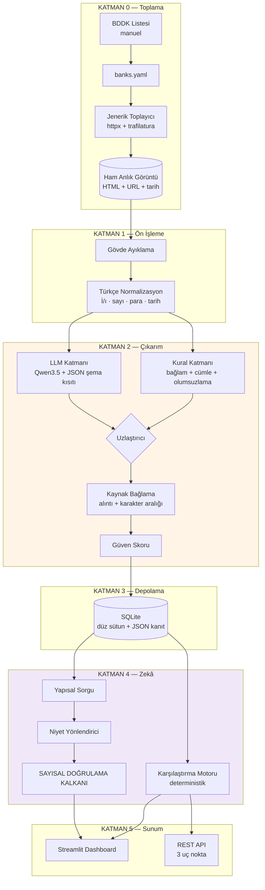

# Sistem Mimarisi ve Veri Akışı

Şartname madde 6'nın *"Sistem mimarisinin genel açıklaması ve veri akışının
özetlenmesi"*, *"Kullanılan NLP yaklaşımının açıklaması"* ve *"Model veya kural
yapısının açıklaması"* başlıklarına karşılık gelir.

---

## 1. Genel bakış



---

## 2. Temel ilke: kanıt zinciri

Sistemin tamamı tek bir kısıt üzerine kuruludur:

> **Kanıtsız değer üretilemez.**

Her alan (`src/schema.py::Alan`) şunları birlikte taşır:

| Bileşen | Ne işe yarar |
|---|---|
| `deger` | Normalize edilmiş değer (float, int, date, bool, enum) |
| `ham_ifade` | Metindeki yazımı (`"%1,89"`, `"120 aya kadar"`) |
| `kaynak.alinti` | Değerin geldiği cümle |
| `kaynak.karakter_baslangic/bitis` | Metindeki tam konum |
| `kaynak.url` + `cekim_tarihi` | Köken ve tazelik |
| `guven` | 0–1 arası güven skoru |
| `yontem` | `kural` / `llm` / `hibrit` / `belirtilmemis` |

Bu bir sözleşmedir, öneri değil: `Alan(deger=2.05, yontem="belirtilmemis")`
çağrısı **`ValueError` fırlatır**. Değeri olan bir alan, hangi katmandan
geldiğini beyan etmek zorundadır.

Alan bulunamadığında `None` döndürülmez — `Alan.yok()` ile **"Belirtilmemiş"**
işaretlenir (şartname madde 11'in örnek tablosu bu ifadeyi kullanıyor).

---

## 3. NLP yaklaşımı: hibrit çıkarım

Tek bir yöntem yerine iki katman kullanılır ve sonuçları uzlaştırılır.
Gerekçe: [ADR 003](kararlar/003-hibrit-cikarim.md).

### 3.1 Kural katmanı (`src/extraction/kural.py`)

Regex tabanlı, **yüksek kesinlikli**. Bir sayıyı ancak dört koşul birden
sağlanırsa kabul eder:

1. **Değer deseni** eşleşir (oran / para / vade / tarih)
2. **Bağlam sözcüğü** yakında bulunur — `"50.000 TL"` tek başına bir şey ifade
   etmez; onu `finansman_tutari_max` yapan şey yakınında *"finansman limiti"*
   yazmasıdır
3. **Dışlayıcı sözcük**, kapsayıcı sözcükten daha yakın değildir
4. İsteğe bağlı: **aynı cümle** kısıtı ve **olumsuzlama reddi**

Son iki kısıt gerçek bir hatadan doğdu:

> *"5.000.000 TL'ye kadar finansman. Dosya masrafı alınmaz."*

Naif bir yakınlık kuralı, 5 milyon TL'yi **tahsis ücreti** sanıyordu. Cümle
sınırı ve olumsuzlama denetimi eklenerek düzeltildi
(`tests/test_kalkan.py::test_tutar_tahsis_ucreti_ile_karistirilmaz`).

Kurallar veri olarak durur (`KURALLAR` demeti); yeni alan eklemek bir satır
eklemektir. **Banka başına özel kural yoktur.**

### 3.2 LLM katmanı (`src/extraction/llm.py`)

Qwen3.5, Ollama üzerinden, **JSON şema kısıtıyla**. Şema `format` parametresiyle
verildiği için model şemanın dışına çıkamaz — "JSON ayrıştırma hatası"
kategorisi yapısal olarak yok edilir (şema geçerliliği = 1,00).

İki kritik ayar:

- **`think=False`.** Qwen3.5 bir düşünme modelidir; varsayılan davranışta üretim
  bütçesinin tamamını akıl yürütmeye harcar ve `content` boş döner. Kapatınca
  kayıt başına süre ~3 dakikadan ~10 saniyeye iner.
- **`temperature=0.1`.** Yapısal çıkarımda yaratıcılık istenmez.

**Halüsinasyon önleme:** Modelden değeri yorumlaması değil, *metinde geçtiği
hâliyle birebir kopyalaması* istenir. Dönen ifade ham metinde aranır;
bulunamazsa alan **reddedilir** ve günlüğe yazılır. Bu bir istem mühendisliği
vaadi değil, koddur — modelin iyi niyetine güvenmez.

Katılım bankacılığı terimleri (şartname 5.5'teki resmî tanımlar) isteme
enjekte edilir.

### 3.3 Uzlaştırıcı (`src/extraction/uzlastirici.py`)

| Kural | LLM | Sonuç |
|---|---|---|
| var | var, **uyuşuyor** | `hibrit`, güven **yükseltilir** (+0,08) |
| var | var, **çelişiyor** | Sayısal alanda **kural** kazanır, güven düşürülür, çelişki kaydedilir |
| var | yok | `kural` |
| yok | var | `llm` |
| yok | yok | `belirtilmemis` |

Sayısal karşılaştırmada %1 göreli tolerans uygulanır: `"50.000 TL"` ile
`"50 bin TL"` farklı yazımlardır, farklı değer değil.

---

## 4. Veri akışı

```
banks.yaml
   │  bankalari_yukle()
   ▼
Toplayıcı ──► HamKayit ──► data/raw/{kod}/{id}.{json,html}
   │                            │
   │                            │ ham_kayitlari_oku()
   │                            ▼
   │                     kampanya_cikar()
   │                       ├─ kurallarla_cikar()  → dict[str, Alan]
   │                       ├─ LLMCikarici.cikar() → dict[str, Alan]
   │                       └─ uzlastir()          → Kampanya
   │                            │
   │                            │ kaydet()  (10 kayıtta bir ara kayıt)
   │                            ▼
   │                     SQLite: kampanyalar
   │                       ├─ düz sütunlar  → karşılaştırma, sıralama
   │                       └─ tam_kayit JSON → kanıt zinciri
   │                            │
   │            ┌───────────────┼───────────────┐
   ▼            ▼               ▼               ▼
Streamlit   Karşılaştırma   Chatbot        REST API
```

`kampanya_id`, `banka_kodu + URL` üzerinden **deterministik** üretilir. Yazma
işlemi `merge` (upsert) olduğu için koşu tekrarlanabilir; yeniden çekim
yinelenen kayıt üretmez.

---

## 5. Depolama: iki temsil bir arada

| Temsil | Kullanım |
|---|---|
| **Düz sütunlar** (`kar_payi_orani REAL`, `vade_ay_max INTEGER`, …) | Karşılaştırma ve sıralama — SQL ile hızlı ve doğru |
| **`tam_kayit` JSON** | Kanıt zincirinin tamamı — kullanıcı bir satırı açtığında gösterilen şey |

Düz sütunlar türetilmiştir; doğruluk kaynağı her zaman `tam_kayit`'tır.

SQLAlchemy kullanılması PostgreSQL'e geçişi bir yapılandırma değişikliğine
indirger (`VERITABANI_URL`).

---

## 6. Chatbot: halüsinasyonsuz mimari

```
Kullanıcı sorusu
   ▼
[Niyet Yönlendirici]  kural tabanlı, 4 sınıf, deterministik
   ├── tekil_sorgu    → SQLite yapısal sorgu
   ├── karsilastirma  → karşılaştırma motoru
   ├── kosul_sorgusu  → metin arama
   └── kapsam_disi    → kibar ret
   ▼
[Şablon tabanlı cevap üretimi]   — serbest LLM üretimi YOK
   ▼
[SAYISAL DOĞRULAMA KALKANI]      ← özgün katkımız
   Cevaptaki her sayının getirilen yapısal kayıtta karşılığı var mı?
   Yoksa → cevap REDDEDİLİR
   ▼
[Kaynak ekleme]  banka + URL + çekim tarihi + yasal uyarı
```

**Altın kural:** *Sayısal cevaplar asla metin aramasından gelmez, her zaman
yapısal veriden gelir.* Metin arama yalnız *"kampanya koşulları neler?"* gibi
metinsel sorulara hizmet eder.

Niyet yönlendirici bilinçli olarak kural tabanlıdır: karar 4 sınıflı ve kelime
örüntüsüyle güvenilir biçimde çözülüyor. Her LLM çağrısı 4B modelde ~10 saniye;
bunu yönlendirmede harcamak yerine cevabın doğruluğunda kullanmak daha doğru.

> Türkçe ayrıntı: soru eki dört biçimlidir (mi/mı/mu/mü). `arama_anahtari`
> normalizasyonu bunu ikiye indirir; ünlü uyumunu hesaba katmamak
> *"A mı daha iyi?"* sorusunu yanlış katmana yönlendirir.

---

## 7. Karşılaştırma motoru

Tamamen deterministik, **LLM kullanmaz**. Bankalar arası karşılaştırmada LLM
kullanmak, açıklanamayan ve tekrarlanamayan sonuç demektir.

Şartname 5.7'nin beş kriteri (`Kriter` enum) desteklenir. *"En Avantajlı"*
kara kutu değildir:

1. Her kriter kendi içinde min-maks ile 0–1'e ölçeklenir
2. Kullanıcının belirlediği ağırlıklarla toplanır (varsayılan: kâr payı %40,
   masraf %25, vade %20, ödül %15)
3. Eksik veri nötr (0,5) sayılır ve **karşılaştırılabilirlik** oranı düşer —
   kullanıcı yarım veriye dayalı bir sıralamayı tam veri sanmasın
4. Ağırlıklar arayüzde kaydırıcıyla değiştirilir

Ayrıca finansal titizlik uyarıları üretilir: farklı vadeli ürünler yan yana
konduğunda *"doğrudan karşılaştırılamaz"* uyarısı çıkar.

---

## 8. Modülerlik

| Modül | Sorumluluk | Bağımlılığı |
|---|---|---|
| `schema.py` | Veri sözleşmesi | — (hiçbir şeye bağlı değil) |
| `preprocessing/` | Türkçe normalizasyon | — (saf fonksiyonlar) |
| `collector/` | Toplama | `schema` |
| `extraction/` | Çıkarım | `schema`, `preprocessing` |
| `depolama.py` | Kalıcılık | `schema` |
| `comparison/` | Karşılaştırma | `depolama` |
| `rag/` | Chatbot | `depolama`, `comparison` |
| `api/`, `app/` | Sunum | yukarıdakiler |

Bağımlılık yönü tek yönlüdür; `schema` hiçbir şeye bağlı değildir ve bu yüzden
dondurulabilmiştir ([ADR 001](kararlar/001-sema-sozlesmesi.md)).
